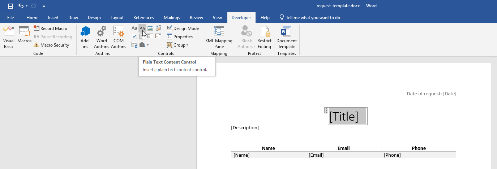

Generate Word document from Plumsail Form with MS Power Automate
===========================================================================

.. contents:: Contents:
 :local:
 :depth: 1
 
Create Word template
--------------------------------------------------
To generate word document, you'll need to create a template file first. For this, you will need desktop version of Microsoft Word.

First, you need to activate the Developer tab in the ribbon. Click **File** -> **Options**, select **Customize Ribbon** in dialog and activate the Developer tab in the right column:

|customize ribbon|

.. |customize ribbon| image:: ../images/integration/word/integration-word-customize-ribbon.png
   :alt: Customize Ribbon

Go to the Developer tab. With it, you can select any part of your text, for example, the *Title* and select them as Plain Text content control:

|plain text content|

These sections can then be populated via a flow. Upload templates to OneDrive or SharePoint to use in your flows.

MS Power Automate
--------------------------------------------------
Generate a Word document from template when someone submits Plumsail Form with |MS Power Automate| and |Word Online (Business)| connector.

|flow process img|

.. |flow process img| image:: ../images/integration/word/integration-word-flow-process.png
   :alt: Flow process

.. |MS Power Automate|  raw:: html

   <a href="https://flow.microsoft.com/" target="_blank">MS Power Automate</a>

.. |Word Online (Business)|  raw:: html

   <a href="https://emea.flow.microsoft.com/en-us/connectors/shared_wordonlinebusiness/word-online-business/" target="_blank">Word Online (Business)</a>