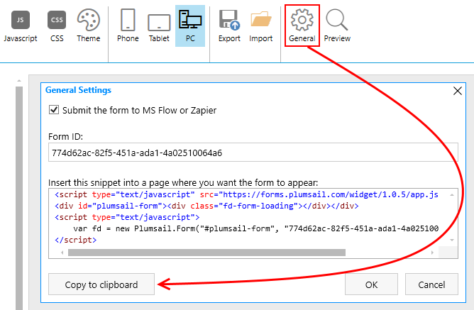
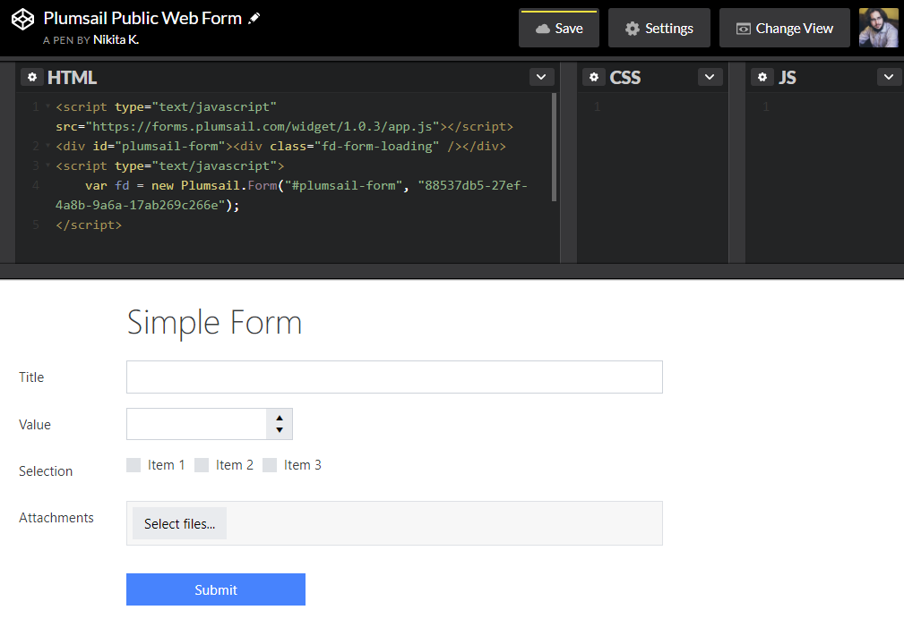

Sharing forms
==================================================

.. contents:: Contents:
 :local:
 :depth: 1

Embedding forms
-------------------------------------------------------------
You can publish Public Web Form to any webpage on your own site or anywhere else on the web, where you can edit the HTML and add our widget.

The widget can be found in General Settings in the designer where you can copy it to clipboard:

|pic18|

You can also copy form's widget from Plumsail Account Forms section in |Forms subsection| where all your forms are stored. 

Simply click the copy button next to a form:

|pic19|

.. |Forms subsection| raw:: html

   <a href="https://account.plumsail.com/forms/forms-page" target="_blank">Forms subsection</a>

After copying the widget, simply insert it as HTML to your page and the form will be published, ready to receive submissions:

|pic20|

.. note::   If you're placing more than one form per page, make sure to change div id="**plumsail-form**" and new Plumsail.Form("**#plumsail-form**" to something unique for each widget. The easiest option is to add an index, for example:

            .. code-block:: javascript

               
               

               

               
               

               

For more examples, please, check our |Integration section| with Wordpress, Joomla, Wix, Squarespace and Facebook cases.

.. |Integration section| raw:: html

   <a href="https://plumsail.com/forms/integration/" target="_blank">Integration section</a>

Now, to actually work with the received data, please, check out our :doc:`Collecting data from submissions </submissions>` article, or read about handling data in :doc:`Microsoft Flow </microsoft-flow>` or :doc:`Zapier </zapier>`.

Sharing pages
-------------------------------------------------------------
Sharing pages allow you to share forms directly with users - via the URL. You can send this URL in an email, or add it to any link on your site.

To create a sharing page, please, go to your Plumsail Account -> Forms -> Pages section and click **Add page**:

|pic1|

.. |pic1| image:: /images/start/sharing-add-page.png
   :alt: Add page for sharing

Once you click it, you'll be greeted with the following screen:

|pic2|

.. |pic2| image:: /images/start/sharing-new-page.png
   :alt: New page creation

Here, you can configure sharing page to your liking and change its appearance to match your company's or personal style.

If you select **Make default** for this page, you'll be able to share any form with this page, by copying links in |Forms section| of your account:

.. |Forms section| raw:: html

   <a href="https://plumsail.com/forms/forms/" target="_blank">Forms section</a>

|pic3|

.. |pic3| image:: /images/start/sharing-forms-links.png
   :alt: Links to forms

**Title** field is mandatory and its required to identify each sharing page that you have. You can also change the **Logo** and add a link to it, so when users click on the logo, it redirects them to your site. Adjust **Header** where the logo is placed by switching header color or the pattern, where you can choose from many options. Choose **Body background** - either a solid color or an image.

You can upload your own image or select one of existing in image gallery:

|pic8|

.. |pic8| image:: /images/start/sharing-background-gallery.png
   :alt: Background image gallery

Customize the text that appears above the form.

Finally, you can also adjust **Footer**'s background color, text color and what text will appear in the footer.

With all that done, save the page.

After saving you'll get some extra options. For once, you'll be able to **Save as** or **Delete** the page. You'll also finally get an option to **Share** the page:

|pic13|

.. |pic13| image:: /images/start/sharing-share-quit.png
   :alt: Share or quit
   
When you click **Share**, you'll be able to choose which form to share and copy the URL for sharing:

|pic14|

.. |pic14| image:: /images/start/sharing-select-form.png
   :alt: Select form for sharing and copy its URL

And here's the page that I've created in just a couple of minutes with a simple form:

|pic15|

.. |pic15| image:: /images/start/sharing-page-result.png
   :alt: Final page

Once again, to work with the received data, please, check out our :doc:`Collecting data from submissions </submissions>` article, or read about handling data in :doc:`Microsoft Flow </microsoft-flow>` or :doc:`Zapier </zapier>`.
