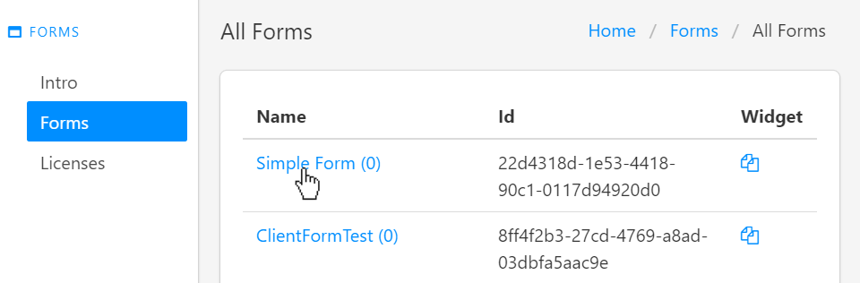
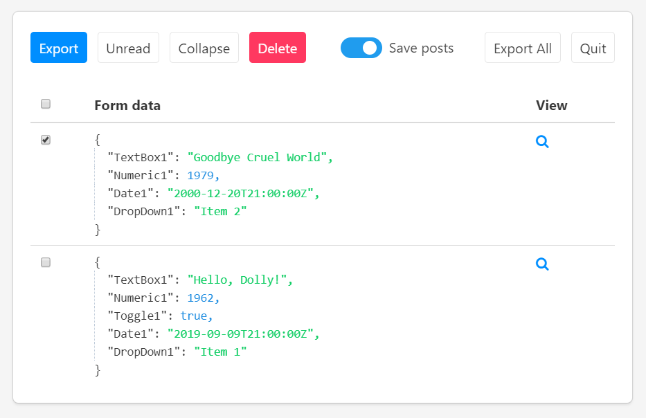
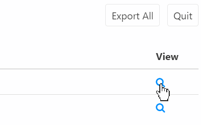
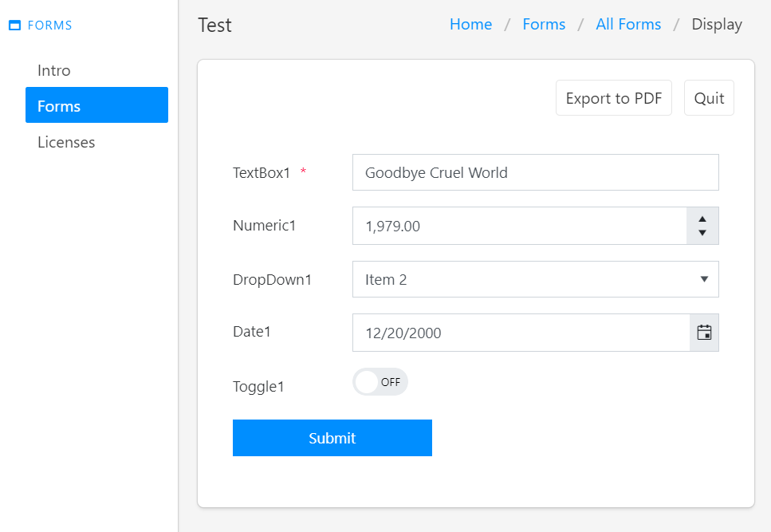

.. title:: Collecting Plumsail Forms submissions in Plumsail Account

.. meta::
   :description: Save, preview, re-submit and export previous submissions of public web forms in your Plumsail Account

Collecting submissions of online forms designed with Plumsail Forms (public forms)
===================================================================================

Enable data collection
-------------------------------------------------------------
Data collection and storage is enabled by default for all forms that you create. 

.. note::   You can disable it manually after saving a form in form's **General settings**:

            |pic0|

            .. |pic0| image:: ./images/submissions/submissions-general-settings-save-submissions.png
               :alt: Save submissions

            *Disable notifications to stop receiving emails with submitted information.*

You can then view the data in Forms section of your Plumsail Account, simply click on the form:

|pic1|

After each submission, the data will be available in Plumsail Account:

|pic2|

You can also view the form as it appeared during submission, just click on the magnifying glass icon:

|pic3|

Here you will find the form filled in and an option to export it to PDF:

|pic4|

