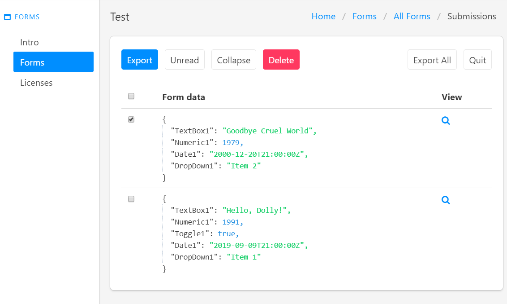

Collecting data from submissions
==================================================

.. contents:: Contents:
 :local:
 :depth: 1

Enable data collection
-------------------------------------------------------------
Data collection and storage is disabled by default for all forms that you create. 
You can enable it manually, if you go to Forms section of Plumsail Account:

|pic0|

.. |pic0| image:: ./images/submissions/submissions_0_Click.png
   :alt: Click on the form

Click on the form that you want to enable data collection for and turn it on:

|pic1|

After each submission, the data will be available in Plumsail Account:

|pic2|

