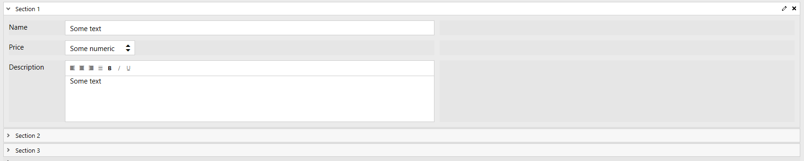

.. meta::
   :description: Information about containers and their properties

Containers in Plumsail Forms for SharePoint
==================================================

.. contents:: Contents:
 :local:
 :depth: 1

Introduction
-------------------------------------------------------------
Containers are elements that contain other elements inside of them. Containers can contain any elements inside, including other containers.

All containers are taken from Bootstrap and are fully responsive.

.. _designer-grid:

Grid
-------------------------------------------------------------
Grids are the most basic element of Plumsail Forms. By default, every form already has a grid.

But you are not limited to one grid per Form either. By placing Grid container inside the form, you are technically inserting 
one grid within another and then can lay out elements within second grid, which will be constrained by its own Parent Grid. 

So, despite Parent grid only having 12 options for Width property, you can adjust your layout precisely by using multiple grid containers.

Cell Properties
~~~~~~~~~~~~~~~~~~~~~~~~~~~~~~~~~~~~~~~~~~~~~~~~~~
Every element within a Grid has the following properties:

.. list-table::
    :header-rows: 1
    :widths: 10 40
        
    *   - Property
        - Description
    *   - Offset
        - Determines how much of an offset element gets from the left. The offset number also determines how much of the total grid space offset takes, where 6 is equal to half the grid. Setting offset will also affect total available Width for the element, and if not enough space left, it will automatically adjust to be smaller.
    *   - Width
        - Determines how much width an element takes, where 12 is full grid and other values represent smaller portions of the grid. If you add new elements or adjust Width of other elements and run out of space, Width of elements to the right will automatically adapt in the designer, so make sure that your elements don't take more than 12 total.
    *   - Padding
        - Allows you to give extra padding to a particular element from any side, Padding is set in pixels.
    *   - Class
        - Allows you to give custom CSS classes to the grid cell which then can be used in CSS or with JavaScript. Multiple classes need to be separated with spaces.
    *   - Style
        - Allows you to give custom style settings to the grid cell. Works as a style attribute of an HTML tag, doesn't require any selectors to work.

Grid's properties
~~~~~~~~~~~~~~~~~~~~~~~~~~~~~~~~~~~~~~~~~~~~~~~~~~
Every Grid container has the following settings:

General

.. list-table::
    :widths: 10 40

    *   - Stacked
        - Allows you choose at what screen size items get stacked: Never, Small, Medium, Large. Small by default
    *   - Width
        - Set the Width of the container. Can only be set if Width Unit is either Pixel or Percent.
    *   - Width Unit
        - Width Unit to customize witdth of the grid, by default Grid Width uses Parent Grid Width property, but can be further customized if Unit is set to either Pixel or Percent.
    *   - Class
        - Allows you to give CSS Class to the element, in order to apply JavaScript or CSS Style to it. Can give multiple classes separated by spaces to one element.
    *   - Style
        - Allows you to give specific element certain style. No need to use selectors, simply add CSS rules to this setting.

Tabs
-------------------------------------------------------------
Tabs allow you to separate content with tabs. You can use it for the whole form or just for a part of it.

Tabs also utilize Grid and by default contains one inside of each tab.

You can change position of tabs in LAYOUT: Orientation and choose between Top, Left or Bottom position.

.. image:: ../images/designer/containers/Tabs.png
   :alt: Tabs

Tabs' properties
~~~~~~~~~~~~~~~~~~~~~~~~~~~~~~~~~~~~~~~~~~~~~~~~~~
Every Tabs container has the following settings:

General

.. list-table::
    :widths: 10 40
        
    *   - Name
        - Setting utilized by many elements. Name is similar to ID, it's a unique identifier for the element.
    *   - Orientation
        - Choose between Top, Left or Bottom position of tabs.

Accordion
-------------------------------------------------------------
Accordion gives you another way to separate your content into parts, but slightly differently from tabs.

Instead of tabs, it uses panels, each represented with horizontal line which you can give title to. 

Accordion's properties
~~~~~~~~~~~~~~~~~~~~~~~~~~~~~~~~~~~~~~~~~~~~~~~~~~
Every Accordion container has the following settings:

General

.. list-table::
    :widths: 10 40
        
    *   - Name
        - Setting utilized by many elements. Name is similar to ID, it's a unique identifier for the element.
    *   - Mode
        - Single - only one panel is always open. SingleCollapsable - only one panel can be open, but it can also be closed. Multiple means that Multiple panels can be open and all can be closed.
    *   - Expanded
        - Allows you to choose panels that will be expanded by default. Leave it empty if you don't want any panel to be expanded. Can select multiple panels if Multiple mode is selected, e.g. *0,1,2*

.. _designer-wizard:

Wizard
-------------------------------------------------------------
Wizard container is different from all other containers. It's designed to force users fill out
the information as they go, one step at a time. 

Before the user can open the next one, the previous one must be validated.

Wizard's properties
~~~~~~~~~~~~~~~~~~~~~~~~~~~~~~~~~~~~~~~~~~~~~~~~~~
Every Wizard container has the following settings:

General

.. list-table::
    :widths: 10 40
        
    *   - Name
        - Setting utilized by many elements. Name is similar to ID, it's a unique identifier for the element.
    *   - Shape
        - Setting that allows you to change presentation of the Wizard container.
    *   - Next Text
        - Property that holds the text of the Next button.
    *   - Back Text
        - Property that holds the text of the Back button.
    *   - Finish Text
        - Property that holds the text of the Finish button.
    *   - Finish
        - A script which will run when the user presses the Finish button in the last step. Submits the form by default.