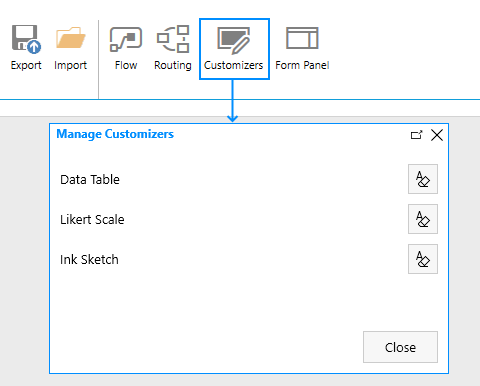

.. title:: Ink Sketch, DataTable, and Likert Scale in SharePoint

.. meta::
   :description: How to save complex controls such as signature or table to a SharePoint list, and how to display them in List View

Save Ink Sketch, DataTable, and Likert Scale controls to SharePoint fields + List View Rendering
=================================================================================================

Starting with version 1.1.6 it's now possible to save Ink Sketch and DataTable controls 
to SharePoint fields when using them on a SharePoint Form. This means that the data will be saved when the form is saved.

These fields can be created and deleted right in the designer when editing settings for one of the controls, created fields will be hidden. 
Alternatively, you can create a new multiple lines Plain Text column and store control's data in it, and this will automatically render saved data in List View.

.. raw:: html

    <iframe width="560" height="315" src="https://www.youtube-nocookie.com/embed/f06XijcSLqw" frameborder="0" allow="accelerometer; autoplay; encrypted-media; gyroscope; picture-in-picture" allowfullscreen></iframe>

.. contents:: Contents:
 :local:
 :depth: 1

How to configure
--------------------------------------------------
Select an Ink Sketch or a DataTable control and you'll see SaveTo property:

*If the form was created with an older version of Forms, simply delete the control and add it again.*

Inside the dropdown you can select one of existing fields to store data to (it must be a Multiline Text field to work) or create a new hidden field:

*New hidden field will be called fd_Signature_InternalName or fd_DataTable_InternalName depending on the type of the field.*

If you want to delete one of the hidden fields from the list, you can do it by selecting "🖉 Manage" option in the dropdown. 

*System fields cannot be deleted this way, but be careful not to delete one of important fields by accident. Old data is not transfered to new field automatically.*

.. _save-fieldcustomizers:

Field Customizers
--------------------------------------------------
Starting with version 1.4.3 Plain text fields holding data for Ink Sketch, DataTable or Likert Scale will automatically apply custom rendering in List View.

.. Note:: :doc:`Update the app package </general/update-package>` for this functionality.

Once you configure SaveTo property for these controls and save the form:

|pic2|

You will see fields updated in the List View as well:

|pic3|

.. |pic3| image:: ../images/how-to/save-table-signature/CustomizersView.png
   :alt: Field customizers in List View

If you don't want to have this formatting applied, you can delete customizers in a new editor menu:

|pic4|

