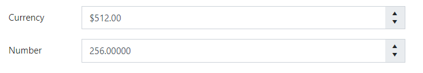
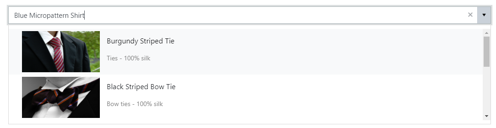

.. title:: SharePoint Fields in Plumsail Forms for SharePoint

.. meta::
   :description: Information about SharePoint fields, e.g. Currency and Lookup, and their properties that you can configure on a form

SharePoint Fields
==================================================

SharePoint fields are based on the columns of the SharePoint List or Library that you connect to. 
These fields, when added to the form, are automatically connected to the List and will retrieve data from the List, as well as automatically submit user input on save.

It's recommended to only use SharePoint fields on SharePoint forms unless you want to handle data from the Common fields with JavaScript or Flow.
This section contains information about settings for fields that are unique to SharePoint. 

.. note::   If you add another column to the list, while editing its forms, you can refresh fields by clicking refresh fields button:

            |refresh|

            .. |refresh| image:: /images/designer/fields-sp/designer-fields-sp-refresh.png
               :alt: Refresh SharePoint fields

.. contents::
 :local:
 :depth: 1

Basic properties
-------------------------------------------------------------
Most fields have following settings:

General

.. list-table::
    :widths: 10 40

    *   - Name
        - Setting utilized by many elements. Name is similar to ID, it's a unique identifier for the element.
    *   - Required
        - Select if the field is required to submit the form or not.
    *   - Orientation
        - Select if the title is displayed on the left from field or on top of it, to the left. Might automatically switch if not enough space.
    *   - Class
        - Give CSS Class to the element, in order to apply JavaScript or CSS Style to it. Can give multiple classes separated by spaces to one element.
    *   - Style
        - Allows you to give specific element certain style. No need to use selectors, simply add CSS rules to this setting.

Title

.. list-table::
    :widths: 10 40

    *   - Text
        - Select the displayed title for the field.
    *   - Visible
        - Select if the title is visible or not.
    *   - Width
        - Select the width of the title.
    *   - Font Size
        - Select font size of the title.
    *   - Font Style
        - Select if the title is in italics or not.
    *   - Font Weight
        - Select if the title is bold or not.
    *   - Font Color
        - Select font color of the title. Can be either selected or manually entered.
    *   - Wrap
        - Select if the title will wrap if it has not enough space or not.

Control

.. list-table::
    :widths: 10 40

    *   - Width
        - Allows you to set the width of the input field manually. Only takes number in pixels, no additional symbols required.
    *   - Hint
        - Allows you to set placeholder value for the text input. Can be used as an example for the users.
    *   - Font Size
        - Select font size for the input.
    *   - Font Style
        - Select if the input is in italics or not.
    *   - Font Weight
        - Select if the input is bold or not.
    *   - Font Color
        - Select font color for the input. Can be either selected or manually entered.

.. _designer-currency:

Currency and Number
-------------------------------------------------------------
Currency and Number fields have received multiple unique properties to configure.

|currency-img|

Currency and Number properties
~~~~~~~~~~~~~~~~~~~~~~~~~~~~~~~~~~~~~~~~~~~~~~~~~~
These properties are unique to Currency and Number fields:

General

.. list-table::
    :widths: 10 40

    *   - Min
        - Minimum possible value.
    *   - Max
        - Maximum possible value.
    *   - Decimals
        - Number of decimals.
    *   - Format
        - |Numeric format| for the field.
    *   - Step
        - Value added or removed when using the control's arrows.

.. |Numeric format| raw:: html

   <a href="https://docs.microsoft.com/en-us/dotnet/standard/base-types/standard-numeric-format-strings" target="_blank">Numeric format</a>

.. _designer-lookup:

Lookup
-------------------------------------------------------------
Lookup field has received several new features, all of which can be configured in the designer.

Now, users can use search bar to filter the selection in the lookup field. 
There's also an option to add new items to the source list, if the item wasn't found - this could be turned on/off.

Additionally, you can apply a field based filter on the lookup with Filter properties.

|example|

Lookup unique properties
~~~~~~~~~~~~~~~~~~~~~~~~~~~~~~~~~~~~~~~~~~~~~~~~~~
Lookup field has the following unique settings:

General

.. list-table::
    :widths: 10 40

    *   - Operator
        - Determines how the search is handled by the lookup. Has two options: StartsWith - only show items that start with the entered value, Contains - show all items that contain the entered value.
    *   - Add New
        - Allows users to add new values to the source list of the Lookup. User must enter value that doesn't exist yet, then there will be an option to add new item.
    *   - Extra Fields
        - Select fields from the list that also need to be loaded. By default, only ID and 'Display Field' are retrieved. Extra fields can accessed with JavaScript. When adding Lookup fields in Extra Fields setting, do not forget to format them like this: **Category/ID**, **Category/Title**. Uses OData *$select* query option - read more |REST|.
    *   - Expand
        - In the Expand setting you need to enter the Lookup field that you are getting in Extra Fields, such as: **Category**. Uses OData *$expand* query option.
    *   - Order By
        - Select a field to display available options in a specific order.
    *   - Order Type
        - Available if Order By property is set - select Ascending or Descending order.

Filter

.. list-table::
    :widths: 10 40

    *   - Depends on
        - Select what field in the current list will be used for filtering items available in the lookup field. For complex fields, such as Lookup or Person, also select which property to match (ID, Title or Email, Display Name, etc.)
    *   - Match to
        - Select what field in the source list has to match the field selected in **Depends on** property. For more information on filtering, refer to our :doc:`Filter lookup fields article <../how-to/lookup-filter>`.

.. |REST| raw:: html

   <a href="https://docs.microsoft.com/en-us/sharepoint/dev/sp-add-ins/use-odata-query-operations-in-sharepoint-rest-requests#select-fields-to-return/" target="_blank">here</a>