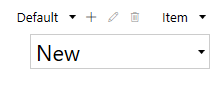
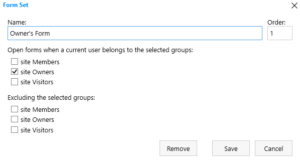
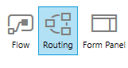
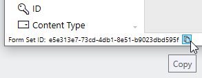

.. title:: Personalized Form sets in Plumsail Forms for SharePoint

.. meta::
   :description: How to create special form sets, such as a set of forms for supervisors or managers, and redirect only specific users to them based on SharePoint groups or custom rules

Personalized Form sets in Plumsail Forms for SharePoint
=============================================================

.. contents:: Contents:
 :local:
 :depth: 1

Introduction
-------------------------------------------------------------
Form Sets allow you to design additional forms for SharePoint List or Library. 

By default, each List only has three forms - New, Edit and Display. 
Each additional Form Set allows you to add three more forms - also New, Edit and Display, but a Form Set doesn't have to contain all three forms, it can be just one or two.

- :ref:`designer-grouprouting` can be used to redirect users who belong to selected groups to a specific Form Set.
- :ref:`designer-customrouting` can be used to apply more complex logic prior to redirection, for example, check item's field values or user's properties.

|pic1|

You can select currently active Form Set in an upper right corner, in the drop-down.
Default Form Set is what all users see if they are not redirected.

Add new Form Set by clicking **+ sign** next to the currently selected Form Set. Clicking Pen Icon allows you to edit properties of the currently selected Form Set.
Trash bin icon allows you to delete a Form Set. After creating a Form Set, do not forget to save every form you plan to use or it might be missing.

.. _designer-grouprouting:

Automatic routing based on SharePoint group membership
-------------------------------------------------------------
When you create a Form Set, straight away, you can configure automatic routing for the members of certain groups:

|pic2|

* Name - the name of the Form Set, can be anything you want, just makes it easier to find among all the Form Sets.
* Order - determines the order in which to open Form Sets if conditions are met. The lower the Order value, the higher the priority for Form Set to open.
* Open forms when a user belongs... - select all groups user must belong to in order to be redirected. **Note!** Must select something in order for redirection to work.
* Excluding the selected groups - will not redirect the user that belongs to the previously picked groups, if the user also belongs to one of the groups selected here.

.. _designer-customrouting:

Custom routing
-------------------------------------------------------------
You are not limited to checking current user's group membership, using custom routing you can use any logic to redirect users to specific form.
With custom routing, you can check current item's field values, user's properties, such as title or department, 
or any other information from SharePoint. Based on this information, you can redirect users to different Form Sets or URLs.

Custom routing always takes priority over group routing. So, if your custom code returns ID of a Form Set, 
users will get redirected to the corresponding URL or Form Set all the time, even if they do not belong to the selected groups for this Form Set.
Custom routing is configured for all Forms and Form Sets of the current Content Type. Each Content Type has its own custom routing configuration.

To add custom routing conditions, click *Routing* button:

|pic3|

Custom routing is based on JavaScript with SharePoint Patterns & Practices (PnP) |JavaScript Core Library| and 
several predefined variables describing the current context. PnP library contains a fluent API for working with the full SharePoint REST API, 
allowing you to easily get any necessary information from SharePoint.

.. |JavaScript Core Library| raw:: html

   <a href="https://sharepoint.github.io/PnP-JS-Core/" target="_blank">JavaScript Core Library</a>

Some predefined variables accessible from your code:

    -   **webUrl** - URL of the current site
    -   **listId** - ID of the current list
    -   **itemId** - ID of the current item
    -   **pnp** - pnp JS library instance
    -   **web** - current Web from pnp 
    -   **list** - current List from pnp
    -   **item** - current Item from pnp or null for a New form
    -   **host** - check if form is opened in a regular page, in a panel, or in a user web part. Value can be: 0 / 1 / 2. See :ref:`example <designer-hostvar>`.

The code in custom routing must return an ID of a Form Set, or a Promise that is resolved with Form Set ID. 
The ID will be used to render a specific Form Set.

Form Set ID can be found in the lower left corner of the designer, it can be copied with a button click:

|pic4|

If the code returns nothing or throws an error, default routing is applied.

Routing examples
-------------------------------------------------------------

Check item's field
**********************************************
Redirect to a certain Form Set if 'Status' field equals 'Solved':

.. code-block:: javascript

    //check if Item already exists, will return true for Edit and Display Form
    if (item) {
        // return Promise
        return item.get()
            .then(function (item) {
                //if Item's Status is Solved, redirect
                if (item.Status == 'Solved') {
                    //return ID of a Form Set
                    return '31fb1f41-63f3-48ff-a1c2-18b4e7f7c3e7'
                }
            });
    }

Check user's property
**********************************************
Redirect to a certain Form Set if User's Department is 'Fire Safety':

.. code-block:: javascript

    //get properties of the current user
    return pnp.sp.profiles.myProperties.get().then(function(result) {
        var props = result.UserProfileProperties;
        //if there is a property with Key: Department and Value: Fire Safety
        if (props.some(function(p){ return p.Key === 'Department' && p.Value === 'Fire Safety'})) {
            //return ID of a Form Set
            return '8720f859-7cca-4c51-8548-7a28f271d6a8';
        }
    });

Check item's Person field
**********************************************
Redirect to a certain Form Set if 'AssignedTo' Person field equals the current user:

.. code-block:: javascript

    //check if Item already exists, will return true for Edit and Display Form
    if (item) {
        //first, get the current user
        var user;
        // return Promise
        return web.currentUser.get()
            .then(function(u) {
                user = u;
                return item.get();
            })
            .then(function(item) {
                //then compare User ID to ID of the user in the AssignedTo field
                if (user.Id == item.AssignedToId) {
                    //return ID of a Form Set
                    return '31fb1f41-63f3-48ff-a1c2-18b4e7f7c3e7';
                }
            });
    }

Check item's multiple selection Person field
**********************************************
Redirect to a certain Form Set if 'People' multiple selection Person field contains the current user:

.. code-block:: javascript

    //check if Item already exists, will return true for Edit and Display Form
    if (item) {
        //first, get the current user
        var user;
        // return Promise
        return web.currentUser.get()
            .then(function(u) {
                user = u;
                return item.get();
            })
            .then(function(item) {
                //if field People contains current user's ID
                if(item.PeopleId && item.PeopleId.indexOf(user.Id) >= 0){
                    //return ID of a Form Set
                    return '8720f859-7cca-4c51-8548-7a28f271d6a8';
                }
            });
    }

.. _designer-hostvar:

Check host
**********************************************
Redirect to a certain Form Set if form is opened in full page mode, in a panel, or in a webpart:

.. code-block:: javascript

    // regular form
    if (host === 0)
        return '568be5c6-383e-4903-ab5b-aeef7f1e76ae';

    // SharePoint panel
    if (host === 1)
        return '87a5e162-3fe5-4459-8527-e1c04e14621f';

    // Plumsail Forms Web Part 
    if (host === 2)
        return '719a0769-1c0a-4a6c-8dcf-57abc8a7d71a';

Examples
-----------------------------------------------------

Please see how you can use Form Sets through the example of :doc:`Ticket management system</examples/ticket-management>`.