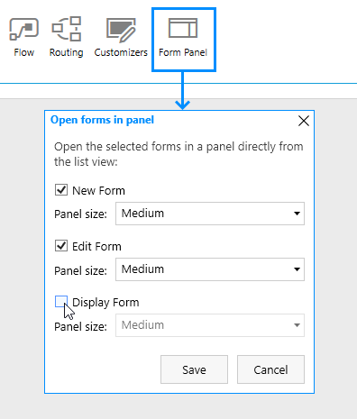

.. meta::
   :description: Select if you want forms to load in a panel or not

Configuring appearance of SharePoint form in panel from list or library view
==================================================================================

.. contents:: Contents:
 :local:
 :depth: 1

Introduction
-------------------------------------------------------------
SharePoint Form Panel will open SharePoint forms in a panel, similar to default SharePoint forms.

.. note::    *In order to use this functionality, please, make sure to* :ref:`update the package <install-app-package>` *in the App Catalog to the latest version.*

Form Panel preserves full functionality of our custom SharePoint fields - including :doc:`routing </designer/form-sets>`.

It is enabled by default in the latest version, but can be configured in the designer, in the Form Panel section:

Here, you can select which forms you want or do not want to be opened in the panel, as well as the size of the panel. 

.. important::    There is a slight delay between the time when a user opens the list and when the script loads completely for panel forms, so if the users open a form too quickly, 
                  then they will be redirected to a default full-screen form instead of a panel.

Custom Width
*************************************************************
If you want to change the width of the Panel, and three given options do not suit your needs, you can simply use the following CSS and specify any width that you need:

.. code-block:: css

        .ms-Panel-main{
          width: 1200px !important;
        }