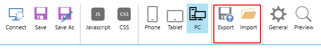
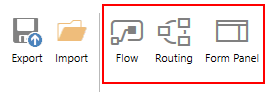

Ribbon Actions
==================================================

.. contents:: Contents:
 :local:
 :depth: 1

.. _designer-layouts:

Layouts - PC, Tablet or Phone
--------------------------------------------------
Modern Plumsail Forms are built to be responsive. On top of utilizing |Bootstrap| for its elements, Forms can also be specifically designed for different devices.

.. |Bootstrap| raw:: html

   <a href="https://getbootstrap.com/" target="_blank">Bootstrap 4</a>

Plumsail Forms do not simply rely on the screen size, instead the appropriate Form is chosen based on browser's user agent and then displayed. 
Phone forms are displayed for smartphones, Tablet forms are displayed for tablets and other devices utilize PC Form which is the default one.

Designing Forms
**************************************************
Designing forms for different devices has never been easier. All you need to do, is click 
the icon of the device you want to design form for, customize the form and click Save.

The red cross under the icon of the device indicates that the form is registered. Click on it to remove the specific form. 
There will be a confirmation prompt to avoid potential misclicks: 

|pic1|

.. |pic1| image:: ../images/designer/ribbon-actions/Layouts.png
   :alt: Layouts icons

.. important::  Make sure that the fields present on different layouts have the same internal names and the same type to avoid errors on submission in Microsoft Flow. These can be different fields with the same name as long as the type is the same, for example, Textbox and MultilineTextBox.

Testing Forms
**************************************************
For testing purposes, you can just change user agent in your browser to see a different form. For example, when using Google Chrome you can open Developers tools
and click Toggle device toolbar icon next to Inspector which will allow you to change the device and see how the form is displayed on other devices.

|pic2|

.. |pic2| image:: ../images/designer/ribbon-actions/ToggleDeviceToolbar.png
   :alt: Toggle Device Toolbar

Similar functionality is present in almost all modern browsers.

.. _designer-export:

Export and Import
--------------------------------------------------
You can export currently selected form by pressing Export button. It will allow you to save the form as a file on your computer.

|pic3|

This can be used in variety of situations, especially if you need to design a number of similar forms. 

We also recommend storing backups for your important and/or complex forms, 
so if somebody changes the form later, it would be possible to restore it quickly.

Finally, you can import forms from the exported files, either yours or somebody else's, by pressing the Import button and selecting the form to import.

Flow, Routing and Form Panel
-------------------------------------------------
These three buttons offer extra functionality to SharePoint form.

|pic4|

Flow button opens Flow settings, you can also select if you want to submit form to Flow which needs to be checked if you want to use the form with Microsoft Flow, 
but it is turned off by default. You still need to configure the Flow to actually do something with the submitted data.

This Flow submission is handled by Plumsail Forms connector, and allows you to collect data not only from SharePoint fields, but also from Controls and Common Fields. 
If you are interested in SharePoint fields only, you can use Microsoft's SharePoint connector and not submit the form itself to Flow.

You can also generate, edit or copy Form ID for SharePoint forms. 
This allows you to give the same ID to multiple forms, so that Flow handles submission from more than one form.
You still need to make sure that fields have the same internal names.

This can be useful if you want to handle submission of both New and Edit Form through Microsoft Flow, so you don't have to create different Flows for it.
But make sure that Form IDs are different for your forms if you only want to handle one form with specific Flow.

Finally, there is Form Schema is available for SharePoint forms and it only updates on Save, so don't forget to Save prior to copying it.

|pic5|

This schema is used when creating Flow with Plumsail Forms connector to parse JSON:

|pic6|

**Routing** button allows you to configure automatic redirection to a correct Form Set, based on some rules. Find out more about in our :doc:`Form Sets article </designer/panel>`.

|pic7|

**Form Panel** button allows to configure how the forms are opened in browser - taking up whole screen or only in the panel. 
It also allows running custom scripts in Modern List View. More about it in our :doc:`Form Panel article </designer/panel>`.

|pic8|

