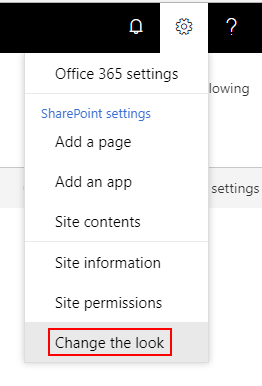

.. title:: SharePoint themes with Plumsail Forms

.. meta::
   :description: How SharePoint themes are applied to Forms - support for both standard and custom themes

SharePoint themes with Plumsail Forms
=========================================

.. contents:: Contents:
 :local:
 :depth: 1

Themes for SharePoint
-------------------------------------------------------------
Modern Forms for SharePoint now include support for SharePoint themes. The changes are purely aesthetic and only affect the colors of various elements on the form.
You can change the look of the SharePoint site in the Settings menu:

|pic1|

Now these changes will affect forms as well:

|pic2| |pic3|

.. |pic2| image:: ../images/designer/themes/ThemeBlue.png
   :alt: Blue Theme SharePoint Form
   :width: 49%

.. |pic3| image:: ../images/designer/themes/ThemeRed.png
   :alt: Red Theme SharePoint Form
   :width: 49%

Modern Forms for SharePoint also support custom themes, but applying a custom theme will take more time than applying one of default Microsoft themes.

It might take around 5 minutes for a custom theme to apply properly. Until the process is done, the form will still open with the default theme.