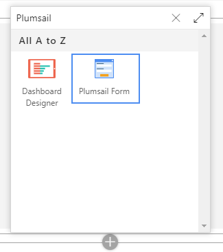
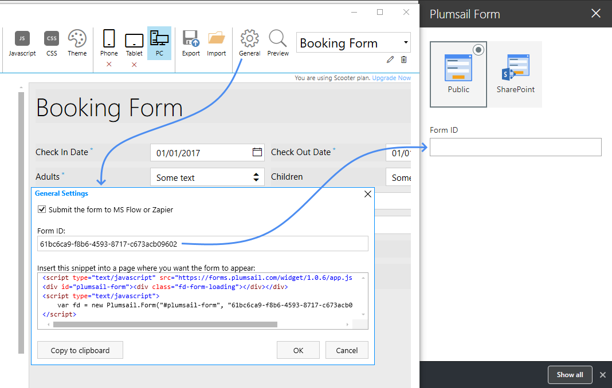
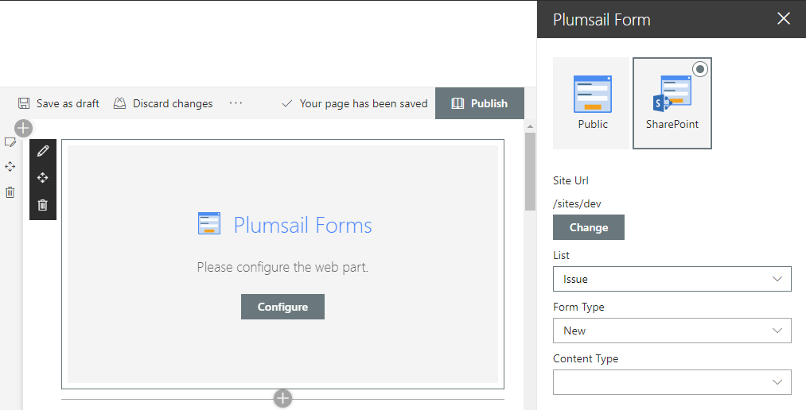
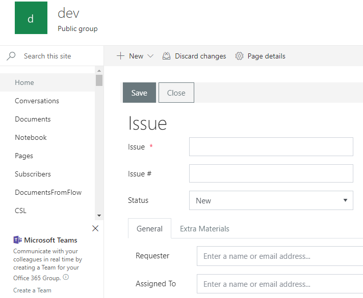
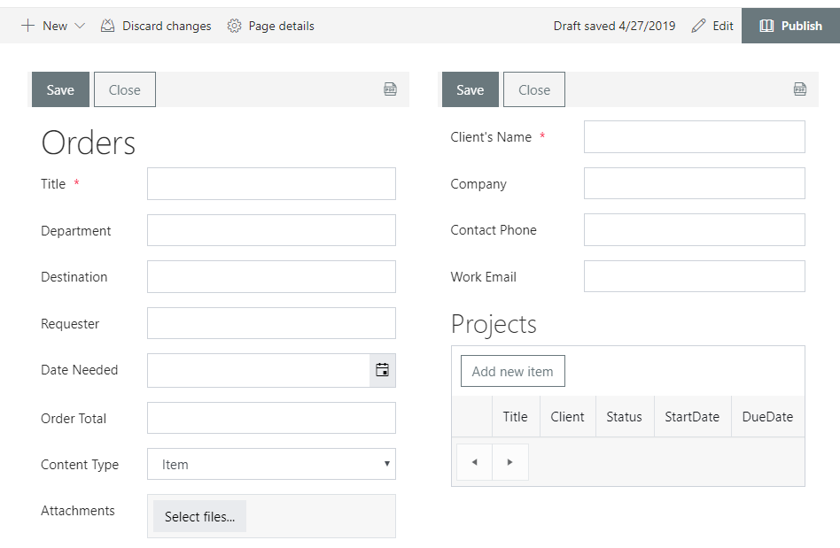

SharePoint Web Part
=========================================

.. contents:: Contents:
 :local:
 :depth: 1

Plumsail Forms Web Part
-------------------------------------------------------------
New Web Part will allow you to publish any Public or SharePoint Form to any page. As long as user has access to the form's List, they'll have access to the form.

.. important:: You need to :doc:`update the app package </general/update-package>` to version 1.0.7.0

You can add Web Part to any Modern page:

|pic1|

Public Web Form
-------------------------------------------------------------
If you want to publish Public Web Form, simply create it, save it, open General settings and copy Form ID to the Web Part:

|pic2|

The form will then be submitted to Flow, where you can `process it <https://plumsail.com/docs/forms-web/microsoft-flow.html>`_.

SharePoint Form
-------------------------------------------------------------
If you want to publish SharePoint Form, select Site URL, List and Content Type in Web part settings:

|pic3|

Then, you'll see the form on the page:

|pic4|

You can even have several forms published on the same page:

|pic5|

To make sure the users get the correct form for them, please, use :doc:`Form Sets </designer/form-sets>`.