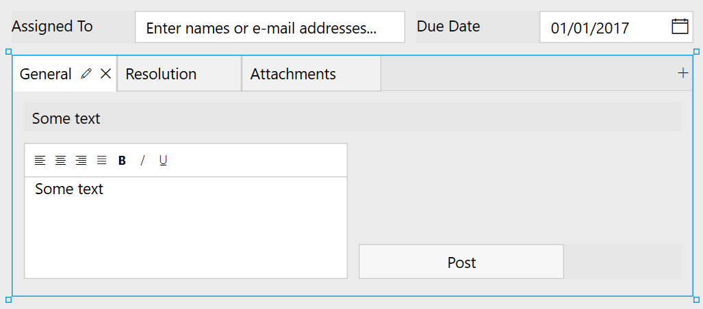

.. title:: Add discussion to a SharePoint form

.. meta::
   :description: Use JavaScript and item versioning to add discussion field to a form, where multiple users can leave their comments

How to add discussion to a SharePoint form
==================================================

With Plumsail Forms, you can enrich a SharePoint form with a discussion where users exchange their opinions, suggest ideas, and leave comments. 

It can be handy in tasks, requests, issues in systems like CRMs, help desks, request management, document processing and others where you work with items and documents needed to be discussed. 

|pic0|

.. contents:: Contents:
 :local:
 :depth: 1

How to configure
--------------------------------------------------

First of all, add an append-only rich text field to store a discussion in. 

Please note that you must also enable versioning for the list since each comment is stored in a separate version of an item. Go to the List settings -> Versioning settings and enable version history. 

Next, create a field:

|pic1|

Now, we are ready to design a form. Here is an example: 

|pic2|

By default, users can add new comments to an append-only field via saving the form which leads to refreshing the page. 

In this example, however, we will add an extra button to create new comments right after clicking it **without saving the whole form**. 

Put an extra 'Post' button next to the append-only field and insert the below snippet into its Click property: 

.. code-block:: javascript

    //Replace "Comments" with the internal name of your Comments field  
    var commentField = fd.field("Comments");  
  
    //Replace "NTaskArticle" with the name of your list   
    var list = sp.web.lists.getByTitle("NTaskArticle");  

    //Replace "Comments" with the internal name of your Comments field   
    list.items.getById(fd.itemId).update({Comments: commentField.value}).then(function(){  
        fd.field("Comments").refreshHistory();     
        commentField.clear(); 
    });   

Here is the result:

|pic3|

