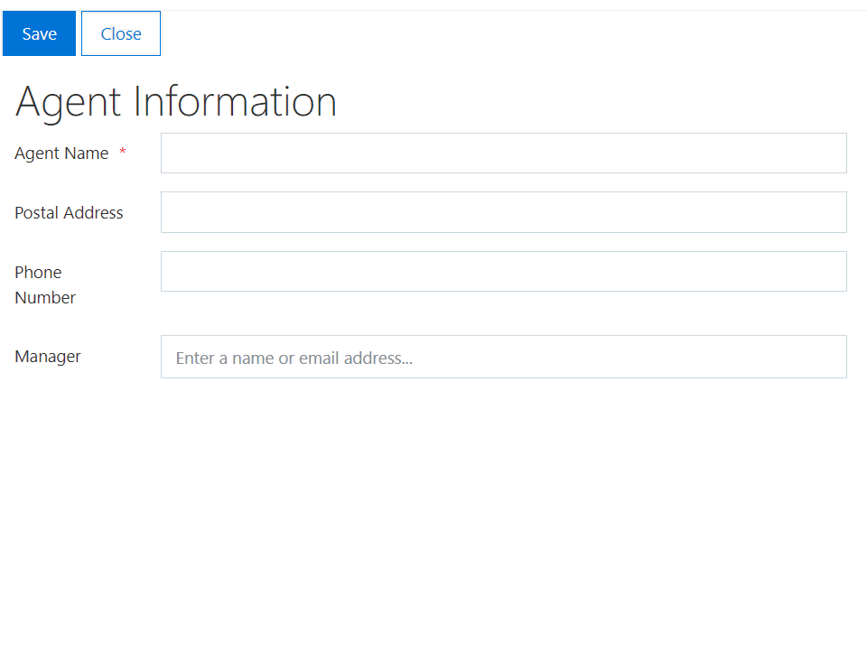
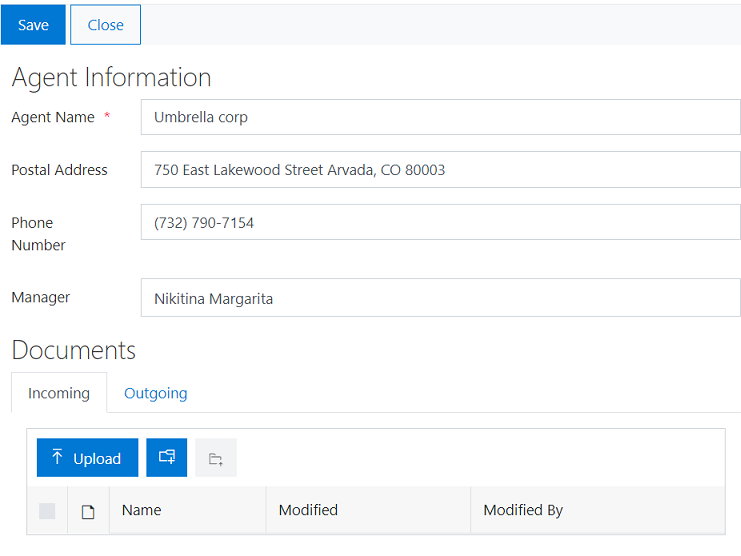

How to organize related files in folders and display documents from specific folder in a SharePoint form
==================================================================================================================

.. contents:: Contents:
 :local:
 :depth: 1

Introduction
--------------------------------------------------
In this article, I will show you how to create a folder in a document library automatically right after adding an item to a SharePoint list and how to display the content of this folder in Edit and Display forms of the list with the help of List or Library control.

Imagine, we have a list with general information about customers and suppliers. And there are two libraries for storing incoming and outgoing documents related to agents. Documents in those libraries are organized by folders. Each customer or supplier has the corresponding folder in each library. 

Now, we want to create a folder in those libraries automatically after adding a new agent and display and upload related documents right from the Edit and Display forms. 

|pic0|

Forms Overview
--------------------------------------------------

Agent Information form contains the following fields: 

- Agent Name (text field);
- Postal Address (text field);
- Phone Number (text field);
- Manager Name (people picker field).

In Edit and Display forms, we also add a Tab control with two tabs: Incoming and Outgoing. Each tab contains a List or Library control associated with the corresponding document library.

|pic1|

Creating a folder
--------------------------------------------------

First, we add JavaScript code to the New form to create folders in both libraries for each new customer or supplier.

We use the PNP JS library to create folders in a document library. You can find more information about working with SharePoint items with PNP |link to documentation|.

.. code-block:: javascript

    fd.spBeforeSave(function() {
        
        // we'll create folders with the name of a customer or supplier
        var agentName = fd.field('Title').value;
        
        //create folder in Incoming document library
        var folder1 = pnp.sp.web.lists.getByTitle("Incoming").rootFolder.folders.add(agentName);
        
        //create folder in Outgoing document library
        var folder2 = pnp.sp.web.lists.getByTitle("Outgoing").rootFolder.folders.add(agentName);
        
        // waiting until the folders are created
        return Promise.all([folder1, folder2]);  
    }); 

Also, if you want to redirect users to the Edit form after creating a customer or supplier so they could add related documents to the new folders, take the code from the |Redirect user after form submission in SharePoint| article and insert it into the New form.

Root folder
--------------------------------------------------

In the Edit and Display forms, we have two List or Library controls for incoming and outgoing documents related to the current agent. 

By default, List or Library control displays all items from the root folder of a document library. But with a bit of code, we can change the root folder and display documents from a specific folder only. 

Use the code in the Edit and Display forms to display documents from a folder of the current customer or supplier: 

.. code-block:: javascript

    function setRootFolder(dt){
        
        var agentName = fd.field('Title').value;
        
        if(agentName){ 
            
            dt.baseRootFolder = agentName; 
            dt.rootFolder = agentName; 
        }
    }
    
    fd.spRendered(function(ctx) {
        
        var dtIncoming = fd.control('SPDataTable1'); 
        
        //set root folder when the form loads
        dtIncoming.ready().then(function(dt) {
            setRootFolder(dt);
        })
        
        var dtOutgoing = fd.control('SPDataTable2'); 
        
        //set root folder when the form loads
        dtOutgoing.ready().then(function(dt) {
            setRootFolder(dt); 
        })  
    }); 

.. |link to documentation| raw:: html

   <a href="https://pnp.github.io/pnpjs/sp/docs/items/" target="_blank">here</a>

.. |Redirect user after form submission in SharePoint| raw:: html

   <a href="https://plumsail.com/docs/forms-sp/how-to/redirect-sp-save.html" target="_blank">Redirect user after form submission in SharePoint</a>