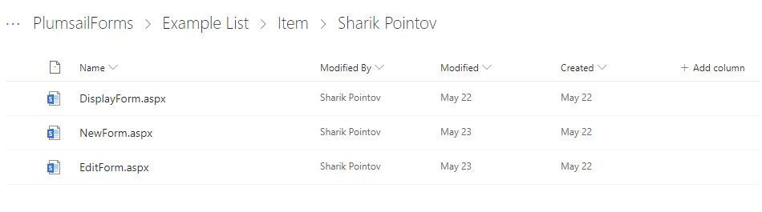
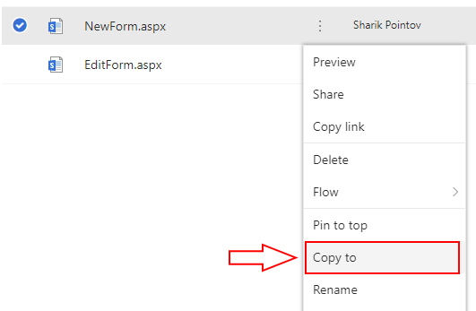
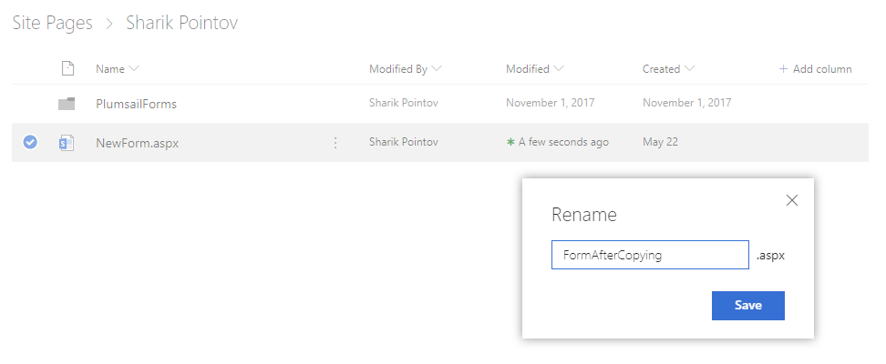

How to move new SharePoint form page to another location
=============================================================

.. contents:: Contents:
 :local:
 :depth: 1
 
Introduction
--------------------------------------------------
By default, user can only access forms via the List View, when working with items of the list - creating New items, editing or looking at the existing. But the forms for the list
are actually stored in Site Pages -> Plumsail Forms folder.

It's also possible to use these pages, or at least New Forms, without going into List View. Edit and Display Form require you to select an item manually in the List.

.. Note:: Instead of moving a form page to another location, you can also create a new page and :doc:`put a form web part </designer/web-part>` into it. Forms published with a form web part are not limited to just the New Form. You can also add Edit or Display Forms and provide ID in a query parameter which is also configurable. 

Getting the page
--------------------------------------------------
Let's say you want to move the page, so the SharePoint users don't have to go to List View and click *Add new item*. 

If you go to Site Pages -> Plumsail Forms -> *List Name* -> *Content Type*, you will find all the forms for this List and specific Content Type, with form sets in separate folders:

|pic1|

You can freely open and work in New Forms, they do not require any parameters, so it's possible to just open them here and start creating New items.

Copying the page
--------------------------------------------------
Going so deep to find a specific form might be quite tedious, and the URL would be rather long. Instead, you can click on any of the New Forms, 
select Copy To and find a better location for your most important forms:

|pic2|

Now, users can go to directly to this place and open the form from a page (which you can also rename), instead of using the List View:

|pic3|

By default, submitting the New Form will always redirect you to the List View of this form, but you can change it. Find out how to do it :doc:`here </how-to/redirect-sp-save>`.