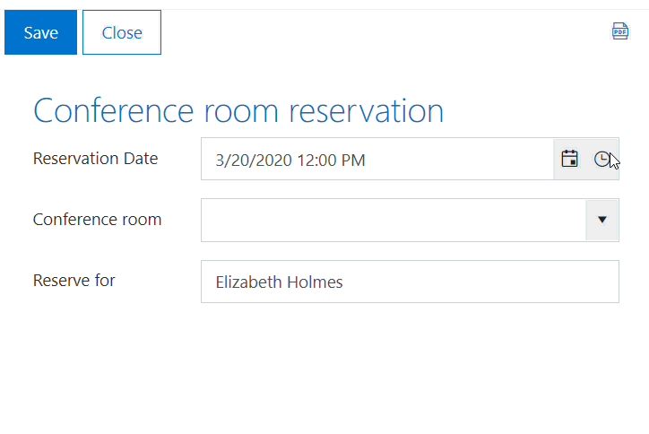
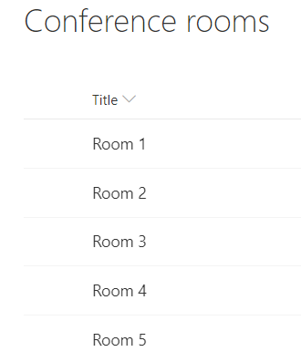
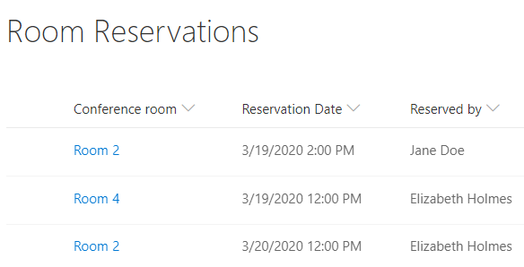
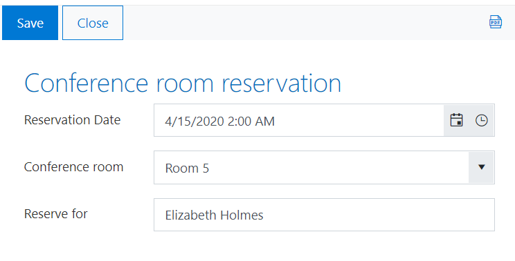

How to create a SharePoint form for booking a meeting room
=========================================================================

.. contents:: Contents:
 :local:
 :depth: 1

Introduction
----------------------------------------

In this article, we'll show you how to create a simple reservation system. This approach can be applied in booking systems for hotels, restaurants, meeting, or conference planning. 

Assume, there are several conference rooms, and they are available for booking with the 1-hour interval. To make a reservation, a user selects the date and time of the planning meeting and then picks one of the available rooms in the dropdown.

|pic0|

Lists
----------------------------------------

So first, create two lists: Conference rooms and Room reservations. 

Conference rooms list has names of all existing rooms. 

|pic1|

Room Reservations list stores bookings and contains three columns: 

- Conference room (Lookup);
- Reservation Date (Date and Time); 
- Reserved by (Person or Group).

|pic2|

Conference room reservation form
----------------------------------------

Next, we move on to the form design. Add all fields to the form, so that the New form would look like this in the browser: 

|pic3|

Now, we want to restrict the list of rooms and display only those which are available at the specified time. For this, we need to apply extra filtering to the 'Conference room' field to exclude occupied rooms. First, we retrieve Ids of the occupied rooms with |PnPjs library| that is built into Plumsail Forms: 

.. code-block:: javascript
    
    var rDate = date.toISOString(); 
    var list = pnp.sp.web.lists.getByTitle("Room Reservations");
    list.items.filter("ReservationDate eq '" +  rDate +"'").get().then(function(items) {
        // items contains the list of rooms occupied at the selected time
        var roomIds = items.map(function(i) { return i.RoomId });
    });

Then, we exclude those rooms from the lookup results: 

.. code-block:: javascript
    
    if(roomIds.length > 0) {
        var filterString = "Id ne " + roomIds.join(" and Id ne ");
        fd.field('ConferenceRoom').filter = filterString;
        fd.field('ConferenceRoom').widget.dataSource.read();
    }

Filtering is applied automatically after changing the Reservation Date field: 

.. code-block:: javascript
    
    fd.field('ReservationDate').$on('change', function(date) {
        // retrieving occupied rooms and filering the lookup field
    }); 

Also, we need to disable the Conference room field if a user has not picked the time: 

.. code-block:: javascript
    
    fd.field('ConferenceRoom').disabled = !fd.field('ReservationDate').value;
    
    fd.field('ReservationDate').$on('change', function(date) {
        fd.field('ConferenceRoom').disabled = !date;
    });

In this example, the rooms are available for booking with the 1-hour interval, so we set the time interval for the Reservation Date field to 60 minutes: 

.. code-block:: javascript
    
    fd.field('ReservationDate').widgetOptions = { 
        interval: 60
    }

Here is the final code: 

.. code-block:: javascript

    fd.spRendered(function() {
        
        //disable Conference room field on form load
        fd.field('ConferenceRoom').disabled = !fd.field('ReservationDate').value;
        
        //set the time interval in minutes
        fd.field('ReservationDate').widgetOptions = { 
            interval: 60
        }
        
        fd.field('ReservationDate').$on('change', function(date) {
            //enable/disable Conference room field if date and time is changed
            fd.field('ConferenceRoom').disabled = !fd.field('ReservationDate').value; 
            
            if(date != null) {
                
                var rDate = date.toISOString();
                
                //replce Room Reservations with the name of the list
                var list = pnp.sp.web.lists.getByTitle("Room Reservations");
                
                //get IDs of rooms that are occupied
                list.items.filter("ReservationDate eq '" +  rDate +"'").get().then(function(items) {
                    
                    roomIds = items.map(function(i) { return i.RoomId });
                    
                    if(roomIds.length > 0) {
                        
                        //filter Conference room lookup field values
                        var filterString = "Id ne " + roomIds.join(" and Id ne ");
                        fd.field('ConferenceRoom').filter = filterString;
                        fd.field('ConferenceRoom').widget.dataSource.read();
                    }
                });
            }
        });
    });

.. |PnPjs library| raw:: html

   <a href="https://pnp.github.io/pnpjs/" target="_blank">PnPjs library</a>
