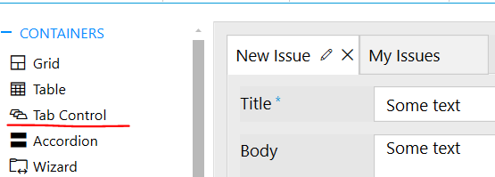

How to add a personal form for creating and tracking tickets to an arbitrary SharePoint page 
=================================================================================================

.. contents:: Contents:
 :local:
 :depth: 1

Introduction
--------------------------------------------------
In this article, I will show you how to design specific form layouts for different user groups and publish them to a SharePoint page located on another site.  

|pic0|

For example, we have an issue processing system. Issue records can be created by any users, but only a support team can process them. For user convenience, we will add an ability to report issues and track their statuses on an intranet page where users spend most of their time.

Creating forms for regular users
--------------------------------------------------
First, we design forms for regular users which do not belong to the support team – New and Edit. 

New Form  
~~~~~~~~~~~~~~~~~~~~~~~~~~~~~~~~~~~~~~~~~~~~~~~~~~
Here, we add a Tab Control with two tabs:  'New Issue' and 'My Issues'.

|pic1|

The 'New Issue' tab will contain a title of an issue – Title and multiline text box for the description - Body.  

In 'My Issues' tab, we will add a List or Library control that displays issues created by the current user. For this, we will first create a list view. Go to the List Settings >> Views >> Create View.  

|pic2|

Name the view 'My Issues', select fields you want to display, and go to the 'Filter' section.   

Add a filter: 'Create By' is equal to [Me]. 

|pic3|

Go back to the designer and configure the Data Source property of the List or Library control to display data from the 'Issues' list using the 'My Issues' view.

|pic4|

To refresh the List or Library control after adding a new issue, we must insert the following code into JS-editor. Replace 'SPDataTable1' with the internal name of the  List or Library control.

.. code-block:: javascript
  
    fd.spSaved(function(result) {  
        fd.control('SPDataTable1').refresh();  
    });  

Edit form
~~~~~~~~~~~~~~~~~~~~~~~~~~~~~~~~~~~~~~~~~~~~~~~~~~

The Edit form for regular users will contain Title, Body, Assigned To, and Due Date in the read-only mode. Disable editing by setting ReadOnly property of fields to True.   

|pic5|

Lastly, we add a Comment field, which is a rich text field with enabled Append Only property, to store discussion in the issue.   

Find more information on |adding discussion to a SharePoint form|.  

Creating forms for support team
-------------------------------------------------- 

Next, we will add separate forms for the support team. They will be able to view all unresolved issues created by any users and edit all their properties including Due Date, Assigned To, and Status. 

To create a separate form set for the support team, click on the plus button next to the default form set.

|pic6|

In the opened window, specify a name of the form set and select SharePoint groups for which forms from the form set will be displayed.  

.. Note:: You can also exclude some SharePoint groups here to prevent users from them to see this form set. 

|pic7|

New form
~~~~~~~~~~~~~~~~~~~~~~~~~~~~~~~~~~~~~~~~~~~~~~~~~~

Here, we also add Tab Control with two tabs: 'New Issue' and 'All Issues'.  

Add Title, Body, Assigned To, Due Date, and Status fields to the first tab. In the 'All Issues' tab, we put a list of all unresoved issues, no matter who created them.  

For this, we create another list view, following the steps described above. Name the view 'All Issues'. In the filter section, set Status field not equal to Solved.  

|pic8|

In Data Source settings of the List or Library control, select the 'Issues' list and its 'All Issues' view in the corresponding properties.     

|pic9|

And we also have to add JavaScript code for refreshing the List or Library control after adding a new issue that I mentioned above.   

Edit from
~~~~~~~~~~~~~~~~~~~~~~~~~~~~~~~~~~~~~~~~~~~~~~~~~~
  
In the Edit form, we add Title, Body, Assigned To, Due Date, and Comments fields. For the support team, all those fields will be editable. 

Adding form to a SharePoint page
-------------------------------------------------- 

Now, we can add our form to an intranet page from another site. 

Navigate to the page, click 'Edit', and add Plumsail Form web part.    

|pic10|

|pic11|

Once the web part added, click Configure and select 'SharePoint' form type.    

In Site URL, specify the SharePoint site where we added the Issues list and select it in the 'List' drop-down.

The form type to display is New in this example.

|pic12|

Once the setup completed, publish the page.

This is how our form looks for the regular users: 

|pic13|

And this is what users from the support team see on the same page: 

|pic14|

.. |adding discussion to a SharePoint form| raw:: html

   <a href="https://plumsail.com/docs/forms-sp/how-to/add-discussion.html" target="_blank">adding discussion to a SharePoint form</a>