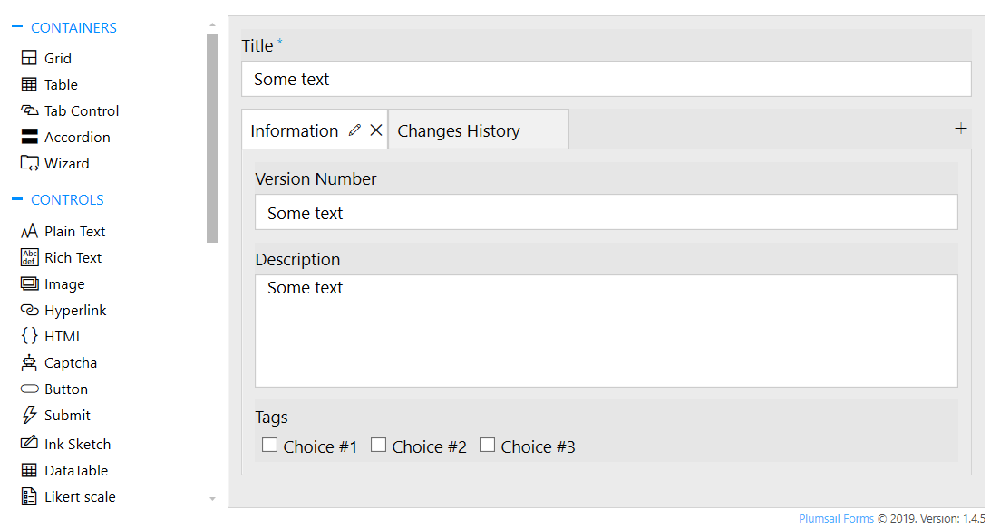
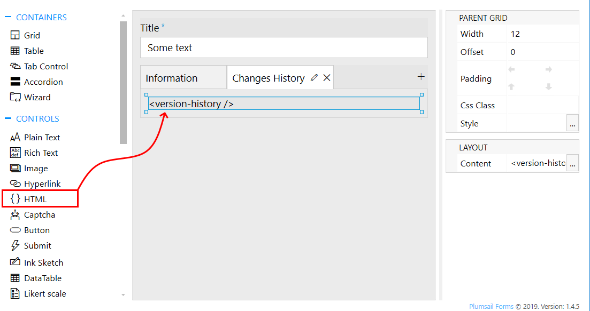
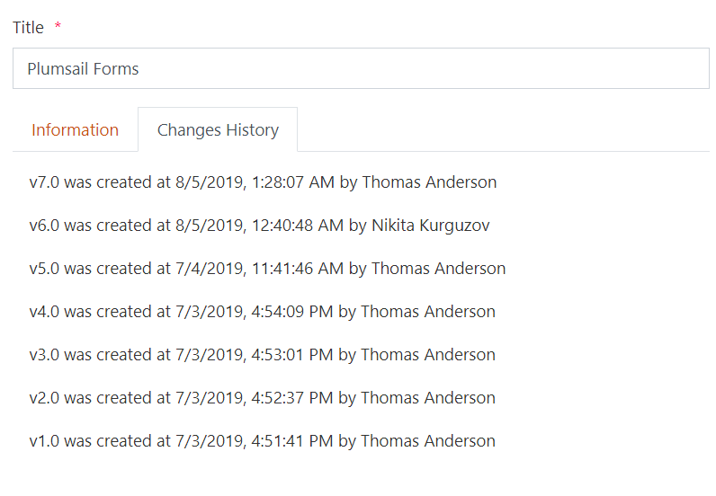
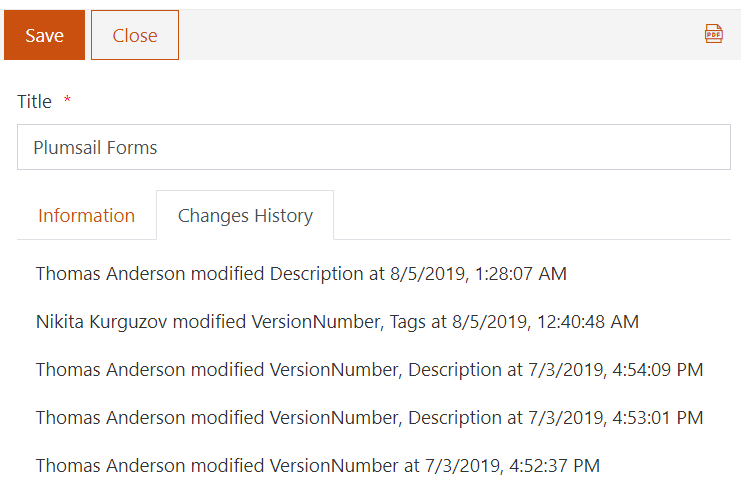

.. title:: Display version history in a SharePoint form

.. meta::
   :description: Track item and specific field changes, as well as users who've added these changes with version history on the form

How to display version history in a SharePoint form
=================================================================================================

.. contents:: Contents:
 :local:
 :depth: 1

Introduction
--------------------------------------------------
In this article, we'll show you a basic example of how to display version history of an item on the form. You will be able to see who and when modified an item.

We're also going to showcase Vue components and their potential use.

Form
--------------------------------------------------
Create your SharePoint form, in this case I've created something simple like this:

|pic1|

I've added Tab Control and placed HTML control on the second tab:

|pic2|

This HTML control is important - it will contain our Version history, I've used the following HTML code:

.. code-block:: HTML

    <version-history />

Copy and paste this code to ensure that the following JS code works for you as well!

Tracking item changes
--------------------------------------------------
Since our forms are built with Vue.js it's possible to create and mount custom components to the form.

For example, this component will detect who and when made changes to the form and display it in our HTML control:

.. code-block:: javascript

    Vue.component('version-history', {
        template: '

v{{entry.version}} was created at {{entry.date}} by {{entry.user}}

',
        data: function() {
            return {
                entries: []
            }
        },
        mounted: function() {
            var self = this;
            var listUrl = fd.webUrl + fd.listUrl;
            var id = fd.itemId;
            pnp.sp.web.getList(listUrl)
                .items
                .getById(id)
                .versions
                .get()
                .then(function(versions){
                    self.entries = versions.map(function(v) {
                        return {
                            version: v.VersionLabel,
                            date: new Date(v.Modified).toLocaleString(),
                            user: v.Editor.LookupValue
                        }
                    })
                });	
        }
    });

If you place this code inside JS editor it will automatically mount the component on form load, getting the result like this:

|pic0|

Tracking field changes
--------------------------------------------------
The following component will check fields for changes, and if any of observed fields had changed - will display so:

.. code-block:: javascript

    var observableFields = ['Title', 'VersionNumber', 'Description', 'Tags'];

    Vue.component('version-history', {
        template: '

{{entry.user}} modified {{entry.fields}} at {{entry.date}}

',
        data: function() {
            return {
                entries: []
            }
        },
        mounted: function() {
            var self = this;
            var listUrl = fd.webUrl + fd.listUrl;
            var id = fd.itemId;
            pnp.sp.web.getList(listUrl)
                .items
                .getById(id)
                .versions
                .get()
                .then(function(versions){
                    var prevValues = {};
                
                    self.entries = versions
                        .reverse()
                        .map(function(v) {
                            var changedFields = [];
                            observableFields.forEach(function (f) {
                                var curValue = JSON.stringify(v[f]);
                                if (prevValues[f] !== curValue) {
                                    changedFields.push(f);
                                    prevValues[f] = curValue;
                                }
                            })
                            
                            if (changedFields.length > 0) {
                                return {
                                    fields: changedFields.join(', '),
                                    date: new Date(v.Modified).toLocaleString(),
                                    user: v.Editor.LookupValue
                                }
                            }
                            
                            return null;
                        })
                        .filter(function(v) { return Boolean(v) })
                        .reverse();
                });	
        }
    });

And here's how it will look like in SharePoint:

|pic3|

