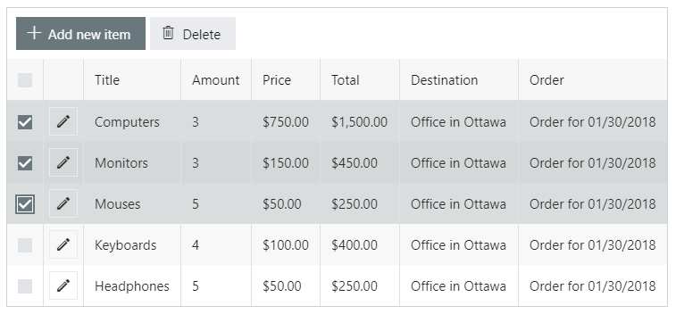

.. title:: Version history of Plumsail Forms for SP Online (Office 365)

.. meta::
   :description: All versions, changes and updates of Plumsail Forms for SharePoint Online are described here

Version history of Plumsail Forms for SharePoint Online (Office 365)
====================================================================================================

v1.8.4
--------------------------------------------------
Minor bug fixes

v1.8.3
--------------------------------------------------
Added responsiveness to the toolbar of List or Library control

Improved the speed of initial rendering of large forms

v1.8.2
--------------------------------------------------
Increased performance of cascading lookups

Added support of dependent lookup fields in edit forms

Added support of classic lists, e.g. Workflow Tasks

Fixed obtaining Plumsail Lookup controls with JavaScript

v1.8.0
--------------------------------------------------
Added :ref:`designer-lookupcontrol` for connecting lists across sites

Aligned numeric columns in Data Tables to the right

Replaced text with checkmarks for boolean columns of Data Tables

.. Note:: :doc:`Update the app package </general/update-package>` for new functionality.

v1.7.8
--------------------------------------------------
Added Hint property to SharePoint fields

Added support of Description and BannerImageUrl of Site Pages library

Added filtering for List or Library by multi-lookup fields

v1.7.7
--------------------------------------------------
Added support of Image fields in SharePoint forms

Fixed auto-adjustment of columns in List or Library control and optimized the performance

v1.7.6
--------------------------------------------------
Added the Height property to List or Library control

Minor bug fixes

v1.7.5
--------------------------------------------------
Added option to configure lookup filtering and cascading lookups without JS code, via new properties.  For more information, refer to our :doc:`Filter lookup fields article <../how-to/lookup-filter>`.

Added multi-choice type column for the Data Table control

Minor bug fixes

v1.7.4
--------------------------------------------------
Added :ref:`designer-stack` container

Added bulk editing for List or Library

Minor bug fixes

v1.7.3
--------------------------------------------------
Added the Alignment property to the Grid container

Minor bug fixes

v1.7.2
--------------------------------------------------
Improved List or Library control Inline editing mode - now the changes are auto-saved when user switches between rows or saves the form. Also, double clicking a row activates editing.

Minor bug fixes

v1.7.1
--------------------------------------------------
Many UI enhancements for the desktop editor - currently selected site URL visible in full when connecting, custom Form Set routing code moved to JavaScript editor, added current List View section to CSS editor, moved Reset button away from Save to form type dropdown, new button to refresh SP fields without reconnecting, and a button to copy Form Set ID, simplified Panel dialog menu by removing List View JS section.

Form panels are enabled by default now.

Minor bug fixes

v1.6.4
--------------------------------------------------
Separate forms are not generated anymore for every form set. A default form resolves the form set now

Performance improvements when opening forms in full-screen mode

Fixed a bug with multilingual sites when users with different languages had to design forms separately

.. Note:: :doc:`Update the app package </general/update-package>` for new functionality.

v1.6.1
--------------------------------------------------
Advanced controls for :ref:`designer-currency` fields in SharePoint forms

Minor bug fixes

v1.6.0
--------------------------------------------------
Added an ability to import forms designed with Forms Designer for Office 365

Minor bug fixes

v1.5.9
--------------------------------------------------
Steps in Wizard container can now be re-organized with drag-n-drop

Performance and stability improvements

Minor bug fixes

v1.5.8
--------------------------------------------------
UI improvements

v1.5.7
--------------------------------------------------
Added an ability to :doc:`customize columns </how-to/list-or-library-columns>` in List or Library controls.

v1.5.6
--------------------------------------------------
Added an ability to open documents from List or Library in desktop apps, depending on the library configuration.

Added aligning options of choice fields (radio buttons and checkboxes).

Minor bug fixes.

v1.5.5
--------------------------------------------------
Minor bug fixes

UI and performance improvements

v1.5.3
--------------------------------------------------
Improved JS and CSS editors: added suggestions of fields, controls, and containers.

Global JS and CSS editors now open in full window, and form can still be saved.

v1.5.2
--------------------------------------------------
List or Library control now supports grouping and aggregation.

Minor bugfixes.

v1.4.8
--------------------------------------------------
Added new features to DataTable control.

Minor bugfixes.

v1.4.6
--------------------------------------------------
Fixed an issue with support of multilingual sites.

Minor bugfixes.

v1.4.5
--------------------------------------------------
Updated **List or Library** control - now you can select a **Content Type** of a new item in the List or Library control or create a folder.

Added **fd.messages** property to customize message text with JS API.

Minor bugfixes.

v1.4.4
--------------------------------------------------
Updated **List or Library** control - now you can select multiple elements, as well as configure buttons with :ref:`JS API updates<javascript-listorlibrary>`.

|multiple|

v1.4.3
--------------------------------------------------
Added List View :ref:`field customizers<save-fieldcustomizers>` for Ink Sketch, DataTable and Likert Scale controls. Fields will automatically show rendered in List View.

.. Note:: :doc:`Update the app package </general/update-package>` for new functionality.

v1.4.1
--------------------------------------------------
Added :doc:`a new web part</designer/web-part>` allowing users to publish a SharePoint form (from any site within the tenant) or a public form to any SP page. 
The only requirement is that a user must have appropriate permissions to the target list.

.. Note:: :doc:`Update the app package </general/update-package>` for new functionality.

Internal names equal to titles for Common Fields by default.

A :ref:`new variable<designer-hostvar>` available in custom routing, so you can route to a certain form set depending on where the form is opened - in a regular page, in panel, or in a user web part.

v1.3.9
--------------------------------------------------
Dutch language support.

Paste images from clipboard to SharePoint Rich Text fields.

Simplified provisioning API

v1.3.8
--------------------------------------------------
List or Library: now supports uploading files with drag-n-drop.

Switched to single part app pages for publishing forms.

API improvements: unified API for SP and common choice fields.

Minor bugfixes.

v1.3.7
--------------------------------------------------
Added support of Location field.

Various bugfixes.

v1.3.6
--------------------------------------------------
Added read-only mode for Likert Scale control.

Fixed issues with Lookup and	Person or Group field.

v1.3.5
--------------------------------------------------
Improved usability of a Single Choice Lookup field.

Added support of multi-lingual sites in Forms.

.. Note:: :doc:`Update the app package </general/update-package>` for new functionality.

v1.3.4
--------------------------------------------------
Optimized retrieving data in Inline Editing mode of List or Library

Added support of Content type column in Inline Editing mode of List or Library

v1.3.3
--------------------------------------------------
Updated :ref:`designer-listorlibrary` control - added an option for Inline Editing, without the need to open dialog window.

Updated Lookup field JS API to allow better filtering on search.

v1.3.2
--------------------------------------------------
SharePoint Fields **ID**, **Created By**, **Created**, **Modified By**, **Modified** can be added to the form, just like any other fields.

Plain Text and Rich Text controls now support display of SharePoint Fields, for example: *Current item #[ID] has been created by [Author]*. Simply place field's [Internal Name] in square brackets.

Simplified URL generation for SharePoint Forms, now using query string for parameters, instead of the hash. Allows linking to specific Form Sets and fixes issues with linking forms in IE. Need to :doc:`update the app package </general/update-package>` for the URL generation to update.

Various bug fixes

v1.3.1
--------------------------------------------------
Added ability to open forms in :doc:`Dialog Mode </javascript/dialog>`

Reworked field controls

Added option to set Ink Sketch and DataTable controls to ReadOnly mode,
if their data is saved to SharePoint field

Optimized performance

v1.2.2
--------------------------------------------------
Descriptions now will display for all SharePoint fields

Fixed issues with IE11 support

Fixed minor styling issues

v1.2.1
--------------------------------------------------
Updated date and time picker for SharePoint forms

Toggle button for SharePoint Yes/No field

Added more responsiveness to Date and Numeric controls

Support of uploading large files with the List or Library control

Fixed an issue with attaching files with special characters in file names, e.g. ampersands, to SharePoint Forms

v1.2.0
--------------------------------------------------
Added ability to :doc:`customize toolbar and buttons</javascript/toolbar>`.

v1.1.9
--------------------------------------------------
:ref:`designer-wizard` container has been added.

Several bug fixes.

v1.1.8
--------------------------------------------------
:ref:`designer-likert` control has been added.

v1.1.7
--------------------------------------------------
Forms now support Native Office 365 authentication.

Tabs and Accordion Panels can now be dragged-and-dropped in the designer - inside the container to switch places, 
to another container of the same type or even outside on the form to create a new container.

v1.1.6
--------------------------------------------------
Ink Sketch and Data Table controls can now be saved to a hidden SharePoint field.

v1.1.5
--------------------------------------------------
:doc:`SharePoint Form Panel </designer/panel>` functionality added.

v1.1.4
--------------------------------------------------
Added Export to PDF button.

DataTable has received :ref:`a new property<designer-datatable>` - New Line(Top or Bottom).

Minor bug fixes.

v1.1.3
--------------------------------------------------
SharePoint :ref:`designer-lookup` field has received an upgrade.

v1.1.0
--------------------------------------------------
Added theme support for Public Web Forms.

v1.0.9
--------------------------------------------------
Added advanced :ref:`designer-customrouting` to Modern SharePoint Forms.

v1.0.7
--------------------------------------------------
Added automatic routing to SharePoint :doc:`Form Sets </designer/form-sets>` based on the user's groups.

Added :doc:`theme support </designer/themes>` for Modern SharePoint Forms.

v1.0.5
--------------------------------------------------
Added :ref:`designer-listorlibrary` control - allows editing items or documents in related SharePoint Lists or Document Libraries.

Fixed default width of titles for vertically-oriented fields.

Fixed activation of Site Pages feature.

Fixed .NET framework prerequisites check.

Other minor bug fixes.

v1.0.4
--------------------------------------------------
Added a drop-down column type to DataTable.

Improved JS-framework: added *'ready'* event to User and Content Type SharePoint fields, *'disabled'* property to Data Tables.

Minor bug fixes.

v1.0.3
--------------------------------------------------
:ref:`designer-datatable` is added.

Minor bugfixes.

v1.0.2
--------------------------------------------------
:ref:`designer-captcha` is added.

v1.0.1
--------------------------------------------------
Initial release.