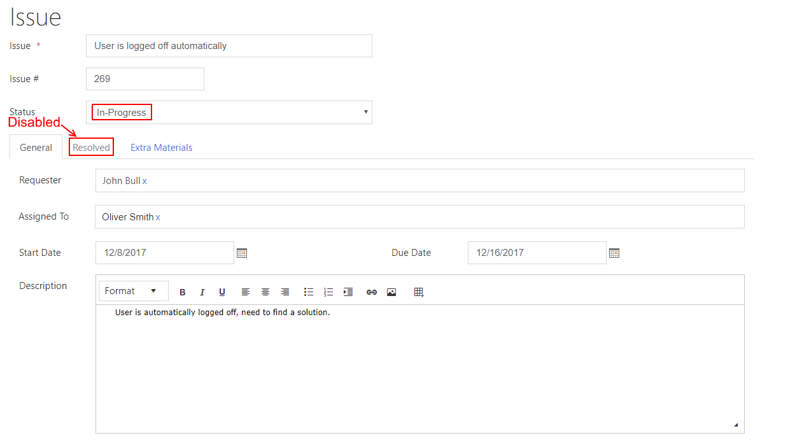
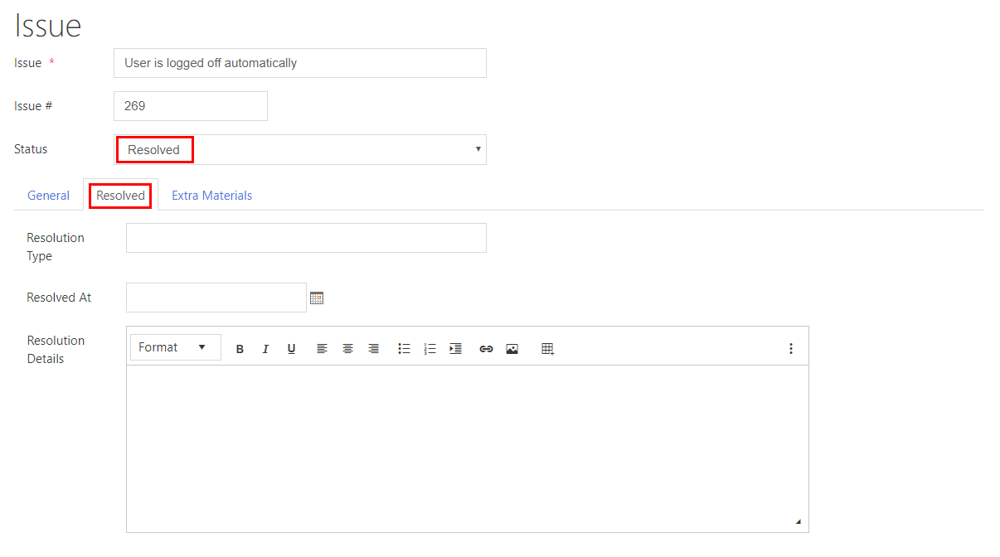
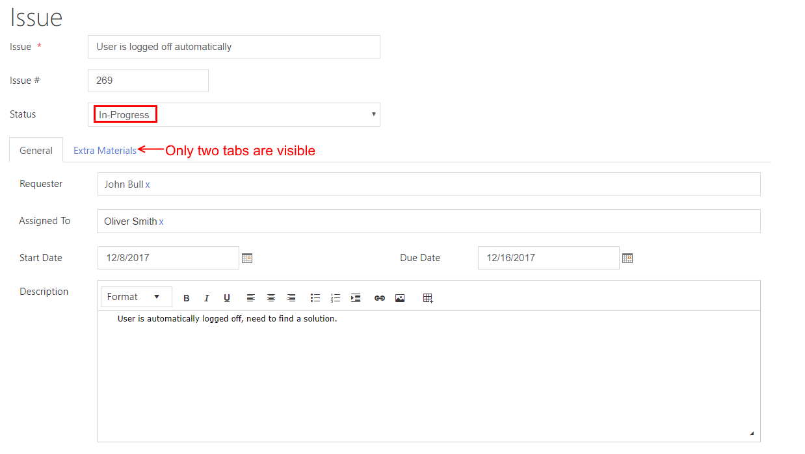
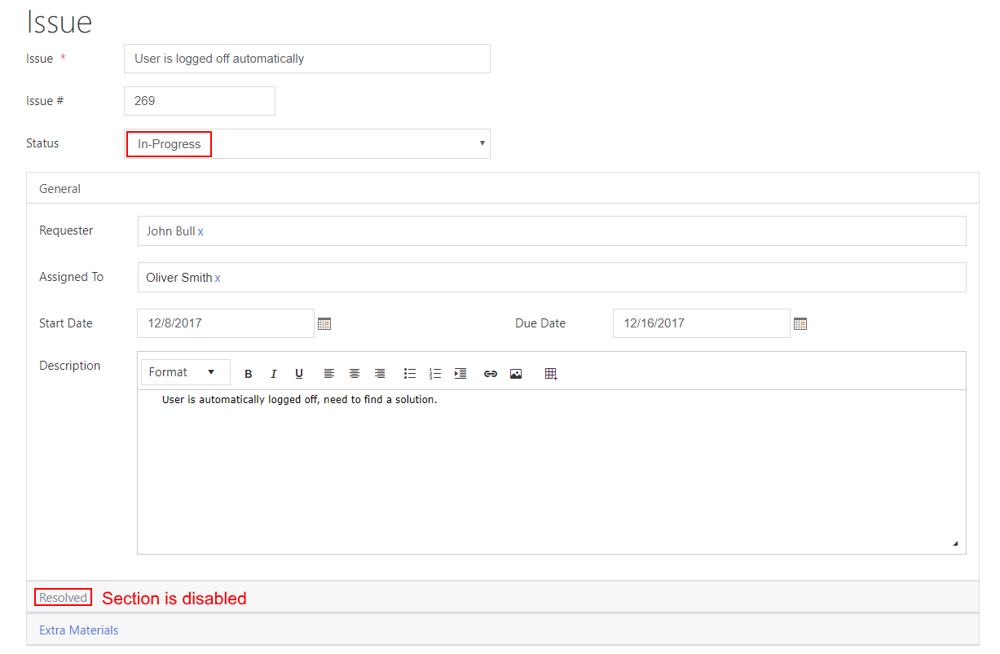
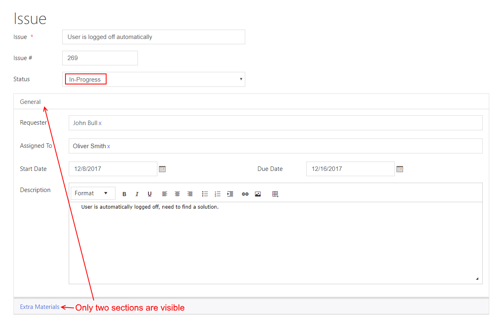

Manipulate tabs and accordions with JavaScript
==================================================

.. contents:: Contents:
 :local:
 :depth: 1

Description
--------------------------------------------------
In this article you can find examples of how to use JavaScript to make 
your SharePoint forms more interactive by hiding, showing and modifying containers, particularly Tab Control and Accordion.

This article will include some simple and easy to understand cases which can then be used as templates for your forms.

You can find similar examples for manipulating fields in this :doc:`article </how-to/conditional-fields>`.

Disable/hide tabs based on condition
--------------------------------------------------
Let's say we have a form for an issue the employee is working on. It's divided into tabs with various pieces of information.

Among these tabs, there is one called Resolved, where we have fields that need to be filled once the issue is resolved.

It makes no sense for this tab to be available at all times, so we can disable it and only make clickable once the issue gets a "Resolved" status.

Here is our form with tabs:

.. image:: ../images/how-to/conditional-containers/TabsForm.png
   :alt: Tabs Form

|

Let's disable Resolved tab and make it's only enabled when the field Status has value "Resolved" with this code:

.. code-block:: javascript

    fd.spRendered(function() {

        function enableOrDisableResolvedTab() {
            if (fd.field('Status').value == 'Resolved') {
                // Show the tab number 1, in our case Resolved
                fd.container('Tab0').tabs[1].disabled = false;
            } else {
                // Hide the tab number 1, in our case Resolved
                fd.container('Tab0').tabs[1].disabled = true;
            }
        }
        
        // Calling enableOrDisableResolvedTab when the user changes the Status
        fd.field('Status').$on('change',enableOrDisableResolvedTab);

        // Calling enableOrDisableResolvedTab on form loading
        enableOrDisableResolvedTab();

    });

Here's the result and as you can see Resolved tab is grayed out and it cannot be selected:

|

Now, if we select Status "Resolved", it can be selected once again:

|

You can also hide Resolved tab with a little bit of CSS which will hide all the disabled tabs:

.. code-block:: css

    .tabset .disabled{
	    display: none; /* disabled tabs don't show up */
    }

Now the user won't even see the tab until the Status is "Resolved":

|

Disable/hide Accordion sections based on condition
--------------------------------------------------
Let's implement the same functionality, but this time for Accordion. Same form and fields, but instead of Tabs container, we have Accordion.

Here is our form with Accordion:

.. image:: ../images/how-to/conditional-containers/AccordionForm.png
   :alt: Accordion Form

|

Let's disable Resolved section and make it's only enabled when the field Status has value "Resolved" with this code:

.. code-block:: javascript

    fd.spRendered(function() {

        function enableOrDisableResolvedSection() {
            if (fd.field('Status').value == 'Resolved') {
                // Show the tab number 1, in our case Resolved
                fd.container('Accordion0').$children[1].disabled = false;
            } else {
                // Hide the tab number 1, in our case Resolved
                fd.container('Accordion0').$children[1].disabled = true;
            }
        }
        
        // Calling enableOrDisableResolvedSection when the user changes the Status
        fd.field('Status').$on('change',enableOrDisableResolvedSection);

        // Calling enableOrDisableResolvedSection on form loading
        enableOrDisableResolvedSection();

    });

As you can see, it's fairly similar, but we need to access Accordion's children instead of tabs.

Here's the result and as you can see Resolved tab is grayed out and it cannot be selected:

|

Resolved section can also be hidden just like a tab with a little bit of CSS which will hide all the disabled tabs:

.. code-block:: css

    .accordion .disabled{
	    display: none; /* disabled tabs don't show up */
    }

Now the user won't even see the section until the Status is "Resolved":

|

Switch to the next tab on button click
--------------------------------------------------
In case you have rather large tabs and Orientation is set to Top, users might have a hard time scrolling to the top each time one tab is filled.

As a solution, we can add buttons to our tabs at the bottom right and left corner to switch to next or previous tab when clicked.

As for code, it will be fairly simple.

Place this code inside OnClick setting for the Next Tab button:

.. code-block:: javascript

    fd.container("Tab0").nextTab();

Place this code inside OnClick setting for the Previous Tab button:

.. code-block:: javascript

    fd.container("Tab0").previousTab();

That's it, you just need to make sure that the InternalName of your Tabs container is correct and this should work.

