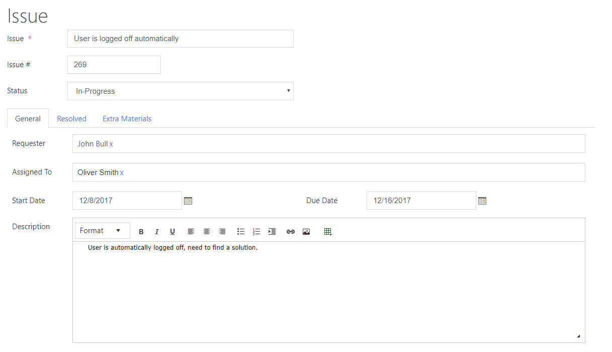
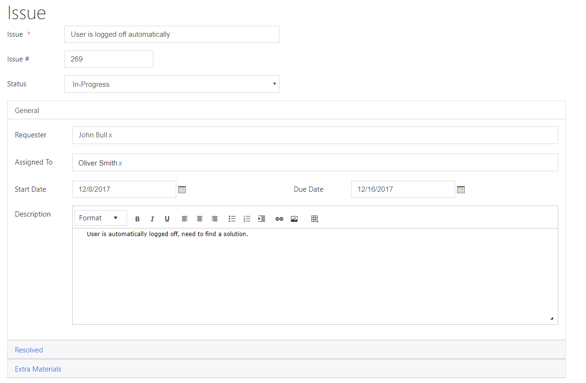
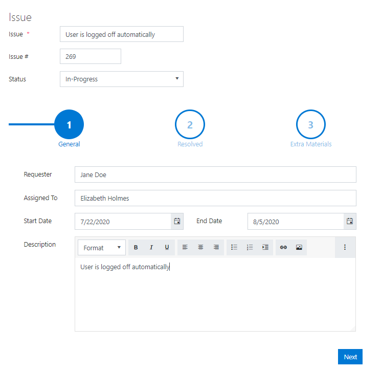

.. title:: Manipulate containers using JS on Plumsail Forms for SharePoint

.. meta::
   :description: How to hide, show and modify containers, particularly Tab Control, Accordion and Wizard, with JavaScript.
   :keywords: javascript tabs, javascript wizard, hide steps, accordion tabs

How to change, disable, or hide specific tabs, accordion sections or wizard steps based on conditions in Plumsail Forms
==========================================================================================================================

.. contents:: Contents:
 :local:
 :depth: 2

Introduction
--------------------------------------------------
In this article you can find examples of how to use JavaScript to make 
your SharePoint forms more interactive by hiding, showing and modifying containers, particularly Tab Control, Accordion and Wizard.

This article includes some simple and easy to understand cases which can then be used as templates for your forms.
You can find similar examples for manipulating fields in this :doc:`article </how-to/conditional-fields>`.

Let's say we have a form for an issue the employee is working on, and we divide various pieces of information using containers.

Tab control
--------------------------------------------------

Here is our form with tabs:

|

Disable & hide tabs
~~~~~~~~~~~~~~~~~~~~

*Resolved* tab stores fields that an employee needs to fill out after he completes the task. It makes no sense for this tab to be available at all times, so we can disable it and only make clickable once the issue status is changed to 'Resolved' using this code:

.. code-block:: javascript

    fd.spRendered(function() {

        function enableOrDisableResolvedTab() {
            if (fd.field('Status').value == 'Resolved') {
                //enable the second tab, in our case Resolved tab
                fd.container('Tab0').tabs[1].disabled = false;
            } else {
                //disable the second tab, in our case Resolved tab
                fd.container('Tab0').tabs[1].disabled = true;
            }
        }
        
        //call enableOrDisableResolvedTab when a user changes the status
        fd.field('Status').$on('change',enableOrDisableResolvedTab);

        //call enableOrDisableResolvedTab on form load
        enableOrDisableResolvedTab();

    });

|

Moreover, you can hide disabled tabs with CSS:

.. code-block:: css

    .tabset .disabled{
	    display: none; /* hide disabled tabs */
    }

Switch to tab
~~~~~~~~~~~~~~~~~~~~

Also, we can set the active tab programmatically. For instance, we can make *Resolved* tab active once the issue gets a 'Resolved' status with this code:

.. code-block:: javascript

    //switch between tabs when a user changes the status
    fd.field('Status').$on('change',function(value){
            if(value == 'Resolved') {
                //setting the second tab as active
                fd.container('Tab0').setTab(1);
            }
            esle {
                //setting the first tab as active
                fd.container('Tab0').setTab(0);
            }
    });

Or we can add buttons to our tabs to switch to the next or previous tab when clicked. That will make it easier for users to switch between tabs when they contain a lot of content, and Tab container orientation is set to 'top'.

Place this code inside 'Click' setting for the *Next Tab* button:

.. code-block:: javascript

    fd.container("Tab0").nextTab();

And this code for the *Previous Tab* button:

.. code-block:: javascript

    fd.container("Tab0").previousTab();

|

Accordion
--------------------------------------------------
Let's implement the same functionality, but this time for Accordion container.

Here is our form with Accordion:

|

Disable & hide section
~~~~~~~~~~~~~~~~~~~~~~~

Let's disable *Resolved* section and make it  enabled only when the status is set to 'Resolved' with this code:

.. code-block:: javascript

    fd.spRendered(function() {

        function enableOrDisableResolvedSection() {
            if (fd.field('Status').value == 'Resolved') {
                //enable the second section, in our case Resolved
                fd.container('Accordion0').$children[1].disabled = false;
            } else {
                //disable the second section, in our case Resolved
                fd.container('Accordion0').$children[1].disabled = true;
            }
        }
        
        //call enableOrDisableResolvedSection when a user changes the status
        fd.field('Status').$on('change',enableOrDisableResolvedSection);

        //call enableOrDisableResolvedSection on form load
        enableOrDisableResolvedSection();

    });

|

*Resolved* section can also be hidden just like a tab with CSS:

.. code-block:: css

    .accordion .disabled{
	    display: none; /* hide disabled sections */
    }

|

Expand/collapse section
~~~~~~~~~~~~~~~~~~~~~~~~~~~

In case you want to expand *Resolved* section once the issue gets a 'Resolved' status, you can use the following code:

.. code-block:: javascript

    fd.field('Status').$on('change',function(value){
            //expand the second section, in our case 'Resolved', when the status is changed to 'Resolved'
            if(value == 'Resolved') {
                fd.container('Accordion0').$children[1].open = true;
            }
    });

|

Wizard
--------------------------------------------------

We can divide information using Wizard container and show/hide steps dynamically.

Here is our form with Wizard:

Hide/Show step
~~~~~~~~~~~~~~~~~~~~~~~~~~~

Let's hide *Resolved* step and show it only when the issue status is set to 'Resolved' using this code:

.. code-block:: javascript

    function hideShowResolvedStep(resolvedTab) {
        if (fd.field('Status').value == 'Resolved' && resolvedTab !== null) {
            //show the second step, in our case Resolved
            fd.container('Wizard0').widget.tabs.splice(1, 0, tab2);
        } 

        if(fd.field('Status').value != 'Resolved') {
            //hide the second section, in our case Resolved
            fd.container('Wizard0').widget.tabs.splice(1, 1);
        }
    }

    fd.spRendered(function() {

        var resolvedTab = fd.container('Wizard0').widget.tabs[1];
        
        //call hideShowResolvedStep when a user changes the status
        fd.field('Status').$on('change',function() {
            hideShowResolvedStep(resolvedTab);
        });

        //call hideShowResolvedStep on form load
        hideShowResolvedStep(resolvedTab);

    });

Switch to step
~~~~~~~~~~~~~~~~~~~~~~~~~~~

We can navigate from one step to another using the code. For instance,  open *Resolved* step when the issue status is changed to 'Resolved'.

.. code-block:: javascript

    fd.field('Status').$on('change',function(value){
            //open the second step, in our case 'Resolved', when the status is changed to 'Resolved'
            if(value == 'Resolved') {
                //that doesn't trigger validation
                fd.container('Wizard0').widget.changeTab(0,1);
            }
    });