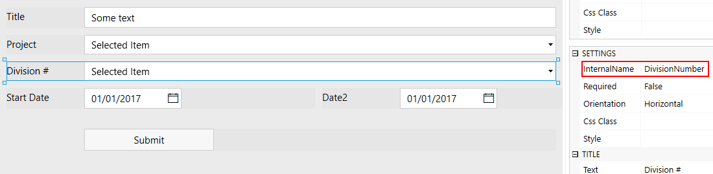
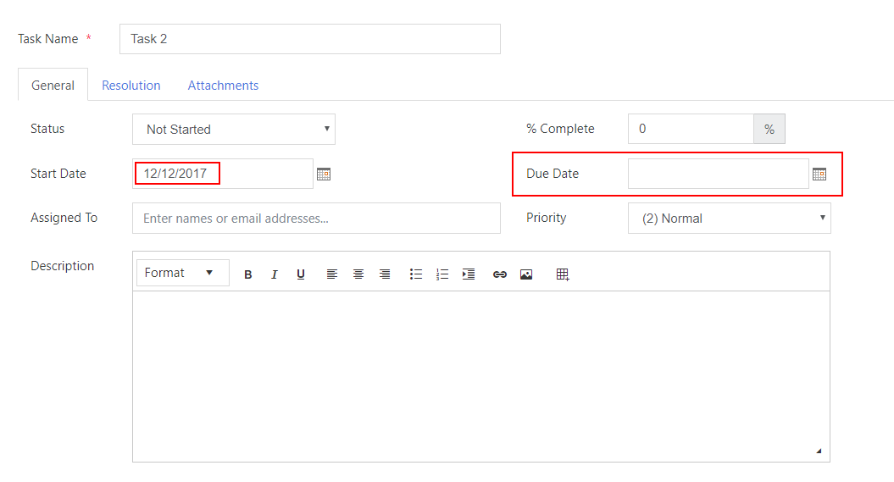
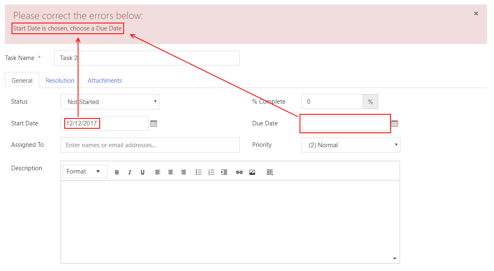
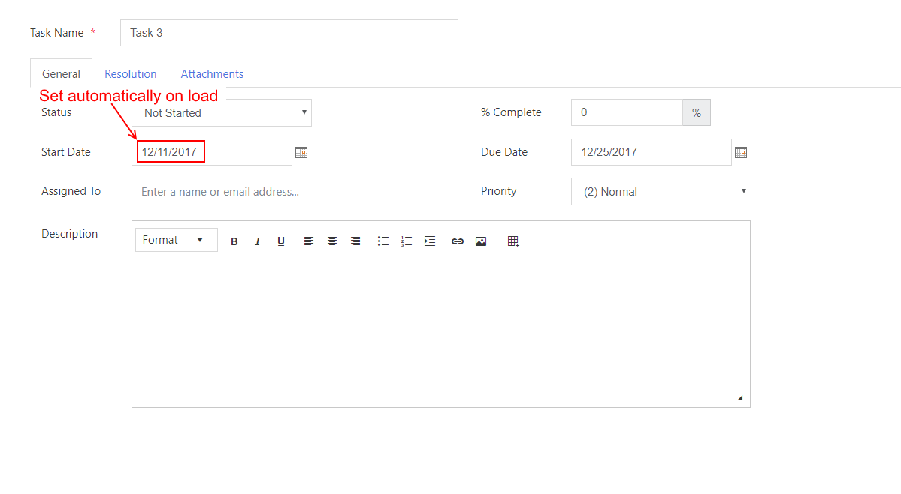

.. title:: Work with fields using JS on Plumsail Forms for SharePoint

.. meta::
   :description: How to populate, hide, show, disable, make required and modify fields, on various events, with custom conditions using JavaScript

How to populate, hide, disable, or make mandatory SharePoint form fields in JavaScript
======================================================================================================

In this article you can find examples of how to use JavaScript to make 
your forms more interactive by hiding, disabling and making fields mandatory based on certain conditions.
These will be simple and popular cases realized mostly with SharePoint forms which you can easily replicate even on Plumsail forms as functionality is fairly similar.
You can also mix and match these examples to achieve the results you are looking for.

In order to access fields in JavaScript, you'll need use **fd.field()** method of which expects an internal name of a field you want to retrieve.
Both Plumsail fields and SharePoint fields have internal name property which is unique for every field on the form. 
Find more about using JavaScript on fields :doc:`here </javascript/fields>`.

|

You can give custom name to Plumsail fields, but SharePoint fields have their own names given by SharePoint. 
In any case, you can check the internal name property of the field in the designer when you select the field.
Read more about different field properties :doc:`here </designer/fields>`.

Another thing to be aware of is that you shouldn't simply place JavaScript inside the editor on its own, it must be executed inside **fd** events 
like **spRendered()** or **spBeforeSave()** in order to actually access the fields or controls that you target.

If you just add these scripts on their own or inside wrong event in JavaScript editor,
they will not have access to the specified fields, or will execute at the wrong time.
Read more about different events in :doc:`Manager section </javascript/manager>`.

.. contents:: Contents:
 :local:
 :depth: 1

Prepopulate field and disable/enable it based on condition
-----------------------------------------------------------
In this example, we will use SharePoint Tasks list to set the Percent Complete to 100% 
and disable it when the user turns the Status field into Completed:

|

Please note, that while SharePoint Online Modern UI doesn't support Tasks lists, our SharePoint Forms will work just fine.

In order to implement this functionality, we place the following code into JavaScript editor inside the designer:

.. code-block:: javascript
    
    fd.spRendered(function() {

        function setPercentComplete() {
            if (fd.field('Status').value == 'Completed') {
                // Setting the Percent Complete to 100
                fd.field('PercentComplete').value = '100';
            
                // Setting field PercentComplete to read-only state
                fd.field('PercentComplete').disabled = true;
            } else {
                // Setting field PercentComplete to read-only state
                fd.field('PercentComplete').disabled = false;
            }
        }
        
        // Calling setPercentComplete when the user changes the status
        fd.field('Status').$on('change',setPercentComplete);

        // Calling setPercentComplete on form loading
        setPercentComplete();

    });

Hide/show field or set of fields conditionally
--------------------------------------------------
What if some field is only needed when a certain condition is met? For example, we might not need to have Due Date field if Start Date is empty.

|

In order to achieve that, we will need to have a function which will hide Due Date if Start Date is empty.

This function will execute when the form is rendered, so it hides Due Date by default, and then run each time there is a change to Start Date. 
As soon as the Start Date is changed and no longer empty, it will display the Due Date field:

|

Here is the code:

.. code-block:: javascript

    fd.spRendered(function() {

        function hideOrShowDueDate() {
            if (fd.field('StartDate').value) {
                // Show the Due Date field
                $(fd.field('DueDate').$parent.$el).show();
            } else {
                // Hide the Due Date field
                $(fd.field('DueDate').$parent.$el).hide();
            }
        }
        
        // Calling hideOrShowDueDate when the user changes the Start Date
        fd.field('StartDate').$on('change',hideOrShowDueDate);

        // Calling hideOrShowDueDate on form loading
        hideOrShowDueDate();

    });

If you want to hide several fields, there are several things you can do. 

The easiest would be to give same CSS class to all fields that need to be hidden, for example, **field-to-hide**. Then use JQuery to hide them all:

.. code-block:: javascript

    fd.spRendered(function() {

        $('.field-to-hide').hide();

    });

Another alternative would be to place all fields inside a Container, for instance, inside a Grid, and give this grid its own CSS class **grid-to-hide**.
Then also use JQuery to hide the container:

.. code-block:: javascript

    fd.spRendered(function() {

        $('.grid-to-hide').hide();

    });

Require field based on condition
--------------------------------------------------
In order to make certain fields required based on condition, you need to add custom Form validator to your form.

Field validators will only work with Plumsail fields as all validation for SharePoint fields is configured via List Settings.

For example, for our task list, we can write a validator to make sure that if the Start Date is set, 
the Due Date must be set to a later date, but not more than 4 weeks.
Our validator will also give a custom error in each case.

|

If conditions are satisfied, it will return true and allow us to save the form with appropriate End Date.

Here is the code:

.. code-block:: javascript

        fd.validators.push({
	        name: 'DueDateValidator',
	        error: "Error text will change dynamically",
	        validate: function(value) {
	            if (fd.field('StartDate').value) {
	                    var startDate = fd.field('StartDate').value;
	                    var endDate = fd.field('DueDate').value;
	                    //initiating max End Date
	                    var maxEndDate = new Date();
	                    //setting max end date to 28 days more than start date
	                    maxEndDate.setDate(startDate.getDate() + 28);
	                    if (!endDate){
	                        this.error = "Start Date is chosen, choose a Due Date";
	                        return false;
	                    } else if (endDate < startDate){
	                        this.error = "Due Date can't be before the Start Date";
	                        return false;
	                    } else if (endDate > maxEndDate){
	                        this.error = "Due Date can't be more than 4 weeks away from the Start Date";
	                        return false;
	                    }
	                }

	            return true;
            }
        });

Form validators are a property of the **fd** manager and you can read about its various properties, methods and events :doc:`here </javascript/manager>`.

In order to minimize amount of times wrong value can be entered in Due Date field, 
we can also set default value of Due Date to be 2 weeks away from the start date:

|

For that, we can slightly modify code from the last section:

.. code-block:: javascript

    fd.spRendered(function() {

        function setDueDate() {
            if (fd.field('StartDate').value) {
                var startDate = fd.field('StartDate').value;
                //initiating due date variable
                var dueDate = new Date();
                //setting due date variable to 14 days more than start date
                dueDate.setDate(startDate.getDate() + 14);
                //setting Due Date field
                fd.field('DueDate').value = dueDate;
            }
        }
        
        // Calling setDueDate when the user changes the Start Date
        fd.field('StartDate').$on('change',setDueDate);

    });

Prepopulate fields on Form load
--------------------------------------------------
This functionality is fairly simple.

Since we've already been working with Dates, let's define Start Date as soon as the form loads:

|

Here's the code:

.. code-block:: javascript

    fd.spRendered(function(vue) {
            fd.field('StartDate').value = new Date();
    });

If we keep our code from the previous section, *change* event will automatically react and 
set Due Date to two weeks after today as it will react to all changes to Start Date, not just direct user input.

Modify fields with Button control
--------------------------------------------------
Button and Hyperlink controls have an Click property which holds JavaScript code which is executed when the control is clicked.

This can be used for variety of purposes and you don't need to include JavaScript inside **fd** events 
as by the time the button has loaded, other fields have already loaded as well.

In our example, we will do something slightly less orthodox as I want to demonstrate how you can tie an async request to another API using JavaScript.

We will use Plumsail Form as an example to automatically fill in information about client on the click of the button. 

|ipinfo.io| API will help us determine person's location and IP.

.. |ipinfo.io| raw:: html

   <a href="https://ipinfo.io/" target="_blank">ipinfo.io</a>

That's what our form will look like filled out:

.. image:: ../images/how-to/conditional/10_ButtonIP.png
   :alt: Button fills out Location and IP

|

Here is the code placed inside my button's Click property:

.. code-block:: javascript

    $.get("https://ipinfo.io", function (response) {
	    fd.field('Location').value = response.city + ", " + response.region;
	    fd.field('IP').value = response.ip;
    }, "jsonp");

Get values on display forms
--------------------------------------------------
Last thing I want to focus your attention on is differences between display and edit or new forms. 
Display forms don’t contain controls, so you can retrieve only the text representation of field values like you see them on a form. 
The samples above work on new and edit forms only. 

You can access fields' data from fd.data() using field's Internal Names, like this:

.. code-block:: javascript

    var title = fd.data().Title;