.. title:: PDF document from SharePoint form based on Word template

.. meta::
   :description: How to convert form data to PDF using Plumsail Forms, DOCX template, Power Automate and Word Online (Business) connector

Create PDF document from SharePoint form based on Word template with Power Automate and Word Online (Business) connector 
==========================================================================================================================

From this article, you will learn how to create a PDF file from a Word document template using Word Online (Business) connector in Power Automate (MS Flow). 

By way of example, we will set up a flow that populates a DOCX template with data from SharePoint lists, converts it to PDF, and saves the resulting file to a SharePoint document library.  

As a result, we will get a PDF document as below generated based on data from two linked SharePoint lists - Work Order and its assignments.

|pic1|

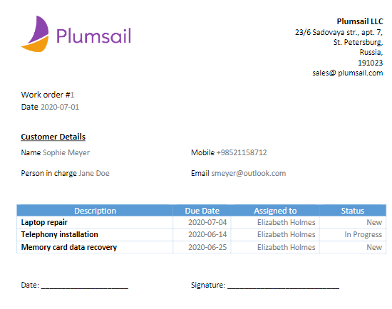

.. contents:: Contents:
 :local:
 :depth: 1

Form 
--------------------------------------------

First, we create two SharePoint lists: 

- Work Order;  

- Assignments.  

Work Order list stores primary information about customers and persons in charge. The list has the following fields: 

- CustomerName (Lookup field, points to the list of the customers); 

- CustomerEmail (Single line text field); 

- CustomerMobile (Single line text field); 

- ResponsiblePerson (Person or Group field); 

- Date (Date and Time field).  

Assignments list stores granular tasks of the corresponding Work Order. The list has the following fields: 

- Description (Single line text field); 

- AssignedTo (Person or Group field);  

- DueDate (Date and Time field);  

- Status (Choice field); 

- WorkOrder (Lookup field, points to the 'Work Order' list).  

Work Order consists of one or more assignments. To bind Assignments list to the Work Order form, we will use the *List or Library* control.  

Please find more information about the *List or Library* control and setup instructions in :doc:`Create forms with related items or documents</how-to/child-parent-form>` article.  

We design a simple Edit and New forms for both lists. And this is how our Work Order form looks like: 

|pic2|

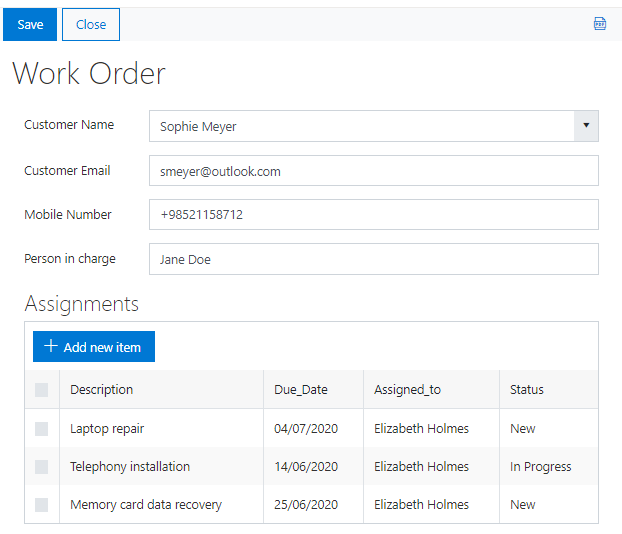

DOCX Template 
--------------------------------------------

First, we need to design a document and arrange placeholders that will be replaced with data from the SharePoint lists in our flow. As placeholders, use content controls which are available in the Developer tab in Microsoft Word. For instance, for a single text field, add Plain Text content control: 

|pic3|

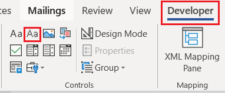

.. Note:: If you don't see the Developer tab, go to the File tab → Options → Customize Ribbon. Under Main Tabs, select the Developer checkbox. 

Each content control must have a unique name that will be used in the flow. In order to assign a name to control, select the control, and go to the Developer Tab → Controls → Properties. 

|pic4|

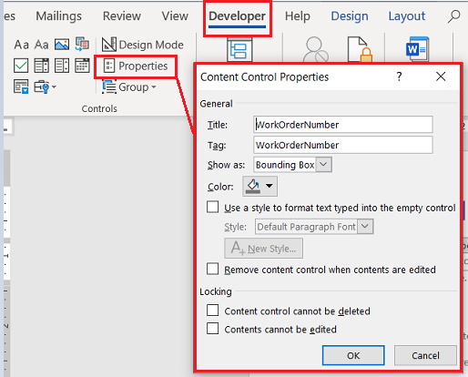

Add Repeating Content Control for the list of assignments. For this, select the entire table and click Repeating Section Content Control in the Developer tab. Give the control a unique name.  

|pic5|

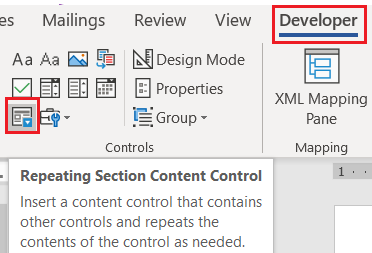

You can download the Work Order template |here|. 

We save DOCX template to the SharePoint document library, but it can be also stored in OneDrive. 

Flow 
--------------------------------------------

Let's move on to creating the flow.  

Go to *My flows* and click *+ New* → *Automated-from blank*:

|pic6|

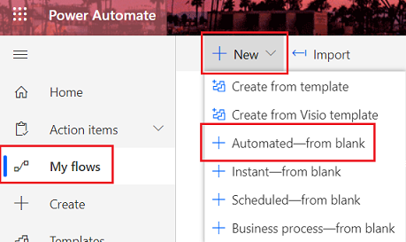

In the pop-up dialog, in *Choose your flow's trigger* field, search for SharePoint item and add *SharePoint Item - When an item is created*: 

|

|pic7|

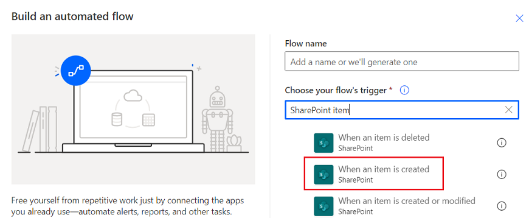

|

Name the flow and click create.  

These are the steps that we use in our flow. Let's take a closer look at each step.  

|

|pic8|

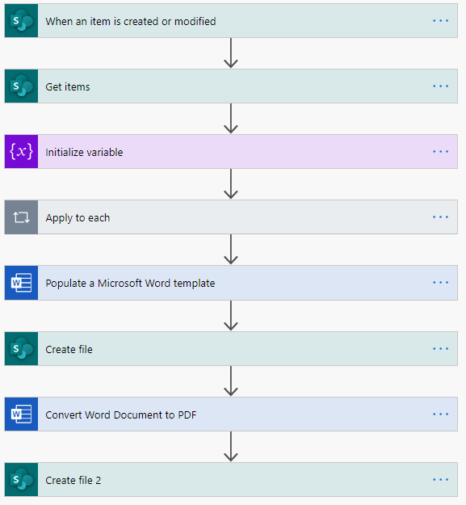

|

**1. When an Item is created or modified**

Here we generate a PDF file after creating a new Work Order record, but you can use any other trigger. 

Enter the URL of the SharePoint site and select the list name. 

|pic9|

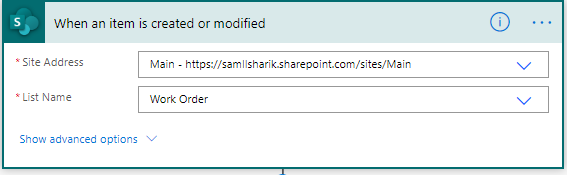

|

**2. Get Items**

Next, we need to get items from the Assignments lists.  

To obtain items that are related to the current work order only, we specify filtration by WorkOrder in the 'Filter Query'.

|pic10|

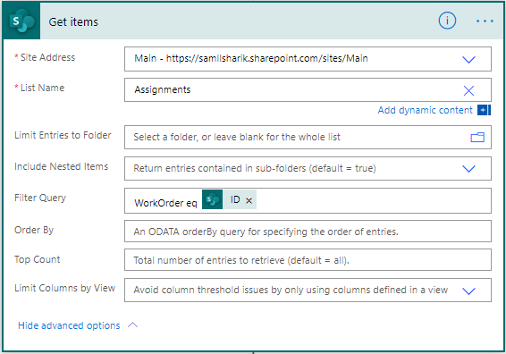

|

**3. Initialize Variable**

We initialize an array variable for storing the assignments. It will be used for populating the repeating section of the Word template later. 

|pic11|

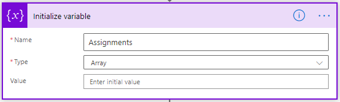

|

**4. Append to array**  

Next, we populate the array with the data from the Assignments list. 

Add the 'Apply to each' action for iterating through the SharePoint items. Insert the 'Append to array variable' action inside. Choose the variable name from the drop-down. In the value section, map SharePoint field names to the control names of the repeating section from the DOCX template. 

|pic12|

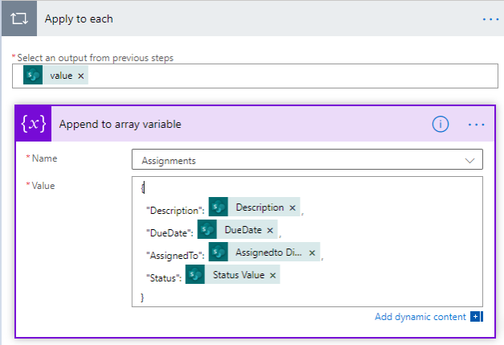

.. Note:: Status is a Choice field. To get the value of the Choice field as a string, please choose the 'Status Value'  in the dynamic content.
    
    |pic13|

    .. |pic13| image:: ../images/how-to/create-pdf-power-automate/create-pdf-power-automate-13.png

.. Note:: AssignedTo is a Person or Group field. To get the name of the person, please choose the 'Assignedto DispalyName'  in the dynamic content. 
    
    |pic14|

    .. |pic14| image:: ../images/how-to/create-pdf-power-automate/create-pdf-power-automate-14.png

|

**5. Populate a Microsoft Word Template**

Add 'Populate a Microsoft Word template' action and specify path to the DOCX template. Once the template is specified, you will see the entire content controls from it. Populate them with the corresponding field values. For the repeating section, select the 'Assignments' array.     

|pic15|

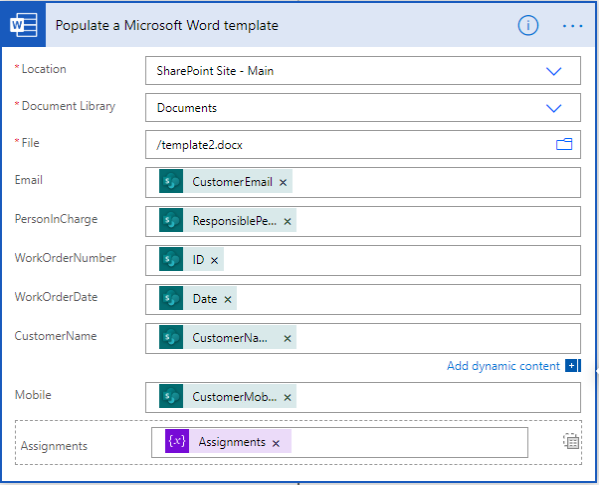

.. Note:: CustomerName is a Lookup field. To get the value of the Lookup field as string, choose the 'CustomerName Value'  in the dynamic content. 
    
    |pic16|

    .. |pic16| image:: ../images/how-to/create-pdf-power-automate/create-pdf-power-automate-16.png

|

**6. Create File from Microsoft Word documents**

Next, add the 'Create file' action. Specify the file name. You can combine it from the text and field values. Here, we use ID of the Work Order item. In the File Content, select the dynamic content from the 'Populate a Microsoft Word template' step. 

|pic17|

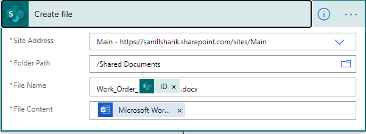

|

**7. Convert Word Document To PDF**

Now that we have a populated Word document, we can use the 'Convert Word Document to PDF' action to convert the file to PDF. Specify name of the Word document in the 'File'.  

|pic18|

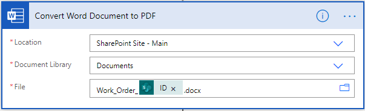

|

**8. Create a PDF file**

Finally, we need to save a result from the previous step to a PDF file. Here, we save it to SharePoint library but you can use any other location e.g. One Drive, Google Drive, or send as email attachment.  

Specify the file name with the proper 'pdf' extension and insert output from the previous step in the File Content. 

|pic19|

|

Conclusion
--------------------------------------------

Use this approach for building complex PDF documents based on custom templates. If you need to save a form as it appears in the browser to PDF with just minor adjustments, use :doc:`save to PDF feature</how-to/export-to-pdf-setup>` of Plumsail Forms. 

.. |here|  raw:: html

   <a href="..\_static\downloads\create-pdf-power-automate\work_order_template.docx" target="_blank" download>here</a>

