.. title:: Generate PDF from DOCX template with Plumsail Processes

.. meta::
   :description: Learn how to populate a DOCX template with data from two linked SharePoint lists and convert it to PDF using Plumsail Processes in Power Automate (MS Flow).
   :keywords: SharePoint forms to pdf, fillable pdf, pdf to docx

Create PDF document from SharePoint form based on Word template with Power Automate and Plumsail Processes 
==========================================================================================================================

The PDF file format is one of the most common file formats in use today for exchanging and distributing documents. 

From this article, you will learn how to populate a DOCX template with data from two linked SharePoint lists and convert it to PDF with the help of |Plumsail Processes| in Power Automate (MS Flow). The instructions below will help you automate the process of the generation of different documents like orders, invoices, inquiries, contracts, etc.

By way of example, we will set up a process that creates a signed work order document and saves the result document to SharePoint library.

.. contents:: Contents:
 :local:
 :depth: 1

SharePoint Form 
--------------------------------------------  

We have already designed a work order form, here it is: 

|pic01|

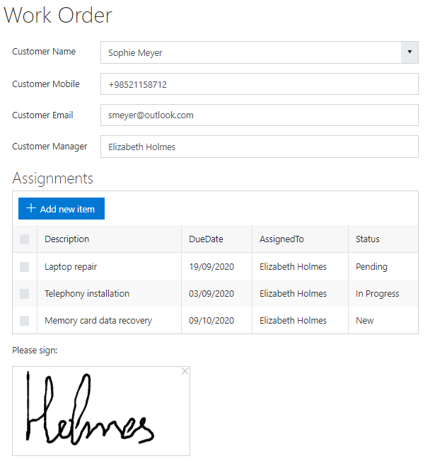

Work order can consist of one or more assignments, that is why we created two lists: 

- Work Order; 
- Assignments.   

'Work Order' list stores primary information about customers and persons in charge. The list has the following fields: 

- CustomerName (Lookup field, points to the list of the customers); 
- CustomerMobile (Single line text field); 
- CustomerEmail (Single line text field); 
- CustomerManager (Person or Group field); 
- Signature (Multiline Plain Text field, stores the data of Ink Sketch control). 

'Assignments' list stores granular tasks of the corresponding Work Order. The list has the following fields: 

- Description (Single line text field); 
- AssignedTo (Person or Group field); 
- DueDate (Date and Time field); 
- Status (Choice field); 
- WorkOrder (Lookup field, points to the 'Work Order' list). 

To bind 'Assignments' list to the work order form, we utilized the List or Library control.   

Find more information about the |List or Library control| and setup instructions in :doc:`Create forms with related items or documents</how-to/child-parent-form>` article. 

Also, we added |Ink Sketch control| to the form to obtain a signature of the customer's manager and save it to the 'Signature' field.  

DOCX Template 
-------------------------------------------- 

We are moving on to creating the Plumsail Word DOCX template. You can download our template |here|.  

|pic02|

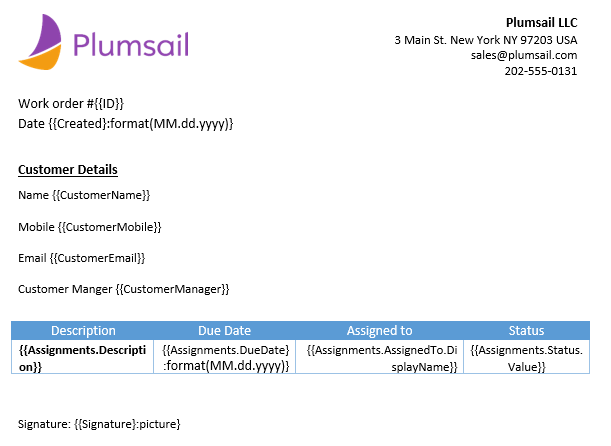

Plumsail Processes uses a minimal amount of syntax that facilitates the process of preparing a DOCX template. 

In brief, everything between curly **{{ }}** brackets is variables that will be replaced with data from the SharePoint list. For instance, **{{CustomerName}}** will be replaced with the name: Sophie Meyer. 

The list of assignments may have indefinite number of rows. For populating the table, we need to put all assignments into an array. For each entry of the array, a separate row will be created in the resulting document. 

To get specific values of items from the array, we add tags to the table with the following structure: **{{ArrayName.FieldInternalName}}**.    

For instance, to get the description of the assignment, we add this tag: **{{Assignments.Description}}**  

.. Note:: If a field value stores an object, use the dot operator to get a property from the object. For instance, to get a display name of a user that is selected in 'AssignedTo' field, use this tag: **{{Assignments.AssignedTo.DisplayName}}**

Also, you can format a tag value. For instance, in our template, we format date tags like this: **{{Created}:format(MM.dd.yyyy)}** 

You can find more about formatters |here1|.  

Last but not least, we will display the manager's signature on the document. The Ink Sketch control picture stores as a base64 string. To insert a base64 string to the document and then display it as a picture, we use this tag: **{{Signature}:picture}**

You can find more information on how to insert pictures in DOCX templates |here2|. 

Process (Plumsail Documents)
-------------------------------------------- 

Let's get started on setting up the process. 

To create a new process, go to the |Processes section| in your Plumsail account. 

|pic03|

Click on the 'Add process' button. 

|pic04|

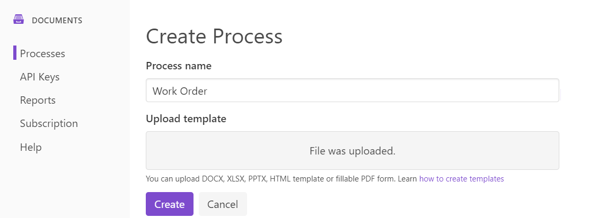

Press the 'Create' button, and you’ll proceed to the next step – *Configure Template*: 

Fill in 'Output filename' and select PDF as the output type.

|pic05|

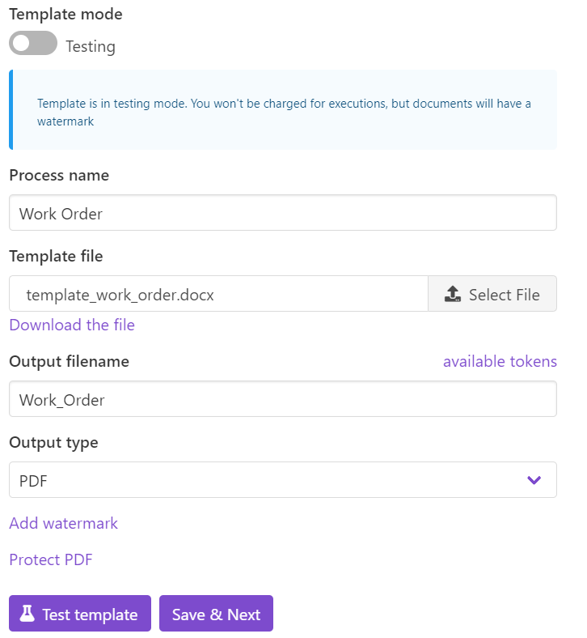

Press the 'Save & Next' button, and you’ll proceed to the final step – *Delivery*. 

Choose 'SharePoint - Save the result documents to SharePoint library' from the list of connectors. 

|pic06|

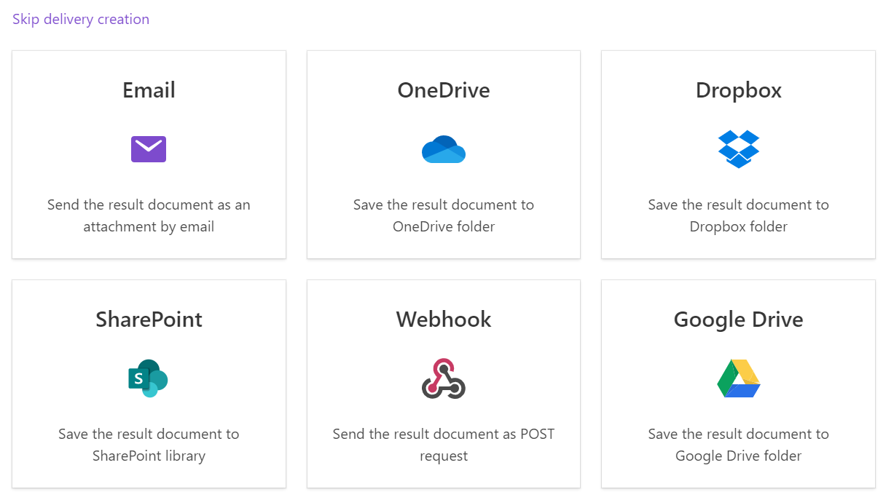

Specify your SharePoint site URL and press 'Connect'. Select the library where you want to save the resulting document and press 'Save & Next'.

|pic07|

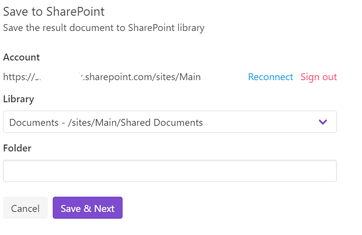

The Process is ready and we move on to creating the flow. 

Flow (MS Power Automate) 
--------------------------------------------  

Go to 'My flows' and click '+ New' → 'Automated-from blank':

|pic08|

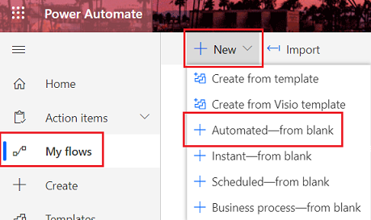

In the pop-up dialog, in 'Choose your flow's trigger' field, search for SharePoint item and add 'SharePoint Item - When an item is created':

|pic09|

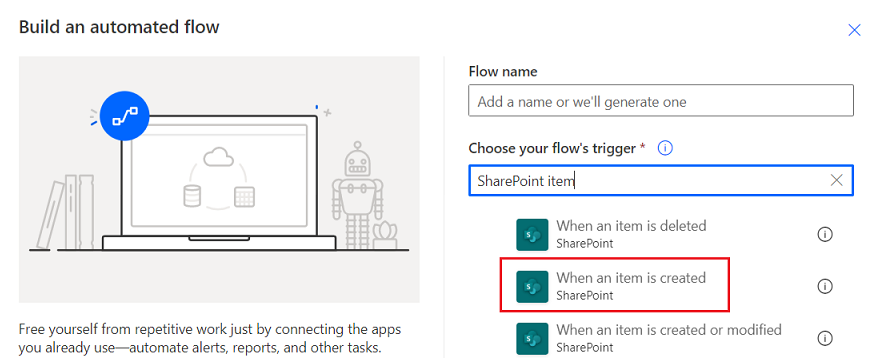

Name the flow and click 'Create'. 

These are the steps that we use in our flow. 

|pic10|

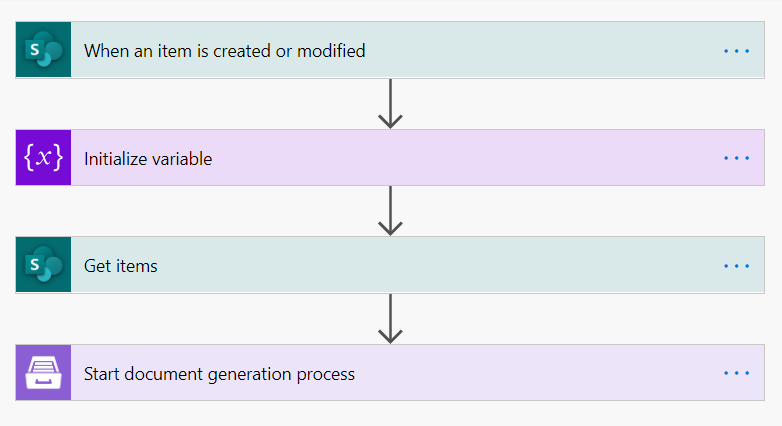

Let's take a closer look at each step. 

1. **When an Item is created or modified**

The flow starts when an item is created or modified in 'WorkOrder' list. You can use any other trigger to start the flow. 

|pic11|

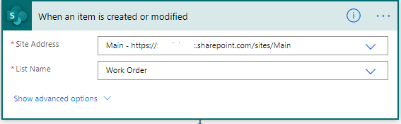

2. **Initialize variable**

The Ink Sketch control stores the data in quotation marks. In order to remove them, we add the 'Initialize variable' step. 
Name the variable and set its type to 'String'. Then, add an expression to the value parameter: 
**replace(triggerBody()['Signature'],'"', '')**

|pic12|

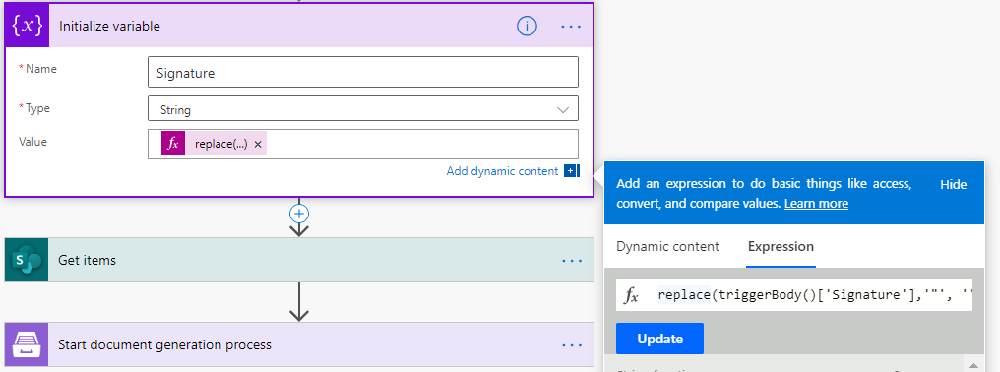

3. **Get Items**

Next, we need to get items from the 'Assignments' lists. 

To obtain items that are related to the current work order only, we specify filtration by WorkOrder in the 'Filter Query'. 

|pic13|

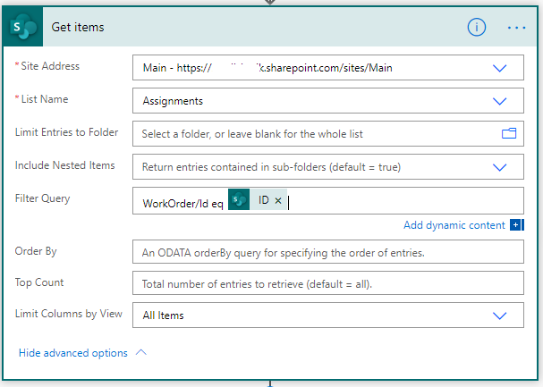

4. **Start document generation process**  

Finally, we set up the step that starts the Plumsail Process. Find the instruction on how to use Plumsail Documents connector in Power Automate |here3|. 

In the 'Template data' parameter, we bind data to the template in JSON format. 

|pic14|

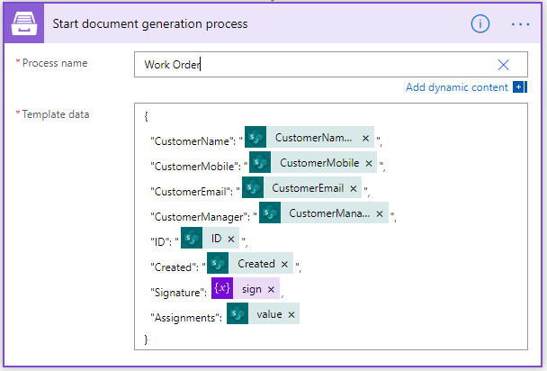

And now our flow is ready to use! 

Conclusion 
-------------------------------------------- 
This is the resulting document generated based on our template with the help of Plumsail Documents and MS Power Automate:  

|pic15|

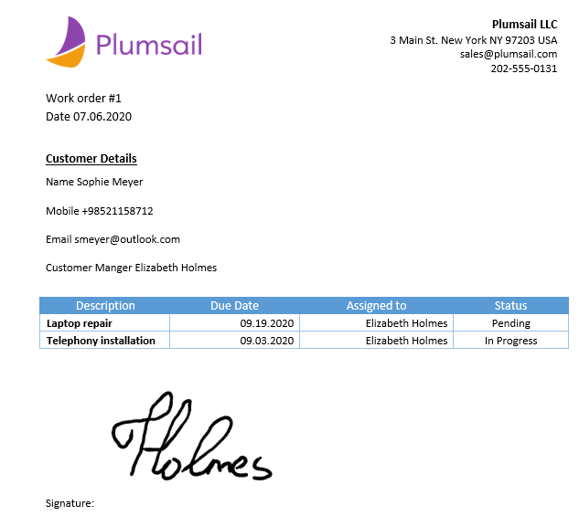

.. |Processes section|  raw:: html

   <a href="https://account.plumsail.com/documents/processes" target="_blank">Processes section</a>

.. |here3|  raw:: html

   <a href="https://plumsail.com/docs/documents/v1.x/getting-started/use-from-flow.html" target="_blank">here</a>

.. |here2|  raw:: html

   <a href="https://plumsail.com/docs/documents/v1.x/document-generation/docx/pictures.html" target="_blank">here</a>

.. |here1|  raw:: html

   <a href="https://plumsail.com/docs/documents/v1.x/document-generation/common-docx-xlsx/formatters.html" target="_blank">here</a>

.. |here|  raw:: html

   <a href="..\_static\downloads\create-pdf-processes\create-pdf-processes-template.docx" target="_blank" download>here</a>

.. |Ink Sketch control|  raw:: html

   <a href="https://plumsail.com/docs/forms-sp/designer/controls.html#ink-sketch" target="_blank">Ink Sketch control</a>

.. |List or Library control|  raw:: html

   <a href="https://plumsail.com/docs/forms-sp/designer/controls.html#list-or-library" target="_blank">List or Library control</a>

.. |Plumsail Processes|  raw:: html

   <a href="https://plumsail.com/docs/documents/v1.x/user-guide/processes/index.html" target="_blank">Plumsail Processes</a>

