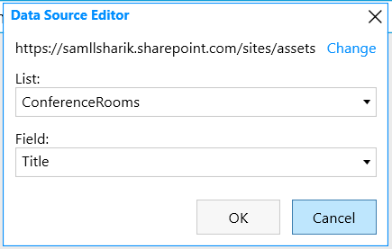
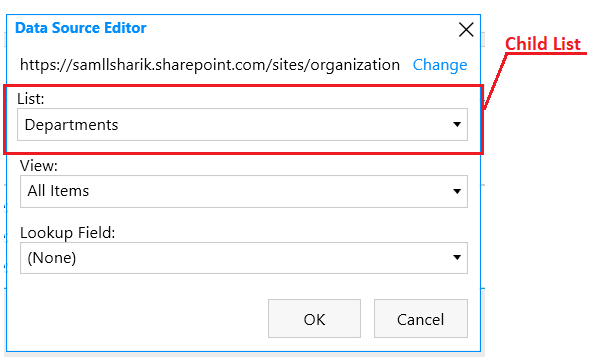
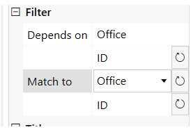

.. title:: Cross-site Lookup for SharePoint forms

.. meta::
   :description: How to link lists across different SharePoint sites using Lookup control of Plumsail Forms
   
How to link lists across different sites using Lookup control
=============================================================================

.. raw:: html

    

      <iframe src="https://www.youtube.com/embed/_jdBG0MGgWk" frameborder="0" allow="accelerometer; autoplay; encrypted-media; gyroscope; picture-in-picture" allowfullscreen></iframe>
   

|

Lookup control allows you to link lists across different sites and even site collections. The control has the same functionality as SharePoint lookup field. You can:

- search through available values;

- allow adding new items to the source list;

- filter and create cascading dropdowns;

- display related items from another site linked via Lookup control with List or Library control.
 
Selected data for this control is stored in a regular text field and rendered as a lookup field in a list view. 

.. contents::
 :local:
 :depth: 2

Configuration
-------------------------------

Data Source
~~~~~~~~~~~~~~~~~~~~

In order to select a data source for the Lookup control, go to control's properties: General → *Data Source*. 

|

First, you need to specify the site URL where the source list is located. You can select any site or site collection within your tenant.

|

After clicking the checkmark button, all lists and libraries from the selected site will be loaded. 

Then, select the source list and the field that will be shown in the control. 

|

Save to
~~~~~~~~~~~~~~~~~~~~

Since it’s a control and not a SharePoint column, its value should be saved to a SharePoint single-line text field.

In the control's properties: General → *Save to*, click *+ Add New* to create a SharePoint column to store the value of the control.

|

In a list view, the column is rendered as a regular lookup field with the help of a field customizer. 

By clicking on the value, you can open a display form of the selected item in a separate tab. 

|

Other properties
~~~~~~~~~~~~~~~~~~~~

Using other control properties, you can:

- Сonfigure how the search within the control is handled - **Operator** property

- Allow users to add new values to the source list - **Add New** property

- Select fields from the source list that also need to be loaded - **Extra Fields/Expand** properties.

|

You can learn more about all available properties in the control description :ref:`here <designer-lookupcontrol>`.

List or Library control
-------------------------------
Lookup control is also supported by List or Library control. Thus, you can design a form with a list of related items from another site. 

In List or Library control, the column that stores lookup control value is also rendered as a regular SharePoint lookup field, both in a dialog and in inline editing mode, and has the same functionality.

|

Bind two lists on different sites
~~~~~~~~~~~~~~~~~~~~~~~~~~~~~~~~~~~~~~~~

Add a Lookup control to your form and select a list from another site as its *Data Source*. 

Create a new field for storing data in the *Save To* property. Save the form and navigate to the source list. 

Display related items on a form
~~~~~~~~~~~~~~~~~~~~~~~~~~~~~~~~~~~~~~~~

Add a List or Library control to the source list form and specify the list where we've just configured the cross-site lookup control as its *Data Source*. 

|

From *Lookup Field* dropdown select the field where the Lookup control value is stored.

This way, only related items will be displayed on the form and new items will be automatically bound to the parent item.

You can find more information on designing a form with the related items in our documentation :doc:`here <./child-parent-form>`.

|

Filtration
--------------

As it is for the SharePoint field, you can configure filtration of items available in the Lookup control. This can be done using  *Depends on/Match to* properties and using JavaScript for creating more complex filter conditions.

Depends on/Match to
~~~~~~~~~~~~~~~~~~~~

With these properties, you can filter lookup values by Single Line text and Choice fields, and also by single value Lookup or Person fields.
You can find instructions on how to configure filtration by different field types in :doc:`this article <./lookup-filter>`.

For instance, you can create cascading dropdowns which source lists are stored on another site.

Let’s say, Office and ConferenceRoom lists are located on the same site - Assets. The conference rooms are linked to the offices using a regular lookup field. 
On the form, the list of conference rooms should be filtered by the selected office.

First, add two Lookup controls to the form. Name controls accordingly: Office and ConferenceRoom.

|

Select a data source for both controls.

|

Next, go to ConferenceRoom control properties: General → *Depends on* property, select the Office lookup control. 

|

Then, in the *Match to* property, select the Office field from the source list. It’s best to match lookups by ID.

|

And this is how it works on the form:

|

Programmatic filtration 
~~~~~~~~~~~~~~~~~~~~~~~~~

Use JavaScript to create more complex filter conditions.

.. note::   Regular fields are reachable via **fd.field()** method but since the Lookup control is not a field, use **fd.control()** for getting it in your code.

For instance, create static filtration of lookup values by two fields.

.. code-block:: javascript

   fd.spRendered(function () {
      fd.control('Lookup0').filter;
      //Show only active items which Title starts with 'A'
      fd.control('Lookup0').filter = " startswith(Title, 'A') and Status eq 'Active' "
   });

Or allow users to search within two fields dynamically.

.. code-block:: javascript

   fd.spRendered(function() {
      //search within Title and Status
      fd.control('Lookup0').filter = function(filter) {
         var search = encodeURIComponent(filter);
         return filter
               ? "substringof('" + search + "', Title) or substringof('" + search + "', Status)"
               : '';
      }
      fd.control('Lookup0').useCustomFilterOnly = true;
   });
