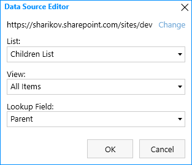
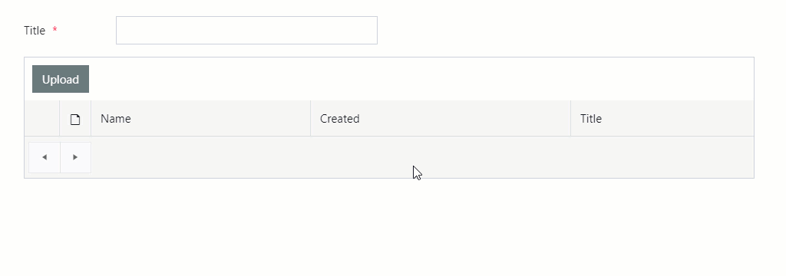

Update uploaded files (List or Library)
=======================================================

.. contents:: Contents:
 :local:
 :depth: 1

Description
--------------------------------------------------
Sometimes, when working with List or Library control, you might want to automatically populate certain values for newly uploaded documents. 

If you've selected Lookup field in Data Source, this field is populated automatically by default:

|pic1|

Other fields are not, and you might want to specify certain properties for the uploaded documents, take it from the current form or make some additional requests with JS.

In this article, I will show you how this can be achieved.

Example
--------------------------------------------------
For Document Library, you can detect when files are uploaded, retrieve their IDs and use them to modify the documents right after they were uploaded.

Simply use the following code:

.. code-block:: javascript

    fd.spRendered(function() {
        fd.control('InternalName').$on('filesUploaded',
            function(itemIds) {
                //get document library by Title
                var library = pnp.sp.web.lists.getByTitle('Documents');
                //go through each uploaded Item Id and set field values
                library.getListItemEntityTypeFullName().then(function(entityTypeFullName){

                    var batch = pnp.sp.web.createBatch();
                    
                    for(var i = 0; i < itemIds.length; i++){
                        library.items.getById(itemIds[i]).inBatch(batch).update({
                            Title: fd.field('Title').value
                        }, "*", entityTypeFullName);
                    }

                    batch.execute().then(function(){ 
                        fd.control('InternalName').refresh();
                    });
                });    
            });
    });

And here is the result:

|pic2|

For more information, check out **pnpjs** documentation on |working with SharePoint items|.

.. |working with SharePoint items| raw:: html

    <a href="https://pnp.github.io/pnpjs/sp/docs/items/" target="_blank">working with SharePoint items</a>
