Generate PDF from DOCX template and SharePoint form fields
==========================================================

.. contents:: Contents:
 :local:
 :depth: 1
 
Description
--------------------------------------------------
In this example, you will find a step-by-step instruction on how you can create Work Order Form from the template and send its PDF version to a specific email.  

|pic0|

.. |pic0| image:: ../images/how-to/docx-to-pdf/how-to-docx-to-pdf-0.png
   :alt: result file

We are going to do this with the help of: 

- |Plumsail Forms| 
- |Plumsail Documents| 
- Simple code 

Form
--------------------------------------------------

We will create 2 SharePoint Lists: 

- Work Order (parent) 
- To-do (child) 

The Work Order List will store the information about the customer and the list of tasks. To bind the task list to the Work Order form we will use :doc:`List or Library </how-to/list-or-library-section>` control. 

.. Note:: For more information about the control, please refer to :doc:`Create and bind associated items or documents on Modern SharePoint Forms </how-to/child-parent-form>` article.  

In this example the To-do List has the following fields: 

- Description (text field) 
- Due date (date field) 
- Assigned To (choice field) 
- Status (choice field) 
- Work_order_id (lookup value referred to the "Work Order" list) 

We are going to create simple New and Edit forms for our tasks with all the fields, excluding **Work_order_id** field - it will get set automatically, and we don’t want users to change it manually. 

|pic1|

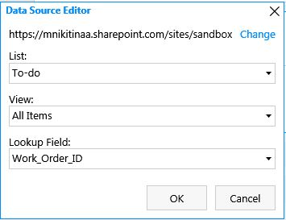

The Work Order List Edit form will have an option to send the result as PDF file to a specific email. For this, we will add Send PDF field (Yes/No) and an Email field (Single line).  

In addition, we want the Email field to be disabled if the checkbox is unchecked. The following code will do the job. 

.. code-block:: javascript

    function updateEmailAvailability() { 
        if (fd.field('SendPDF').value) { 
            // Setting field Email as editable 
            fd.field('Email').disabled = false; 
        } else { 
            // Setting field Email as read-only 
            fd.field('Email').disabled = true; 
        } 
    } 
    fd.spRendered(function() { 

        // Calling updateEmailAvailability when the user changes Send PDF field 
        fd.field('SendPDF').$on('change',updateEmailAvailability); 

        // Calling updateEmailAvailability on form loading 
        updateEmailAvailability(); 
    });     

We also add List or Library control to the form, where in Data Source we specify the Child list, View and Lookup filed. Editing property should be set to "Dialog". 

As a result, the Edit Form is ready and looks something like this. 

|pic2|

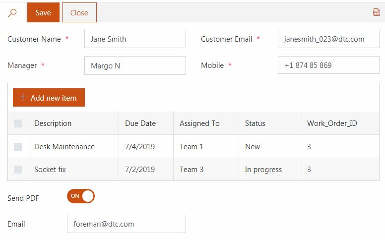

DOCX Template
--------------------------------------------------

We need to create the DOCX template.

|pic3|

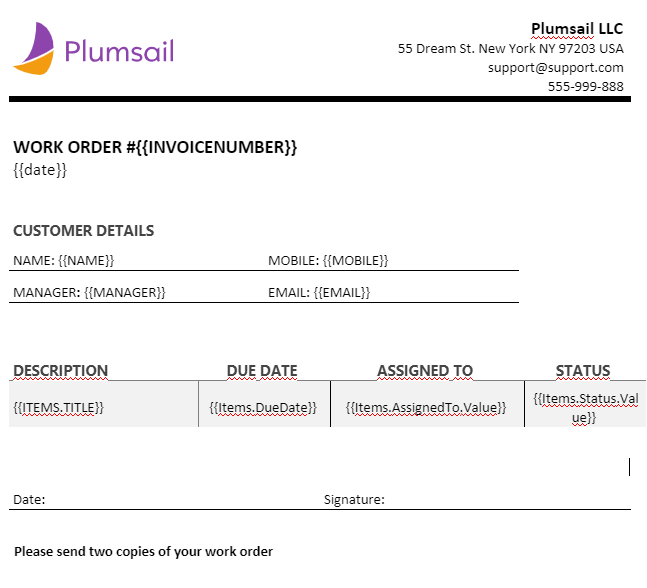

In the template we will specify the variables in braces {{ }}, for example **{{InvoiceNumber}}**. And in the flow, in *Create DOCX from Template* action will set variables with the values.

In the table, as we want to get repeating data, we will use the following construction **{{Items.Title}}**, where Items is a variable containing a list of SharePoint items from "To-do" list and Title is the internal name of the SharePoint field.

.. Note:: As we have Choice fields, we use this construction to pass the values in the template **{{Items.Status.Value}}**, where Items is a variable containing a list of SharePoint items from "To-do" list, Status is the internal name of the SharePoint field and Value is the selected value in the Choice field.

The file can be stored anywhere:

- SharePoint
- Salesforce
- Box
- OneDrive
- Google Drive
- Dropbox
- SFTP
- File System

In our example we uploaed it in Sharepoint Document Library.

Please, have a look at |Create DOCX from template| article to get more details on how the templating engine works. 

Flow
--------------------------------------------------

Create a new Flow from blank that will start with SharePoint connector - *When the item created or modified*.  Specify the address of your site and the name of the list. 

The final Flow will look like this:

|pic4|

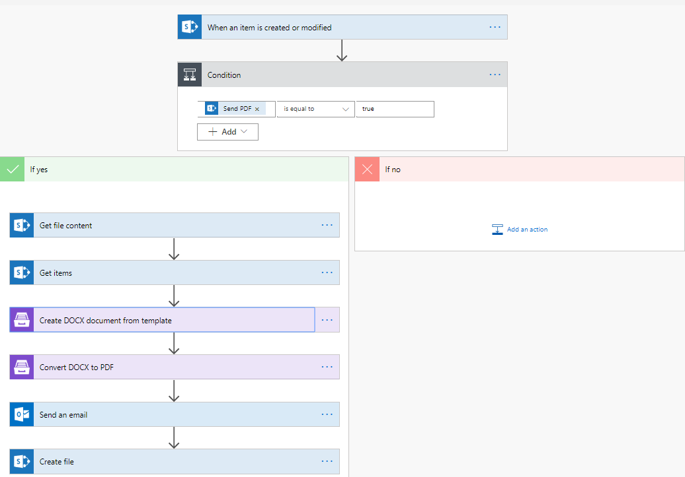

We'll create it step by step.

The Flow will create PDF and send email only if "Send PDF" is checked, so we add a condition first. 

|pic5|

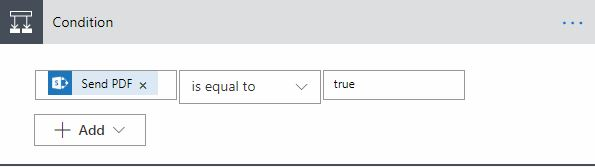

"If no" section will stay blank and in "If yes" section we will add the following steps:  

First, we get file content of the template file, in this case, **.docx**. You need to specify the SharePoint site URL and path to your file. You can use different connectors to get files from other locations, such as Box or Dropbox, for example. 

|pic6|

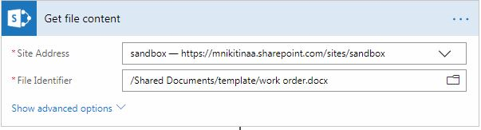

Next, we will get all the items from the child list with *Get items* action and filter them by Parent Item's ID. 

|pic7|

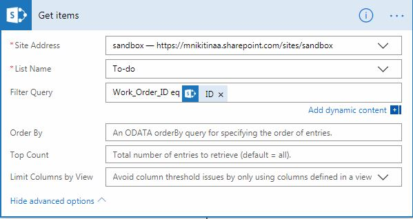

Now it’s time to create the file from the template and convert it to PDF. That are two actions from |Plumsail Documents|. 

First, we will Create |DOCX from Template|: 

|pic8|

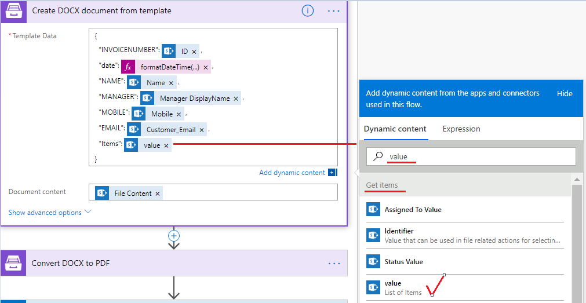

.. Note:: *Value* under *Items* properties is the Value from *Get Items* Action.

And then |Convert DOCX to PDF|: 

|pic9|

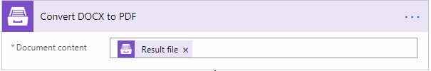

Eventually, we want to *Send an email* to the address specified in the form and attach the result PDF file to it. 

|pic10|

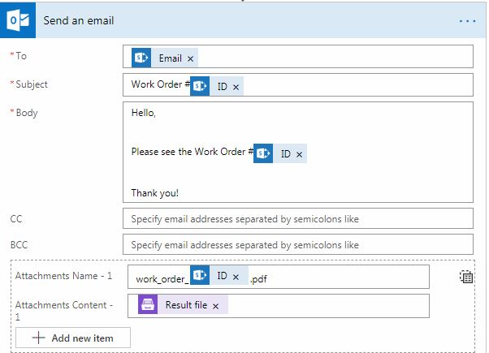

We can also store the result PDF file in the SharePoint library. For that, we add a *Create file* action, select the site address, folder path, file name, and file content. 

|pic11|

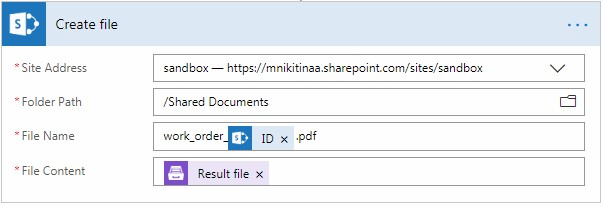

You can save the DOCX file as well. It can be saved to any location, such as:  

- SharePoint 
- Salesforce 
- Box 
- OneDrive 
- Google Drive 
- Dropbox 
- SFTP 
- File System 

.. |Plumsail Forms| raw:: html

   <a href="https://plumsail.com/forms/" target="_blank">Plumsail Forms</a>

.. |Plumsail Documents| raw:: html

   <a href="https://plumsail.com/documents/" target="_blank">Plumsail Documents</a>

.. |Create DOCX from template| raw:: html

   <a href="https://plumsail.com/docs/documents/v1.x/flow/how-tos/documents/create-docx-from-template.html#create-docx-document-from-template" target="_blank">Create DOCX from template</a>

.. |DOCX from Template| raw:: html

   <a href="https://plumsail.com/docs/documents/v1.x/flow/actions/document-processing.html#create-docx-document-from-template" target="_blank">DOCX from Template</a>

.. |Convert DOCX to PDF| raw:: html

   <a href="https://plumsail.com/docs/documents/v1.x/flow/actions/document-processing.html#create-docx-document-from-template" target="_blank">Convert DOCX to PDF</a>