Generate PDF from DOCX template and SharePoint form fields
==================================================

.. contents:: Contents:
 :local:
 :depth: 1
 
Description
--------------------------------------------------
In this example, you will find a step-by-step instruction on how you can create Work Order Form from the template and send its PDF version to a specific email.  

|pic0|

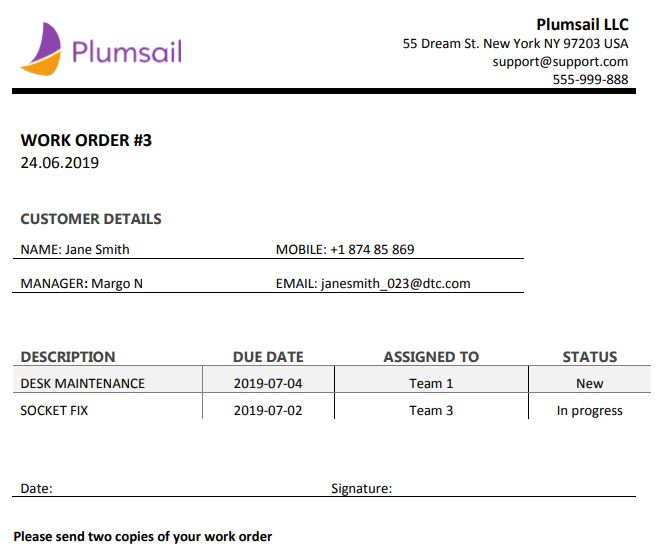

We are going to do this with the help of: 

- |Plumsail Forms| 
- |Plumsail Documents| 
- Simple code 

Form
--------------------------------------------------

We will create 2 lists: 

- Work Order (parent) 
- To-do (child) 

The "Work Order" form will store information about the customer and the list of tasks. To bind the task list and the form we will use :doc:`List or Library </how-to/list-or-library-section>` control. 

.. Note:: For more information about the control, please refer to :doc:`Create and bind associated items or documents on Modern SharePoint Forms </how-to/child-parent-form>` article.  

In this example the "To-do" list has the following fields: 

- Description (text field) 
- Due date (date field) 
- Assigned To (choice field) 
- Status (choice field) 
- Work_order_id (lookup value referred to the "Work Order" list) 

And we will create simple new/edit form for out tasks, excluding "Work_order_id" field, as it will get set automatically, and we don’t want users to change it manually. 

|pic1|

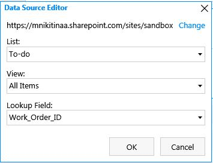

In Edit form, we will add an option to send the result file to a specific email. For this, we will create a "Send PDF" checkbox and an "Email" field.  

In addition, we want the "Email" field to be disabled if the checkbox is unchecked. The following code will do the job. 
Next, we will create forms for the "Work Order". In the "New" view we add general fields and "List or Library" control. In settings for "List or Library" control, in Data source specify the child list, view and Lookup filed. "Editing" should be "Dialog". 

.. code-block:: javascript

    fd.spRendered(function() { 
        function SendEmail() { 
            if (fd.field('SendPDF').value) { 
                // Setting field Email as editable 
                fd.field('Email').disabled = false; 
            } else { 
                // Setting field Email as read-only 
                fd.field('Email').disabled = true; 
            } 
        } 
        // Calling SendEmail when the user changes Send PDF field 
        fd.field('SendPDF').$on('change',SendEmail); 

        // Calling SendEmail on form loading 
        SendEmail(); 
    });     

As a result, the editing form is ready and looks something like this. 

|pic2|

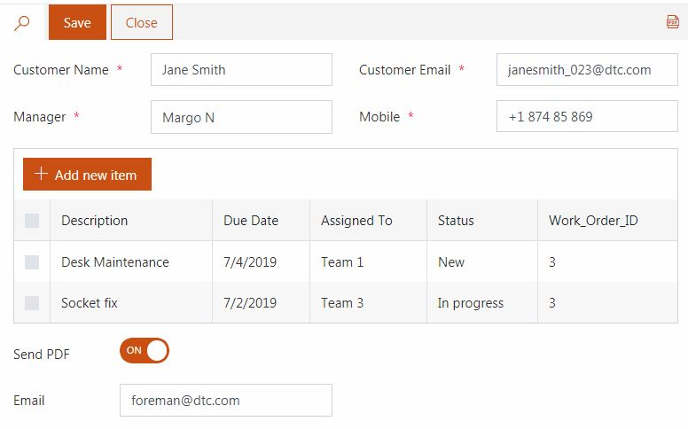

Flow
--------------------------------------------------

Create a new Flow from blank that will start with SharePoint connector - *When the item created or modified*.  Specify the address of your site and the name of the list. 

The final Flow will looks like this:

|pic3|

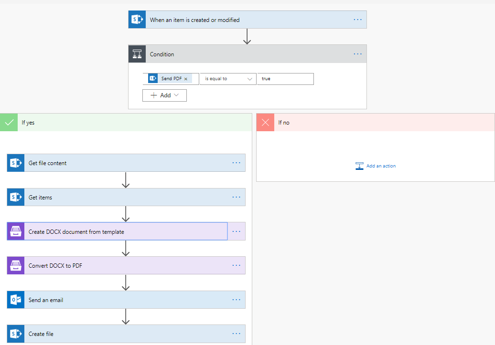

We'll create it step by step.

Add *Initialize variable* action. We’ll need it later to hold SharePoint Items. Specify the name, "Type" is array, and the value is blank. 

|pic4|

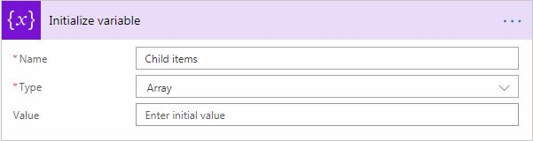

The Flow will create PDF and send email only if "Send PDF" is checked, so we add a condition first. 

|pic5|

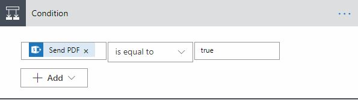

"If no" section will stay blank and in "If yes" section we will add the following steps:  

First, we get file content of the template file, in this case, **.docx**. You need to specify the SharePoint site URL and path to your file. You can use different connectors to get files from other locations. 

|pic6|

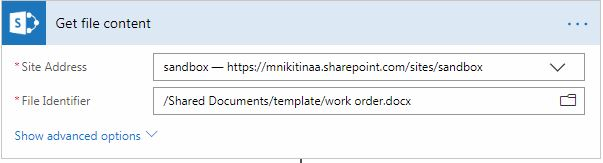

We already have a template file prepared. To find out how to create your own template file, please, have a look at |Create DOCX from template| article to understand how the templating engine works. 

Next, we will get all the items from the child list with *Get items* action and filter them by Parent Item's ID. 

|pic7|

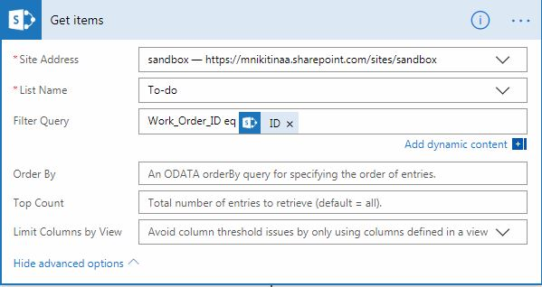

As we need to get multiple items we do the following: 

1. Add "apply to each" control;
2. In "Select an output from previous steps" specify a value from "Get items" action;
3. Add "Compose" action to define current item properties;
4. Then add "Append to array variable", select the variable name from the drop-down, and value is the output from "Compose" action. 

|pic8|

.. |pic8| image:: ../images/how-to/docx-to-pdf/apply_to_each.png
   :alt: Apply to each

Now it’s time to create the file from the template and convert it to PDF. That are two actions from |Plumsail Documents|. 

First, we will Create |DOCX from Template|: 

|pic9|

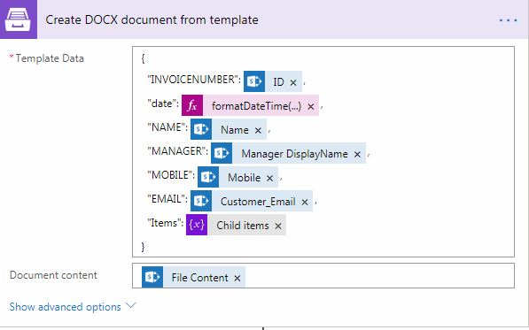

And then |Convert DOCX to PDF|: 

|pic10|

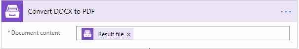

Eventually, we want to *Send an email* to the address specified in the form and attach the result PDF file to it. 

|pic11|

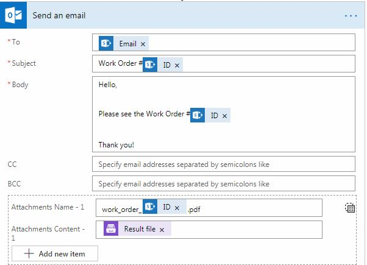

We can also store the result PDF file in the SharePoint library. For that, we add a *Create file* action, select the site address, folder path, file name, and file content. 

|pic12|

.. |pic12| image:: ../images/how-to/docx-to-pdf/file.png
   :alt: Save file

You can save DOCX file too and it can be saved to any location, for example:  

- SharePoint 
- Salesforce 
- Box 
- OneDrive 
- Google Drive 
- Dropbox 
- SFTP 
- File System 

.. |Plumsail Forms| raw:: html

   <a href="https://plumsail.com/forms/" target="_blank">Plumsail Forms</a>

.. |Plumsail Documents| raw:: html

   <a href="https://plumsail.com/documents/" target="_blank">Plumsail Documents</a>

.. |Create DOCX from template| raw:: html

   <a href="https://plumsail.com/docs/documents/v1.x/flow/how-tos/documents/create-docx-from-template.html#create-docx-document-from-template" target="_blank">Create DOCX from template</a>

.. |DOCX from Template| raw:: html

   <a href="https://plumsail.com/docs/documents/v1.x/flow/actions/document-processing.html#create-docx-document-from-template" target="_blank">DOCX from Template</a>

.. |Convert DOCX to PDF| raw:: html

   <a href="https://plumsail.com/docs/documents/v1.x/flow/actions/document-processing.html#create-docx-document-from-template" target="_blank">Convert DOCX to PDF</a>