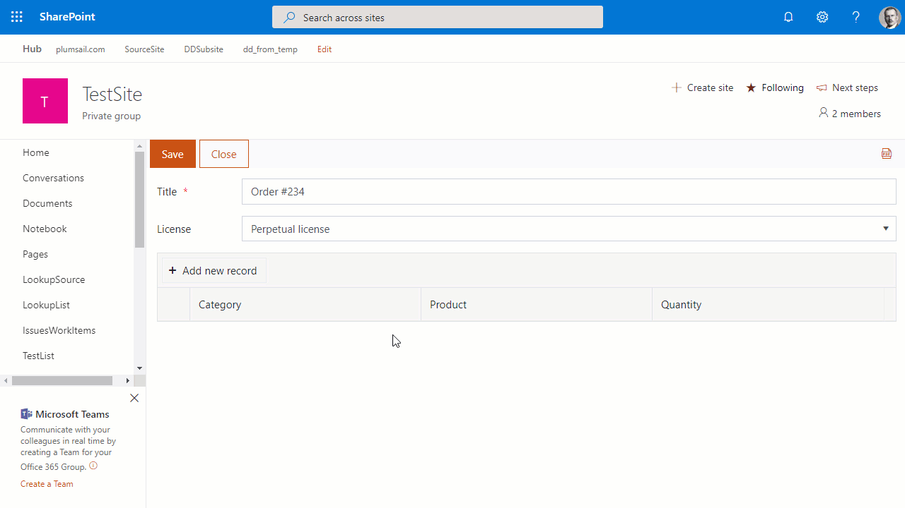
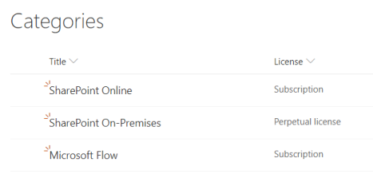
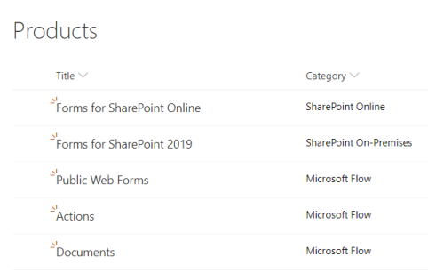
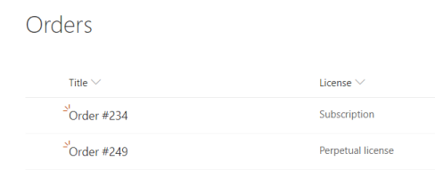
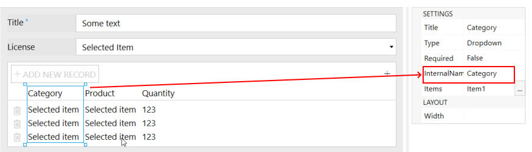
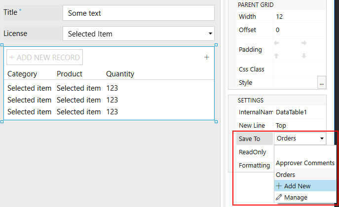
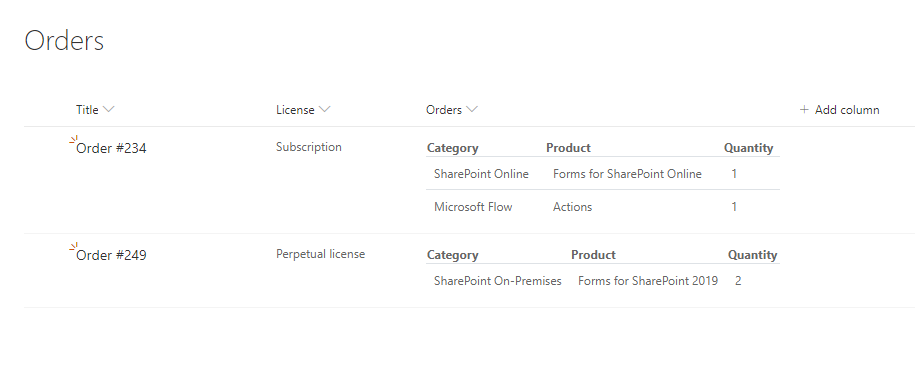
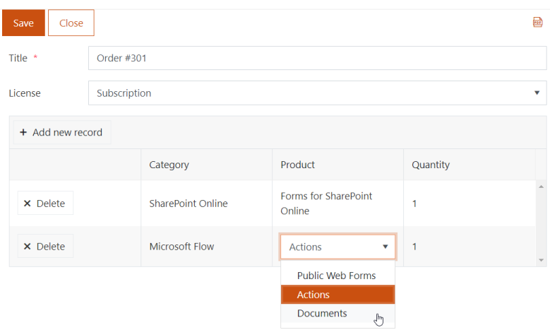

How to populate dropdown column of Data Table in SharePoint form with data from any SharePoint list
======================================================================================================

.. contents:: Contents:
 :local:
 :depth: 1
 
Introduction
--------------------------------------------------
In this article, we'll show you how to load values from SharePoint List and display them in DataTable control dropdowns.

Essentially, this works similar to Lookup fields, but the values are stored as text, 
and if something changes in the source lists, the values in DataTable will stay the same.

This functionality also supports filtering and cascading selection, which we'll showcase in the article.

|pic0|

   
Preparation
--------------------------------------------------
First, create three SharePoint Lists - **Categories, Products and Orders**.

**Categories** List will contain two columns - Title and License (Choice):

|pic1|

**Products** List will contain two columns as well - Title and Category (Lookup):

|pic2|

Finally, **Orders** will also contain two columns - Title and License (Choice):

|pic3|

Form
--------------------------------------------------
Open Orders List in editor and customize forms, add Title and License.

Then, add DataTable control, customize its Form, add Category and Product columns to DataTable, 
set them to Type: *Dropdown* and don't forget to change their Internal Name to match title:

|pic4|

Finally, here's the code to load values from other fields, filter Category column by selected License field value,
and filter Products column by selected Category:

.. code-block:: javascript

    fd.spRendered(function() {
        fd.control('DataTable1').$on('edit', function(e) {
            if (e.column.field === 'Category') {
                //pass widget + current Category value 
                populateCategories(e.widget, e.model.Category);
            }
            
            if (e.column.field === 'Product') {
                //pass widget + current Category and Product value 
                populateProducts(e.widget, e.model.Category, e.model.Product);
            }
        })
        
    });

    function populateCategories(widget, value) {
        //will show as loading
        widget._showBusy();
        
        //get value from License field to filter
        var status = fd.field('License').value;
        sp.web.lists.getByTitle('Categories').items
            .select('ID', 'Title')
            .filter("Status eq '" + status + "'")
            .get()
            .then(function(items) {
                //set options
                widget.setDataSource({
                    data: items.map(function(i) { return i.Title })
                });

                //set value if one was select
                widget.value(value);
                //hide loading state
                widget._hideBusy();
            });
    }

    function populateProducts(widget, parentValue, value) {
        //will show as loading
        widget._showBusy();
        
        sp.web.lists.getByTitle('Products').items
            .select('ID', 'Title', 'Category/Title')
            .expand('Category')
            .filter("Category/Title eq '" + parentValue + "'")
            .get()
            .then(function(items) {
                widget.setDataSource({
                    data: items.map(function(i) { return i.Title })
                });
                
                //set value if one was select
                widget.value(value);
                //hide loading state
                widget._hideBusy();
            });
    }

The value for the DataTable can then be stored either in hidden SharePoint field or in Multiline Plain Text column:

|pic6|

If you store data in column, you will see it displayed in List view with the help of our automatic :doc:`customizers </how-to/save-table-signature>`:

|pic7|

Here's how our form would look like in the browser:

|pic5|

