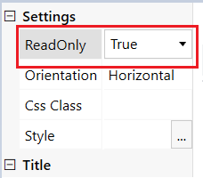
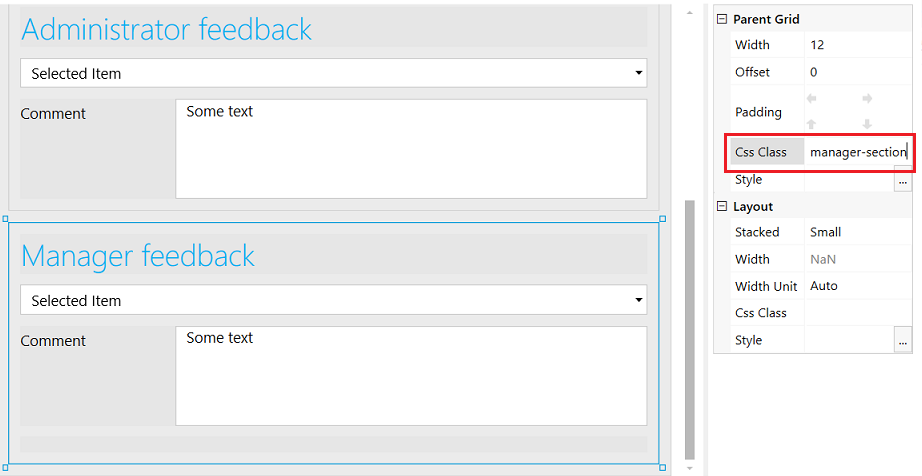
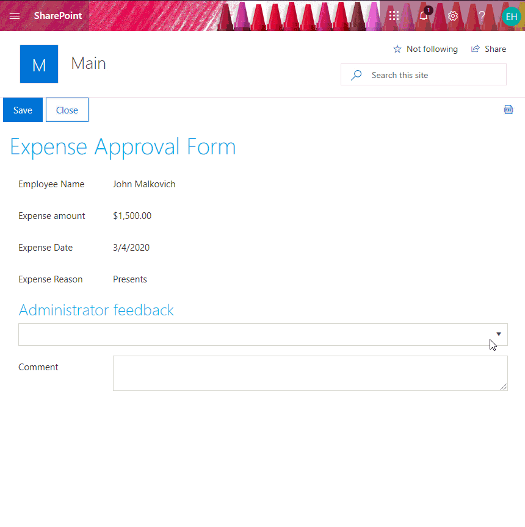

How to display specific sections of SharePoint form conditionally based on user's membership
=============================================================================================

.. contents:: Contents:
 :local:
 :depth: 1

Introduction
----------------------------------------

From this article, you will know how to manipulate fields dynamically depending on groups the current user belongs to. This approach is an alternative to the form sets and can be helpful in cases when forms for different groups are almost identical. For instance, when you need to hide a few fields from all users except the users of a certain group. 
  
Assume you need to design an expense approval form. The approval process requires feedback from users who belong to Administrators and Managers groups. An administrator should not see a comment left by a manager. And a manager should not be able to edit a comment posted by an administrator. 

Expense Approval Form 
--------------------------------------------------

Here, we focus on designing the Edit form, as it differs for different user groups. The Edit form contains the following fields.

Available to employees: 

- Employee Name (plain text field); 
- Expense Amount (currency field); 
- Expense Date (date and time field); 
- Expense Reason (multiline text field). 

Available to administrators: 

- Administrator Feedback (choice field); 
- Administrator Comment (multiple-line text field). 

Available to managers: 

- Manager Feedback (choice field); 
- Manager Comment (multiple-line text field). 

We set all fields available to employees to the read-only state since their values should not be changed after the item creation. 

|pic1|

Since the fields available to managers and administrators only should be hidden from regular users, we put them into Grid containers. Thus, instead of hiding each field separately, we'll hide the Grid containers. To be able to hide the grid containers via code, we assign them unique CSS-classes, e.g. 'manager-section'. 

|pic2|

Manipulating fields dynamically depending on user's membership
----------------------------------------------------------------------------------------------------

To check if the current user belongs to a certain group, we use |PnPjs| library that is built into Plumsail Forms. Depending on the user's membership, we hide or disable specific sections.  

.. code-block:: javascript

    function showHideFields() {

        // get all groups the current user belongs to
        var userId = _spPageContextInfo.userId;
        var userGroups = [];
        pnp.sp.web.siteUsers.getById(userId).groups.get()
        .then(function(groupsData){
            for (var i = 0; i < groupsData.length; i++) {
                userGroups.push(groupsData[i].Title); 
            }
            
            //check if the user is a member of Administrators user group 
            if (userGroups.indexOf('Administrators') >= 0) {
                //Enable fields
                fd.field('AdministratorFeedback').disabled = false;
                fd.field('AdministratorComment').disabled = false;
            } 

            //check if the user is a member of Managers user group
            if (userGroups.indexOf('Managers') >= 0) {
                //Show grid container
                $('.manager-section').show();
            }
        });
    }
    
    fd.spRendered(function() {
        
        //Turning fields available to administrators only into read-only state
        fd.field('AdministratorFeedback').disabled = true;
        fd.field('AdministratorComment').disabled = true;
        
        //Hiding the grid containig fields available to managers only
        $('.manager-section').hide();
        
        //call function on form load
        showHideFields(); 
    }); 

Here is the demonstration of the Expense Approval Form.

|pic3|

Examples
-----------------------------------------------------
Also, you can use :doc:`Form Sets </designer/form-sets>` to create personal forms for different user groups. Find out how to do it :doc:`here </examples/ticket-management>`.

.. |PnPjs|  raw:: html

   <a href="https://pnp.github.io/pnpjs/" target="_blank">PnPjs</a>
