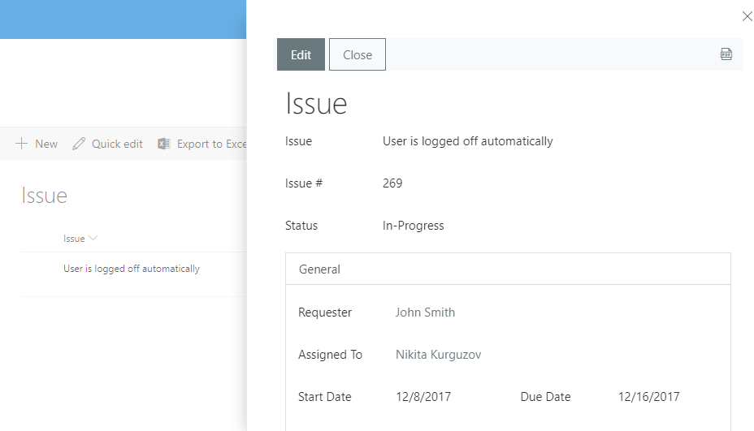
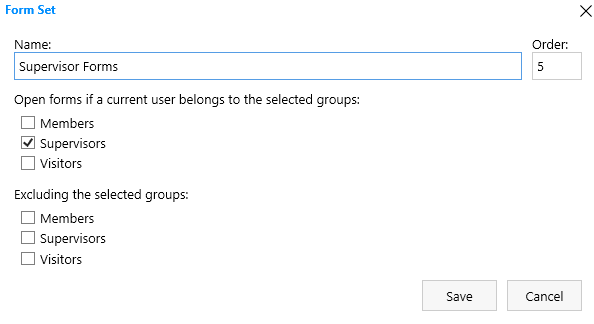
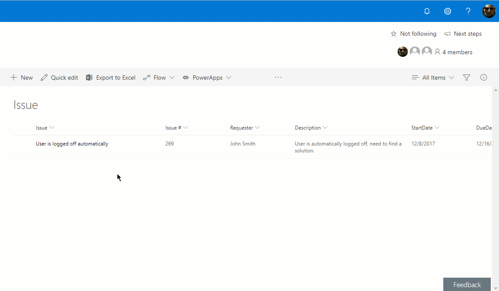

.. title:: Edit form as default for a specific SharePoint group

.. meta::
   :description: Make Edit form show instead of Display form for a specific SharePoint group - for example, reviewers might want to be able to click on the form and start editing it

How to open edit form by default for specific SharePoint group
======================================================================

.. contents:: Contents:
 :local:
 :depth: 1

Introduction
--------------------------------------------------
By default, standard form when user clicks List Item is Display form, but this might not work for all situations. In this article, we'll show you how to automatically open editable form, when Display form opens normally.

.. important:: This does not actually redirect users to Edit form, instead it makes Display form's fields editable.

Configuration
--------------------------------------------------
Let's say you want most users to see default Display form:

|pic0|

You may also want Supervisors group to be able to edit the item when the default form opens. 

For this, you can create a new :doc:`Form Set </designer/form-sets>`, targetted specifically at Supervisors group:

|pic1|

Add the following code to JS editor, as the first line (no events, copy and paste):

.. code-block:: javascript

    fd.spForm._formType = "Edit";

Then, whenever a Supervisor clicks on an item, they'll be able to edit the item:

|pic2|

Essentially, this piece of JavaScript allows you to switch the type of the form, making default Display form behave like an Edit form. 