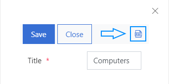
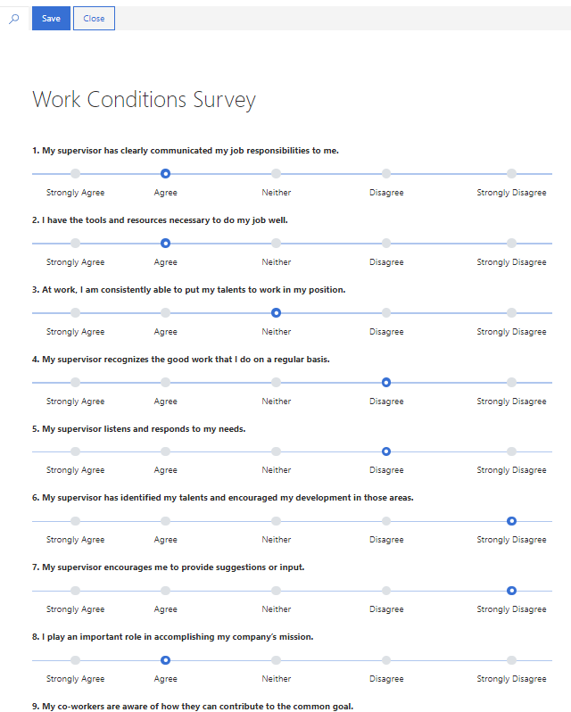
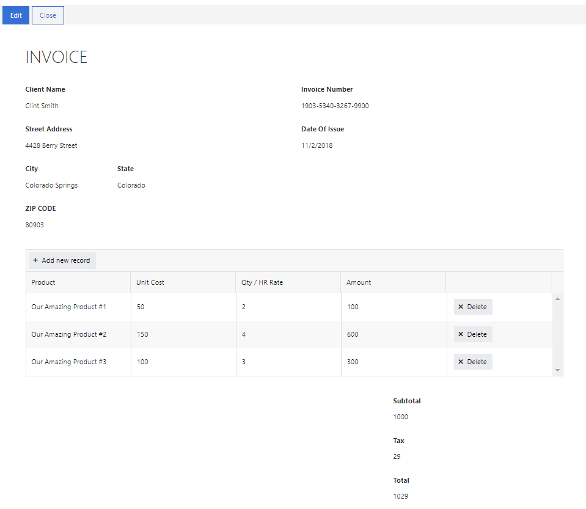
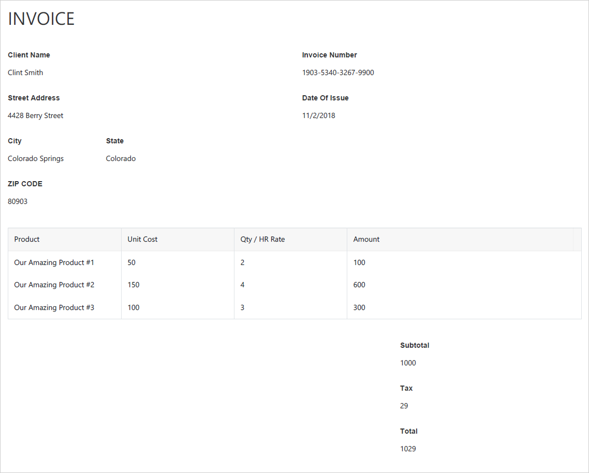
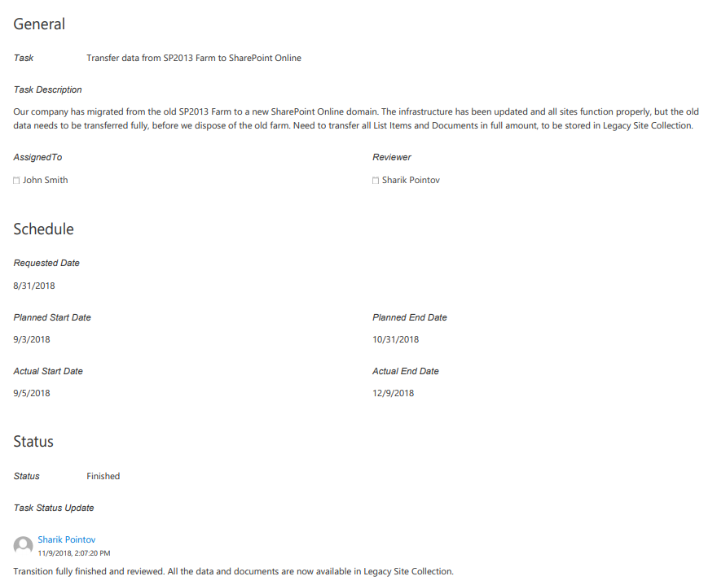
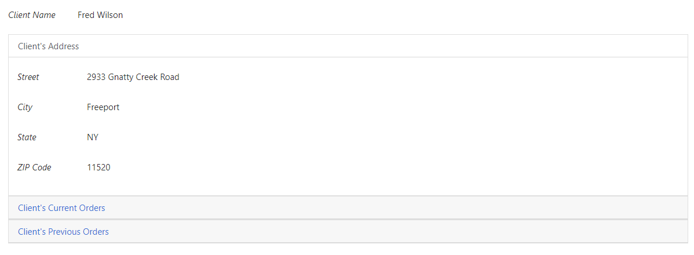
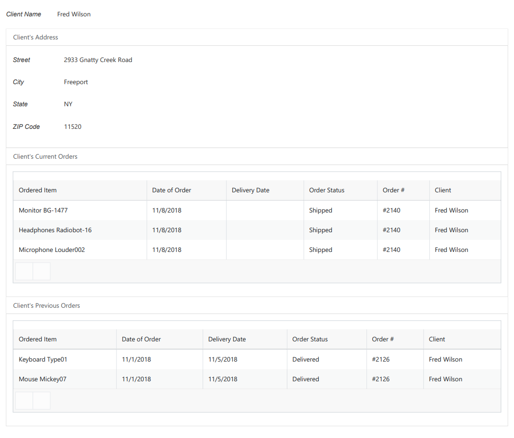
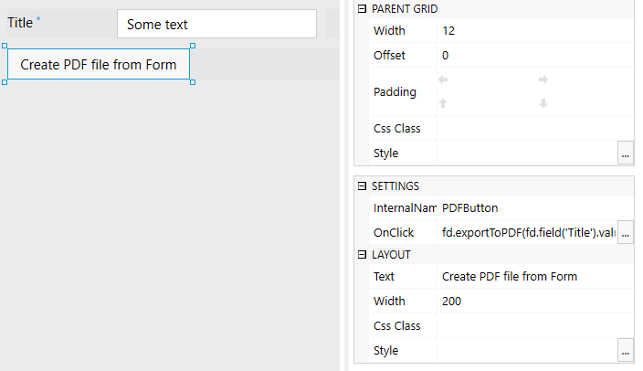
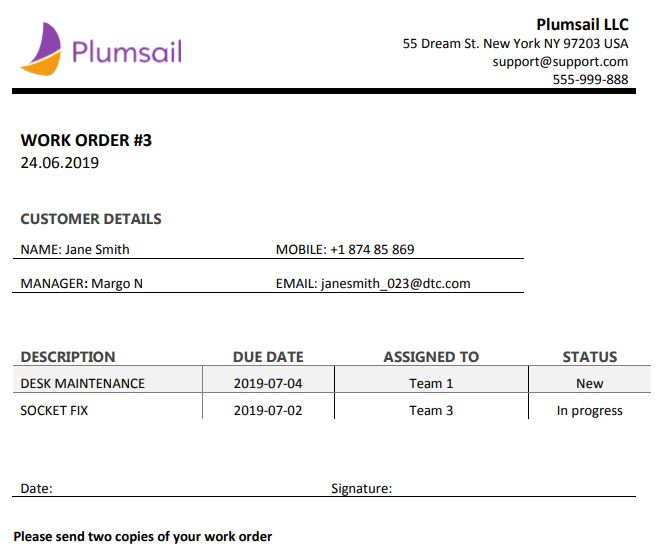

How to save SharePoint form as PDF for printing
=====================================================

.. contents:: Contents:
 :local:
 :depth: 1

Introduction
--------------------------------------------------
If you need your forms printed, you can try printing them from the browser, but the end result will include SharePoint UI 
and overall composition won't look as good as you might want it to. That's why we recommend exporting form to PDF prior to printing. 
You can also use this functionality to store various forms in PDF.

Nothing could be easier, as SharePoint forms have a button which allows forms to be exported to PDF:

|pic1|

It's also possible to set up PDF options with JavaScript that can run outside of any events, by simply including **pdfOptions** in JS editor, like this:

.. code-block:: javascript

    fd.pdfOptions = {
        paperSize: 'A4',
        landscape: true
    };

You can also customize CSS for the exported PDF by using k-pdf-export class. For example, you can hide fields you do not want to be shown on the PDF. 

.. code-block:: css 

    .k-pdf-export .field-to-hide {
      display: none;
    }

Moreover, you can export both SharePoint and Public Web Forms to SharePoint with a simple JavaScript command **fd.exportToPDF();**

*Note: you can find more about options that you can use* |PDF options|.

.. |PDF options| raw:: html

    <a href="https://docs.telerik.com/kendo-ui/framework/drawing/pdf-output#configuration-PDF" target="_blank">here</a>

Multipage vertical form
--------------------------------------------------
It's a very standard scenario to have a long vertical form, which needs to be separated into multiple pages in order to be printed successfully.

If you have a form that doesn't fit on one screen like this:

|VerticalSP|

Simply add the following code to JS editor on the form:

.. code-block:: javascript

                fd.pdfOptions = {
                    paperSize: 'A4',
                    landscape: false,
                    multiPage: true
                };

And you'll get the result like this:

|Vertical|

.. |Vertical| image:: ../images/how-to/export-pdf/how-to-export-pdf-2.png
   :alt: Vertical form exported to PDF

One page horizontal form
--------------------------------------------------
If the form you have is rather wide and needs to be printed in one page, like this invoice form, for instance:

|HorizontalSP|

You can add code similar to this:

.. code-block:: javascript

                fd.pdfOptions = {
                    paperSize: 'A4',
                    landscape: true,
                    multiPage: false
                };

In this case, I would like to hide last column of Data Table with the following CSS:

.. code-block:: css

                /* hide delete column and toolbar from datatable */
                .k-pdf-export .fd-datatable table tr th:last-child, 
                .k-pdf-export .fd-datatable table tr td:last-child,
                .k-pdf-export .fd-datatable div.k-header.k-grid-toolbar
                { display: none; }
                
                /* remove colored lines from datatable */
                .k-pdf-export .fd-datatable table tr.k-alt
                { background-color: rgba(0,0,0,0); }

And here's the result:

|Horizontal|

Display all tabs on exported PDF
--------------------------------------------------
If you are using Tabs container, you would probably want to display all tabs at once on the exported document, and this can be achieved with the use of CSS.

For example, I have a three tab form:

|SharePointTabs|

.. |SharePointTabs| image:: ../images/how-to/export-pdf/how-to-export-pdf-5.png
   :alt: SharePoint Form with Tabs

Since we are going to hide tabs themselves, it would be a good idea to add Plain Text control title to each tab and give it a common CSS class, 
so they'll only be shown on the exported PDF, for example, I gave each title **tab-title** CSS class:

|TabTitleClass|

.. |TabTitleClass| image:: ../images/how-to/export-pdf/how-to-export-pdf-6.png
   :alt: Plain Text Tab Title with CSS class

Next, I add the following CSS to CSS editor:

.. code-block:: css

                /* show tab contents for all tabs */
                .k-pdf-export .tabset .tab-content div.tab-pane.fade { 
                  display: block !important;
                  opacity: 1 !important;
                }

                /* hide tab navigation bar */
                .k-pdf-export .tabset ul.nav.nav-tabs{
                  display: none !important;
                }

                /* hide tab titles by default */
                .tab-title{
                  display: none;
                }

                /* show tab titles when exporting */
                .k-pdf-export .tab-title{
                  display: block;
                }

And then, after exporting to PDF, we get this:

|TabsPDF|

Display all Accordion panels on exported PDF
--------------------------------------------------
Just like Tabs, Accordion panels could be expanded with appropriate CSS styles. Of course, you could also expand Accordion panels by selecting **Mode: Multiple** for the Accordion, 
and then opening all the panels manually, but you could also use CSS to do automatically show all panels on PDF.

An example form with an Accordion:

|SharePointAccordion|

To expand Accordion, we can use the following CSS:

.. code-block:: css

                /* show contents for all Accordion panels */
                .k-pdf-export .accordion .card-block{
                  display: block !important;
                  height: auto !important;
                }

                /* gray out all navigation links */
                .k-pdf-export .accordion>.card>.card-header>.nav-link {
                  background-color: #fff;
                  color: #55595c;
                }

And get the following result:

|AccordionPDF|

Export to PDF script
--------------------------------------------------
The script for exporting the form is very simple, and you can run it anywhere. 

**fd.exportToPDF(fileName, options)** takes two parameters: 

**fileName** - name of the exported PDF file.

**options** - options for exported PDF file, same as described above.

Can be used without either one or both parameters, by simply calling **fd.exportToPDF();**

Running the script from a button
*************************************************
One option for running the script would be to add a custom button to the form, and call it something like **Create PDF file from Form** 
and add the following code to Click property (though, of course, you can modify it for your case):

.. code-block:: javascript

    fd.exportToPDF(fd.field('Title').value);

|pic2|

Running the script on form submission
*************************************************
Another option is to export PDF each time the form is submitted. You'll need to use designer's JS editor for this:

|pic3|

.. |pic3| image:: ../images/how-to/export-pdf/how-to-export-pdf-11.png
   :alt: JS Editor in Plumsail Forms

For **Public Web Forms**, this can be done by adding the following code to the JS editor of the designer:

.. code-block:: javascript

    fd.saved(function() {
        fd.exportToPDF("exported-after-submission");
    });

For **SharePoint Forms**, use the following code instead:

.. code-block:: javascript

    fd.spSaved(function(result) {
        fd.exportToPDF("exported-after-saving");
    });

More complex PDFs
--------------------------------------------------
This solution is good for exporting most forms right from the browser, but it is limited in a few ways. 

If you are looking for a more complex solution which will allow you to configure how the form is converted to PDF, please, check out our :doc:`Generate PDF from DOCX template article </how-to/docx-to-pdf>`.

|pic_fin|

