.. title:: Edit form as default for a specific SharePoint group

.. meta::
   :description: Adjustments you can make to SharePoint form before exporting it to PDF - adjust layout (size, orientation, margins) and styles, show or hide certain parts of the form, manage page breaks and more

How to save SharePoint form as PDF for printing
=================================================================

Plumsail Forms has built-in functionality allowing you to export any SharePoint form to PDF by clicking the button on the right side of the toolbar.

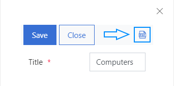

Or using the **fd.exportToPDF** method you can call on button click or form submission.

.. code-block:: javascript

    //export PDF on form submission
    fd.spSaved(function(result) {
        fd.exportToPDF("FileName");
    }); 

From this article, you will learn how to customize the exported PDF and how to resolve common issues you may face. 

.. contents::
 :local:
 :depth: 2

Form 
--------------------------------------------------
Assume that you have a SharePoint form that you need to export into PDF. In this example, we have a simple Invoice form with the following fields and controls: 

- Company Name (text field); 

- Address (text field); 

- ZIP code (text field); 

- Country (choice field); 

- Email (text field); 

- Purchased Products (List or Library control). 

This is our form:

.. image:: ../images/how-to/export-to-pdf-setup/export-to-pdf-setup-01.png
   :alt: Form

Next, we will consider various approaches to redesigning the final PDF document. 

Page layout
------------------------------------------------

With JavaScript, you can specify the basic layout properties of PDF pages, such as page size, margins, etc. Let's have a closer look at each property. 

Size 
~~~~~~~~~~~~~~~~~~~~

*paperSize* option specifies the size of the pages.  

By default, the option is set to 'auto' which means that the page automatically adjusts its size to the content. You can set this option to one of the predefined paper sizes, e.g. 'A4', 'A3', or specify a custom size. 

The available paper sizes are:  

- A0-A10, B0-B10, C0-C10,  

- Executive, Folio, Legal, Letter, Tabloid.

**Examples**: 

Paper size: **A4**

.. code-block:: javascript

    fd.pdfOptions = {
         paperSize: 'A4', 
    };
    
.. image:: ../images/how-to/export-to-pdf-setup/export-to-pdf-setup-02.png
   :alt: A4

|

Paper Size: **Custom** 

.. code-block:: javascript

    fd.pdfOptions = {
        paperSize: ['297mm', '297mm']
    };

.. image:: ../images/how-to/export-to-pdf-setup/export-to-pdf-setup-03.png
   :alt: Custom size

For the invoice document, we select the standard A4 page size. 

Orientation 
~~~~~~~~~~~~~~~~~~~~~~~~~~~~~~

*landscape* option specifies the orientation of the pages. By default, the option is set to 'false' which means that the page orientation is portrait (vertical).
To change the orientation of PDF pages to landscape (horizontal), set the option to be equal true. 

**Examples**: 

Page Orientation: **landscape (horizontal)**

.. code-block:: javascript

    fd.pdfOptions = { 
        paperSize: 'A4',
        landscape: true 
    }; 

.. image:: ../images/how-to/export-to-pdf-setup/export-to-pdf-setup-04.png
   :alt: landscape (horizontal)

|

Page Orientation: **portrait (vertical)**

.. code-block:: javascript

    fd.pdfOptions = {
        paperSize: 'A4',
        landscape: false
    } 

.. image:: ../images/how-to/export-to-pdf-setup/export-to-pdf-setup-05.png
   :alt: portrait (vertical)

The optimal page orientation for the invoice is portrait (vertical).  

Margins 
~~~~~~~~~~~~~~~~~~~~

*margin* is an object which specifies the top, left, right, and bottom page margins. You can set all margins to one size, or specify the margin size for each side of the page separately.  

**Examples**: 

Page Margins: **one size**

.. code-block:: javascript

    fd.pdfOptions = {
        paperSize: 'A4',
        landscape: false,
        margin: '10mm
    };

.. image:: ../images/how-to/export-to-pdf-setup/export-to-pdf-setup-06.png
   :alt: one size margins

|

Page Margins: **custom size**

.. code-block:: javascript

    fd.pdfOptions = {
        paperSize: 'A4',
        landscape: false,
        margin: {
            left   : "20mm"
            top    : "40mm",
            right  : "20mm"
            bottom : "40mm"
        }
    };  

.. image:: ../images/how-to/export-to-pdf-setup/export-to-pdf-setup-07.png
   :alt: custom size margins

Page breaks
--------------------------------------------------

By default, the page breaks are placed automatically depending on the page dimensions: page size, margins, orientation. But you can define where you want the page to break manually using the *forcePageBreak* option that specifies the CSS class of the element before which the page break occurs. 

For instance, you want the page to break before the List or Library control. For this, you need to specify a CSS class of the control, e.g. 'page-break', and assign it to the *forcePageBreak* option in JS-editor.

.. image:: ../images/how-to/export-to-pdf-setup/export-to-pdf-setup-08.png
   :alt: CSS class

.. code-block:: javascript
    
    fd.pdfOptions = {
        paperSize: 'A4',
        margin: '5 mm',
        forcePageBreak: '.page-break'
    };

.. image:: ../images/how-to/export-to-pdf-setup/export-to-pdf-setup-09.png
   :alt: page break

Content adjustments
--------------------------------------------------

You can change the appearance of the exported PDF by using 'k-pdf-export' class. CSS rules for this class are applied to the PDF document only. 

Show or hide blocks of elements 
~~~~~~~~~~~~~~~~~~~~~~~~~~~~~~~~~~~~~~~~

For instance, you want some elements displayed on a form to be hidden in PDF, or vice versa. These can be buttons, fields, titles, containers etc.

In this example, we will hide the Submit button in the exported PDF. First, we assign the 'pdf-hide' CSS class to it: 

.. image:: ../images/how-to/export-to-pdf-setup/export-to-pdf-setup-10.png
   :alt: CSS class

Then, add the following rule to the CSS editor to hide it in PDF: 

.. code-block:: CSS

    .k-pdf-export .pdf-hide {
        display: none !important;
    }

You can give each element that you want to hide in PDF the same class and hide them all at once. 

Also, we want to add the company logo and contact information to the PDF document, but we don't want it to be visible in the form. For this, we place the logo and contact information inside a Grid and assign 'company-info' CSS class to it. 

.. image:: ../images/how-to/export-to-pdf-setup/export-to-pdf-setup-11.png
   :alt: Company info

Next, we add the code to the CSS editor that makes company information visible in PDF document only. 

.. code-block:: CSS

    /*hide company information on the form*/
    .company-info { 
        display: none !Important; 
    } 

    /*show company information in PDF document*/
    .k-pdf-export .company-info { 
        display: contents !important; 
    } 

And this is the result: 

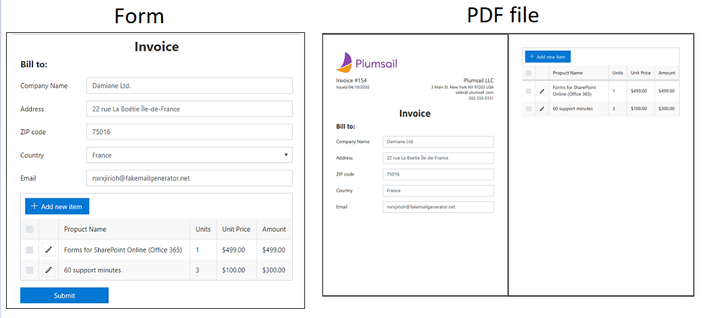

Change view of fields 
~~~~~~~~~~~~~~~~~~~~~~~~~~~~~~~~~~~~~~~~

Also, we want to change the appearance of the input controls in the PDF document. Particularly, we want to hide the titles of fields and input borders. We can do that with the CSS code: 

.. code-block:: CSS

    /*hide field titles*/
    .k-pdf-export label.fd-field-title {
        display: none;
    }

    /*hide input borders*/
    .k-pdf-export span.k-dropdown-wrap.k-state-default,
    .k-pdf-export .fd-form input.form-control { 
        border: none !important;
    } 

And get rid of icons, such as arrow icons in the dropdown, lookup, numeric fields, and calendar icon in the Date and Time field.

.. code-block:: CSS

    .k-pdf-export span.k-select {
        display: none !important;
    }

Here you can see the difference between the form and the PDF document: 

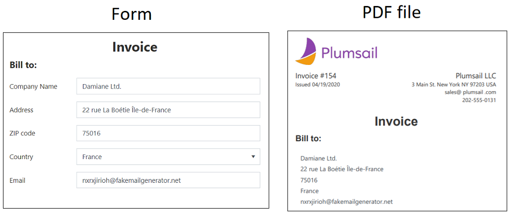

Adjust Data Table and List or Library 
~~~~~~~~~~~~~~~~~~~~~~~~~~~~~~~~~~~~~~~~

One more thing you may want to change is the appearance of Data Table and List or Library controls in PDF document, specifically to hide the toolbar and command columns. 

To hide the last column of Data Table, toolbar and colored lines, you can use the following CSS: 

.. code-block:: CSS

    /* hide delete column and toolbar from datatable */ 
    .k-pdf-export .fd-datatable table tr th:last-child, 
    .k-pdf-export .fd-datatable table tr td:last-child, 
    .k-pdf-export .fd-datatable div.k-header.k-grid-toolbar 
    { display: none; } 

    /* remove colored lines from datatable */ 
    .k-pdf-export .fd-datatable table tr.k-alt 
    { background-color: white; }

This is the appearance of the form and PDF file: 

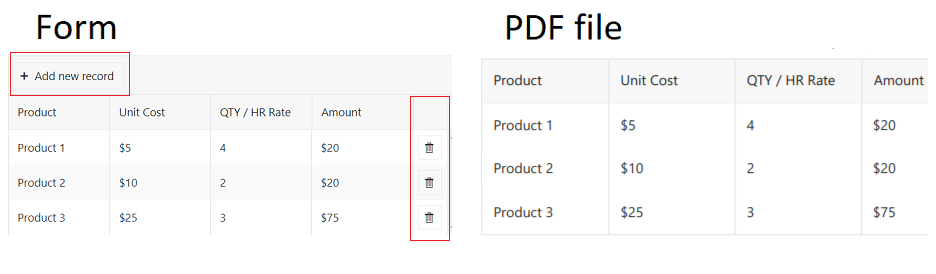

To do the same for List or Library control use this CSS: 

.. code-block:: CSS

    /* hide delete column and toolbar from List or Library  */ 

    .k-pdf-export .fd-sp-datatable-wrapper table tr th:nth-of-type(1), 
    .k-pdf-export .fd-sp-datatable-wrapper table tr td:nth-of-type(1), 
    .k-pdf-export .fd-sp-datatable-wrapper table tr th:nth-of-type(2), 
    .k-pdf-export .fd-sp-datatable-wrapper table tr td:nth-of-type(2), 
    .k-pdf-export .fd-sp-datatable-toolbar { 
        display: none !important; 
    } 

    /* remove colored lines from List or Library  */ 
    .k-pdf-export .fd-sp-datatable-wrapper table tr.k-alt 
    { background-color: white; } 

This is how the List or Library control looks in a web form and in PDF file: 

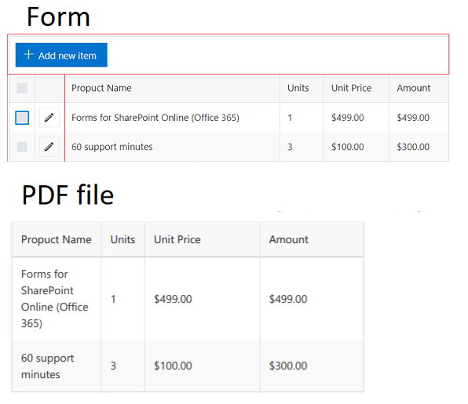

Expand Tabs and Accordion sections
~~~~~~~~~~~~~~~~~~~~~~~~~~~~~~~~~~~~~~~~

If you are using Tab or Accordion containers, you would probably want to display all its content at once in the exported PDF document, and this can be achieved with the use of CSS. 

For example, I have a three tab on the form: 

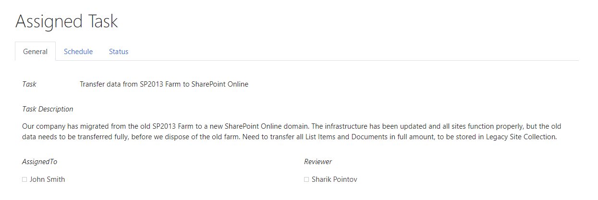

Since we are going to hide tabs themselves, it would be a good idea to add Plain Text control title to each tab and give it a common CSS class, so they'll only be shown on the exported PDF, so I give each title 'tab-title' CSS class: 

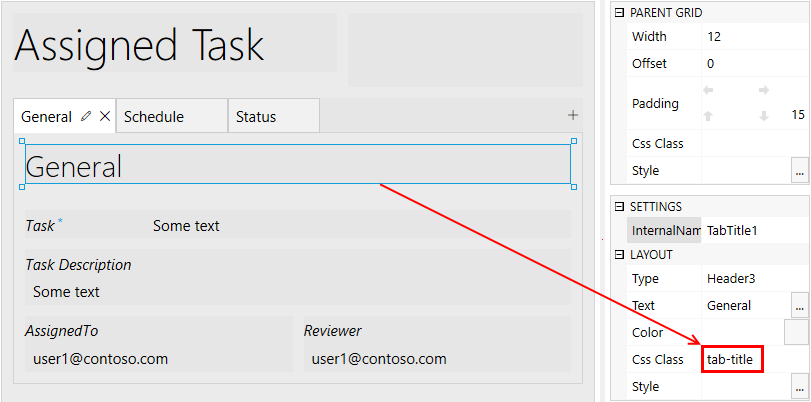

Next, I add the following CSS to CSS editor: 

.. code-block:: CSS

    /* show tab contents for all tabs */ 
    .k-pdf-export .tabset .tab-content div.tab-pane.fade { 
    display: block !important; 
    opacity: 1 !important; 
    } 

    /* hide tab navigation bar */ 
    .k-pdf-export .tabset ul.nav.nav-tabs{ 
    display: none !important; 
    } 

    /* hide tab titles by default */ 
    .tab-title{ 
    display: none; 
    } 

    /* show tab titles when exporting */ 
    .k-pdf-export .tab-title{ 
    display: block; 
    } 

And then, after exporting to PDF, we get this: 

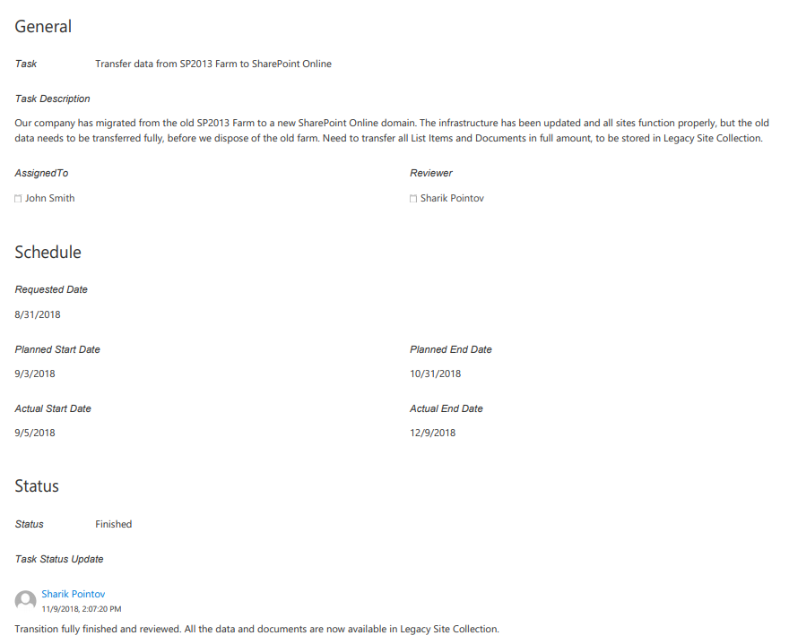

|

Just like Tabs, Accordion panels could be expanded with appropriate CSS styles. 

This is my form with Accordion container: 

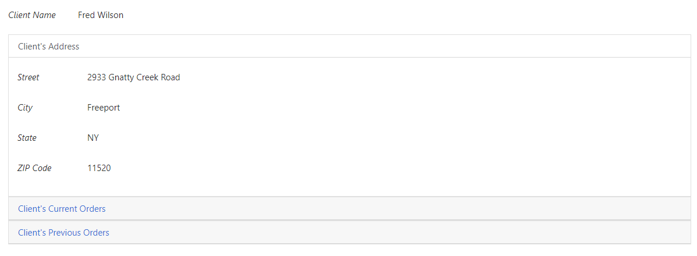

To expand Accordion, we can use the following CSS: 

.. code-block:: CSS

    /* show contents for all Accordion panels */ 
    .k-pdf-export .accordion .card-block{ 
    display: block !important; 
    height: auto !important; 
    } 

    /* gray out all navigation links */ 
    .k-pdf-export .accordion>.card>.card-header>.nav-link { 
    background-color: #fff; 
    color: #55595c; 
    } 

And get the following result on  PDF page: 

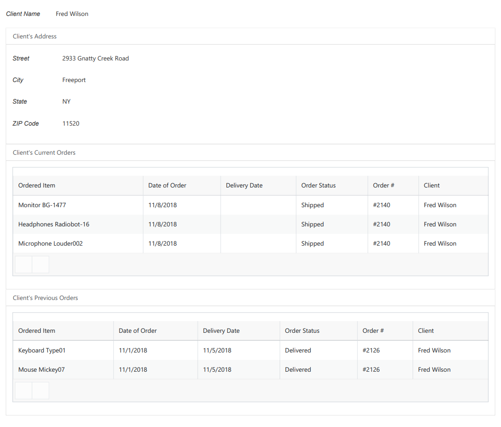

Non-Latin and special characters
--------------------------------------------------

Suppose you have a form in French, German, or Arabic. If you apply font styling to the text, you can notice that the exported PDF stops render Unicode characters. 

For instance, if you make the following text italic: 

.. image:: ../images/how-to/export-to-pdf-setup/export-to-pdf-setup-13.png
   :alt: Italic text

You get the following in the resulting PDF document: 

.. image:: ../images/how-to/export-to-pdf-setup/export-to-pdf-setup-14.png
   :alt: Resulting PDF

To avoid this problem, you need to use DejaVu Sans font for your form in the resulting PDF document, which contains all Unicode characters. And you need to declare the font using the CSS font-face.  Here is how you can declare DejaVu Sans font and change the font for the entire form with CSS: 

.. code-block:: CSS

    /*apply DejaVu Sans font to the content*/ 
    .k-pdf-export {
        font-family: "DejaVu Sans", "Arial", sans-serif !important;
        font-size: 12px;
    }

    /*declair DejaVu Sans font*/ 
    @font-face {
        font-family: "DejaVu Sans";
        src: url("https://kendo.cdn.telerik.com/2020.1.406/styles/fonts/DejaVu/DejaVuSans.ttf") format("truetype");
    }

    @font-face {
        font-family: "DejaVu Sans";
        font-weight: bold;
        src: url("https://kendo.cdn.telerik.com/2020.1.406/styles/fonts/DejaVu/DejaVuSans-Bold.ttf") format("truetype");
    }

    @font-face {
        font-family: "DejaVu Sans";
        font-style: italic;
        src: url("https://kendo.cdn.telerik.com/2020.1.406/styles/fonts/DejaVu/DejaVuSans-Oblique.ttf") format("truetype");
    }

    @font-face {
        font-family: "DejaVu Sans";
        font-weight: bold;
        font-style: italic;
        src: url("https://kendo.cdn.telerik.com/2020.1.406/styles/fonts/DejaVu/DejaVuSans-Oblique.ttf") format("truetype");
    }

And this is how the client data rendered on PDF:

.. image:: ../images/how-to/export-to-pdf-setup/export-to-pdf-setup-15.png
   :alt: Resulting PDF

Header, footer, and page numbering
--------------------------------------------------

When a PDF consists of multiple pages, you may want to add a header, footer, and page numbering into each page of the PDF. In our example, we add a page number to the header and a general message to the footer. 

For this, we add an HTML control with this code to any place in the form.

.. code-block:: HTML

    

Next, we need to insert the code below into the CSS editor for defining position and styling of the header and the footer: 

.. code-block:: CSS

    .page-template > * {
                position: absolute;
                left: 20px;
                right: 20px;
                font-size: 90%;
            }
    .page-template .header {
        top: 20px;
        border-bottom: 1px solid #000;
    }
    .page-template .footer {
        bottom: 20px;
        border-top: 1px solid #000;
    }

Finally, we put the following code into the JS-editor: 

.. code-block:: javascript

    fd.pdfOptions = {
        paperSize: 'A4',
        margin: '10 mm',
        forcePageBreak: ".page-break",
        template: $("#page-template").html()
    }; 

Here, we get HTML content of the element we put into HTML-control on the previous step by its id ('page-template'), and assign it to the template option. 

And this is a final PDF file:

.. image:: ../images/how-to/export-to-pdf-setup/export-to-pdf-setup-16.png
   :alt: Final PDF

Conclusion
--------------------------------------------------

The above tips and tricks are good for exporting most forms right from the browser, but it is limited in a few ways. 

If you are looking for a more complex solution which will allow you to configure how the form is converted to PDF, please, check out our :doc:`Generate PDF from DOCX template article </how-to/docx-to-pdf>`.

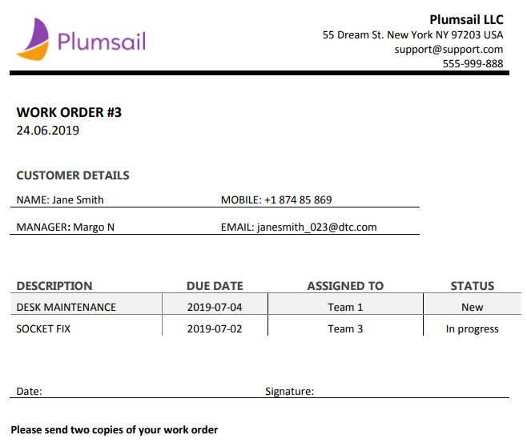