How to adjust SharePoint form for saving as PDF
=================================================================

.. contents:: Contents:
 :local:
 :depth: 1

Introduction
--------------------------------------------------
Plumsail Forms has built-in functionality allowing you to export any SharePoint form to PDF by clicking the button on the right side of the toolbar. From this article, you will learn how to customize the exported PDF and how to resolve common issues you may face.  

Assume that you have a SharePoint form that you need to export into PDF. In this example, we have a simple Invoice form with the following fields and controls: 

- Company Name (text field); 

- Address (text field); 

- ZIP code (text field); 

- Country (choice field); 

- Email (text field); 

- Purchased Products (List or Library control). 

This is our form:

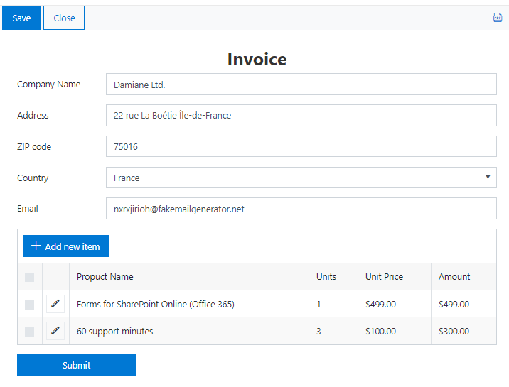

Next, we will consider various approaches to redesigning the final PDF document. 

Page size, orientation, margins 
------------------------------------------------

With JavaScript, you can specify the basic layout properties of PDF pages, such as page size, margins, etc. Let's have a closer look at each property. 

PDF page size 
~~~~~~~~~~~~~~~~~~~~

*paperSize* option specifies the size of the pages.  

By default, the option is set to 'auto' which means that the page automatically adjusts its size to the content. You can set this option to one of the predefined paper sizes, e.g. 'A4', 'A3', or specify a custom size. 

The available paper sizes are:  

- A0-A10, B0-B10, C0-C10,  

- Executive, Folio, Legal, Letter, Tabloid.

**Examples**: 

Paper size: **A4**

.. code-block:: javascript

    fd.pdfOptions = {
         paperSize: 'A4', 
    };
    
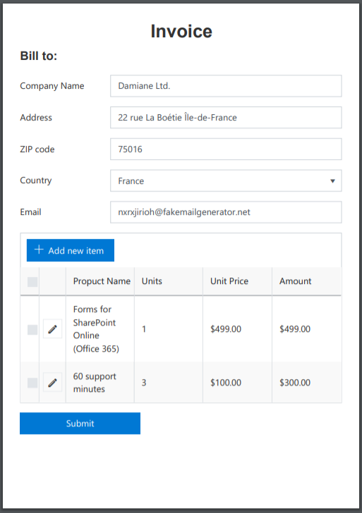

|

Paper Size: **Custom** 

.. code-block:: javascript

    fd.pdfOptions = {
        paperSize: ['297mm', '297mm']
    };

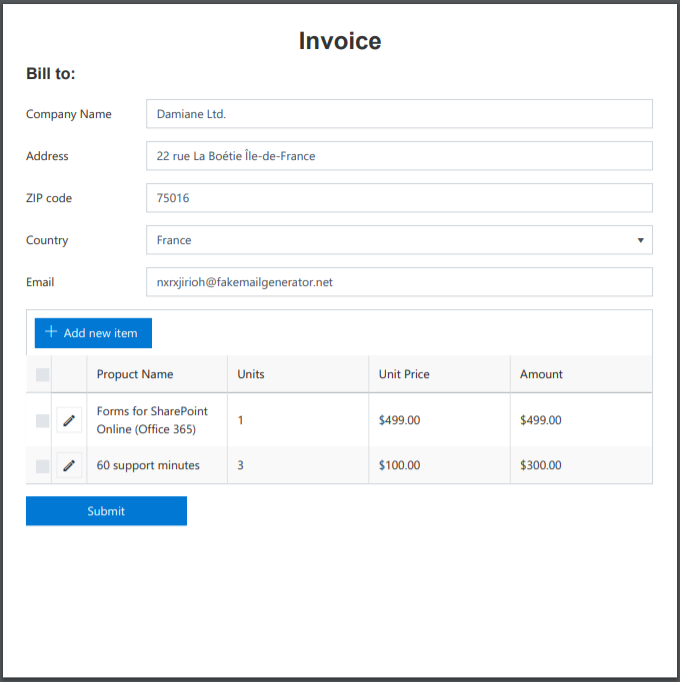

For the invoice document, we select the standard A4 page size. 

PDF page orientation 
~~~~~~~~~~~~~~~~~~~~~~~~~~~~~~

*landscape* option specifies the orientation of the pages. By default, the option is set to 'false' which means that the page orientation is portrait (vertical).
To change the orientation of PDF pages to landscape (horizontal), set the option to be equal true. 

**Examples**: 

Page Orientation: **landscape (horizontal)**

.. code-block:: javascript

    fd.pdfOptions = { 
        paperSize: 'A4',
        landscape: true 
    }; 

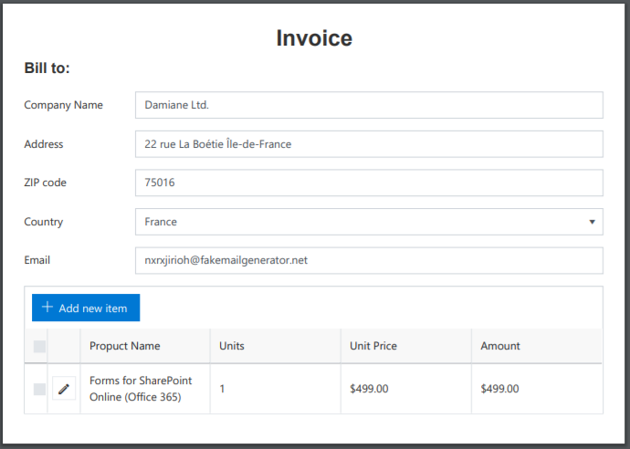

|

Page Orientation: **portrait (vertical)**

.. code-block:: javascript

    fd.pdfOptions = {
        paperSize: 'A4',
        landscape: false
    } 

The optimal page orientation for the invoice is portrait (vertical).  

PDF page margins 
~~~~~~~~~~~~~~~~~~~~

*margin* is an object which specifies the top, left, right, and bottom page margins. You can set all margins to one size, or specify the margin size for each side of the page separately.  

**Examples**: 

Page Margins: **one size**

.. code-block:: javascript

    fd.pdfOptions = {
        paperSize: 'A4',
        landscape: false,
        margin: '10mm
    };

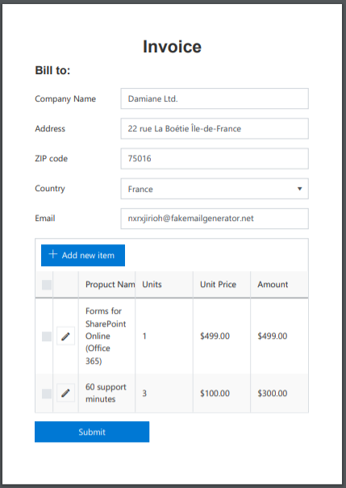

|

Page Margins: **custom size**

.. code-block:: javascript

    fd.pdfOptions = {
        paperSize: 'A4',
        landscape: false,
        margin: {
            left   : "20mm"
            top    : "40mm",
            right  : "20mm"
            bottom : "40mm"
        }
    };  

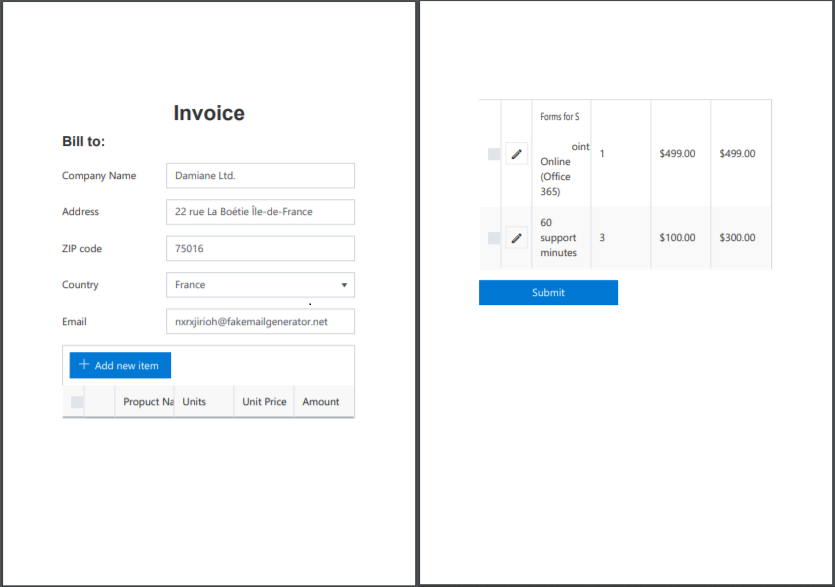

Page breaks
--------------------------------------------------

By default, the page breaks are placed automatically depending on the page dimensions: page size, margins, orientation. But you can define where you want the page to break manually using the *forcePageBreak* option that specifies the CSS class of the element before which the page break occurs. 

For instance, you want the page to break before the List or Library control. For this, you need to specify a CSS class of the control, e.g. 'page-break', and assign it to the *forcePageBreak* option in JS-editor.

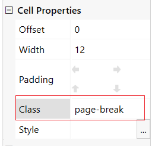

.. code-block:: javascript
    
    fd.pdfOptions = {
        paperSize: 'A4',
        margin: '5 mm',
        forcePageBreak: '.page-break'
    };

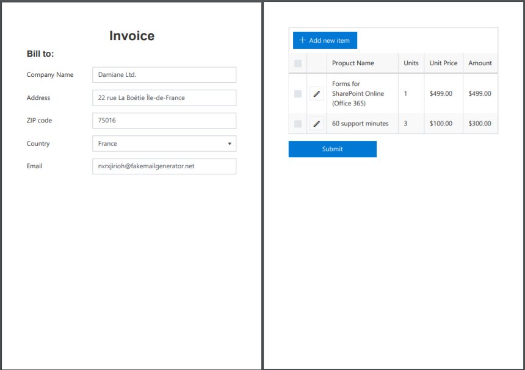

Content adjustments
--------------------------------------------------

You can change the appearance of the exported PDF by using 'k-pdf-export' class. CSS rules for this class are applied to the PDF document only. 

For instance, we don't need the Submit button in the PDF document, so we give it 'pdf-hide' CSS class:

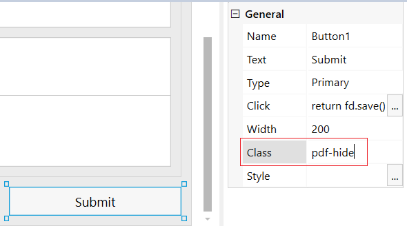

Then, add the following rule to the CSS editor to hide it in PDF: 

.. code-block:: CSS

    .k-pdf-export .pdf-hide {
        display: none !important;
    }

You can give each element that you want to hide the same class and hide them all at once.  

Also, we want to change the appearance of the input controls in the PDF document. Here, we remove borders, arrow buttons of drop-down fields, and toolbar and command columns of the List or Library control using CSS code: 

.. code-block:: CSS

    .k-pdf-export span.k-dropdown-wrap.k-state-default,
    .k-pdf-export .fd-form input.form-control {
        border: none !important;
    }
    
    .k-pdf-export .k-dropdown .k-select {
        display: none !important;
    }

    .k-pdf-export .fd-sp-datatable-wrapper table tr th:nth-of-type(1),
    .k-pdf-export .fd-sp-datatable-wrapper table tr td:nth-of-type(1),
    .k-pdf-export .fd-sp-datatable-wrapper table tr th:nth-of-type(2),
    .k-pdf-export .fd-sp-datatable-wrapper table tr td:nth-of-type(2),
    .k-pdf-export .fd-sp-datatable-toolbar {
        display: none !important;
    } 

Finally, we want to add the company logo and contact information to the PDF document, but we don't want it to be visible in the form. For this, we place the logo and contact information inside a Grid and assign 'company-info' CSS class to it. 

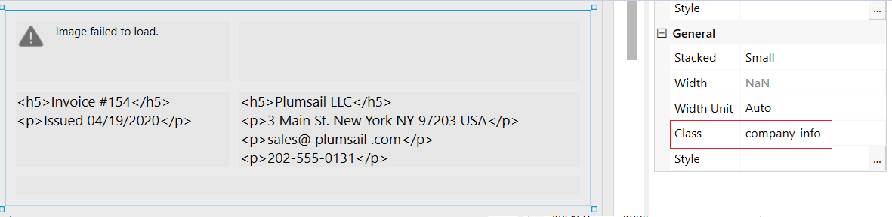

Next, we add the code to the CSS editor that makes company information visible in PDF document only. 

.. code-block:: CSS
    
    .company-info {
        display: none !Important;
    } 
    
    .k-pdf-export .company-info {
        display: contents !important;
    } 

This is the resulting PDF document: 

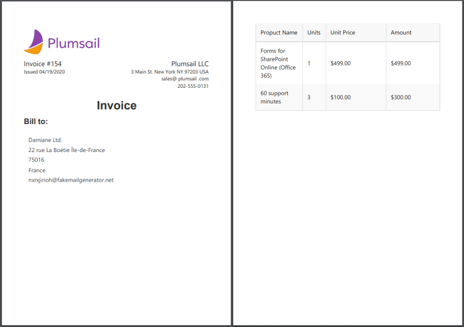

Non-Latin and special characters
--------------------------------------------------

Suppose you have a form in French, German, or Arabic. If you apply font styling to the text, you can notice that the exported PDF stops render Unicode characters. 

For instance, if you make the following text italic: 

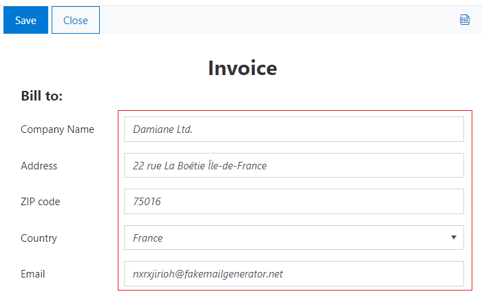

You get the following in the resulting PDF document: 

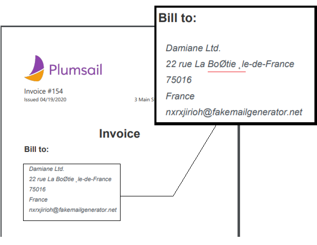

To avoid this problem, you need to use DejaVu Sans font for your form in the resulting PDF document, which contains all Unicode characters. And you need to declare the font using the CSS font-face.  Here is how you can declare DejaVu Sans font and change the font for the entire form with CSS: 

.. code-block:: CSS

    /*apply DejaVu Sans font to the content*/ 
    .k-pdf-export {
        font-family: "DejaVu Sans", "Arial", sans-serif !important;
        font-size: 12px;
    }

    /*declair DejaVu Sans font*/ 
    @font-face {
        font-family: "DejaVu Sans";
        src: url("https://kendo.cdn.telerik.com/2020.1.406/styles/fonts/DejaVu/DejaVuSans.ttf") format("truetype");
    }

    @font-face {
        font-family: "DejaVu Sans";
        font-weight: bold;
        src: url("https://kendo.cdn.telerik.com/2020.1.406/styles/fonts/DejaVu/DejaVuSans-Bold.ttf") format("truetype");
    }

    @font-face {
        font-family: "DejaVu Sans";
        font-style: italic;
        src: url("https://kendo.cdn.telerik.com/2020.1.406/styles/fonts/DejaVu/DejaVuSans-Oblique.ttf") format("truetype");
    }

    @font-face {
        font-family: "DejaVu Sans";
        font-weight: bold;
        font-style: italic;
        src: url("https://kendo.cdn.telerik.com/2020.1.406/styles/fonts/DejaVu/DejaVuSans-Oblique.ttf") format("truetype");
    }

And this is how the client data rendered on PDF:

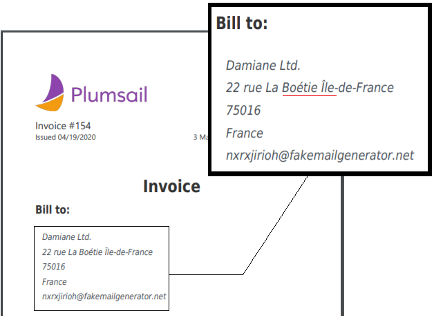

Header, footer, and page numbering
--------------------------------------------------

When a PDF consists of multiple pages, you may want to add a header, footer, and page numbering into each page of the PDF. In our example, we add a page number to the header and a general message to the footer. 

For this, we add an HTML control with this code to any place in the form.

.. code-block:: HTML

    

Next, we need to insert the code below into the CSS editor for defining position and styling of the header and the footer: 

.. code-block:: CSS

    .page-template > * {
                position: absolute;
                left: 20px;
                right: 20px;
                font-size: 90%;
            }
    .page-template .header {
        top: 20px;
        border-bottom: 1px solid #000;
    }
    .page-template .footer {
        bottom: 20px;
        border-top: 1px solid #000;
    }

Finally, we put the following code into the JS-editor: 

.. code-block:: javascript

    fd.pdfOptions = {
        paperSize: 'A4',
        margin: '10 mm',
        forcePageBreak: ".page-break",
        template: $("#page-template").html()
    }; 

Here, we get HTML content of the element we put into HTML-control on the previous step by its id ('page-template'), and assign it to the template option. 

And this is a final PDF file:

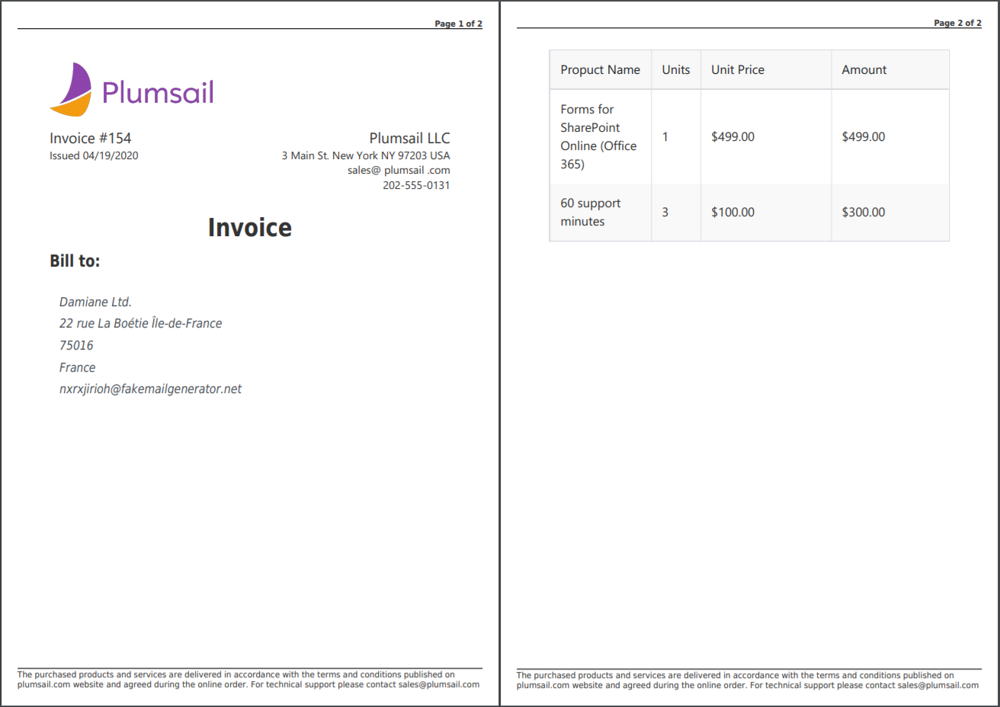

