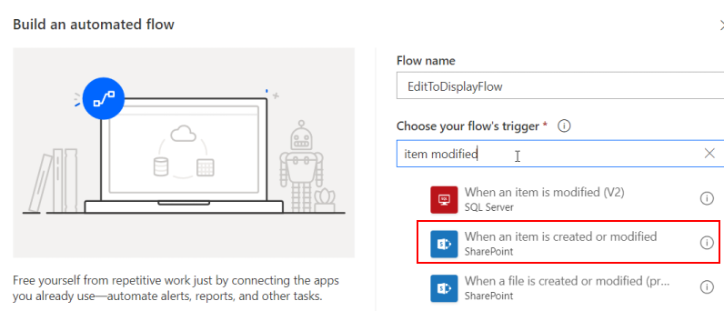

.. title:: Start flow after submitting SharePoint form and wait for it

.. meta::
   :description: Set up flow which starts on saving the form, then redirect users to the updated form after the flow is done

How to start flow after submitting SharePoint form and wait for results
=============================================================================================

.. contents:: Contents:
 :local:
 :depth: 1

Introduction
--------------------------------------------------
Sometimes, you might want to save the item you are working with, start Flow (or Workflow) and see results of the Flow straight away.

For this, we will show you how you can configure both the Flow and the forms to achieve this result.

|pic1|

List and Flow configuration
--------------------------------------------------
First, we'll create a List. I'll call it FlowList in just one word, but you can give it a different name. 

What's important is that it must include two Yes/No columns, I've called one **StartFlow** and the other **FlowFinished**, all without spaces: 

|pic2|

Make sure both columns have default value of **No**. We're going to use these fields in our Flow.

Go to Flow, create an automated flow, which starts when **SharePoint item** (not file) **is created or modified**:

|pic3|

Then, fill out the information about the list we've just created and add a condition, where you need to check value of StartFlow field. 

Use *Expression* tab to populate with real **true** value:

|pic4|

Then, you only need to add anything to Yes part, the No part can remain empty - there is nothing to execute.

I've added a small delay in mine, you don't have to, though you can do it for experiment, but I don't recommend delay larger than 3 seconds 
- it takes much longer to execute in practice. You can just skip it. This is the place where you'll put real actions when running in production.

And in the end, make sure to update the item (use the ID from the trigger), and set **FlowFinished** to **Yes**, 
while I also update Title to make it more obvious:

|pic5|

Building forms
--------------------------------------------------
Now, we'll need to build the forms and customize their JS to make this possible.

First of all, we're going to create New and Display Form - they don't need much, simply drop Title field into them:

|pic6|

Open the Edit Form for the List. I've added **Title** and **StartFlow** field, but I've hidden **StartFlow** with the following Style property: 

.. code-block:: css 

    display:none;

Since it's hidden, users won't modify it manually.

|pic6ed|

I've also added Start Flow button, but we'll populate the *Click* code afterwards.

Next, you need to create a new Form Set for waiting. Don't need to select any groups or priority, just give it a name:

|pic7|

In *Waiting* Form Set, modify the Display Form only. I didn't add any fields, just two Plain Text controls:

|pic8|

More important is the code here. It will use Interval timer to execute requests to the list and check FlowFinished field for the current item. 
Once the FlowFinished field is set to Yes, it will redirect users to Display Form. It will also play a small "animation" while waiting - 
each time a request is sent, the dots will update - this is optional, but at least gives user knowledge that something is happening.

Here's the code:

.. code-block:: javascript

        fd.spRendered(function(){
            $(fd.toolbar.$el).hide();
            //we use Interval timer to send requests checking Flow completion
            var timer = setInterval(checkFlowStatus, 1000);

            function checkFlowStatus(){
                //optional animation call
                playAnimation();
                //use List title and column's Internal Name here
                pnp.sp.web.lists.getByTitle('FlowList').items.select('FlowFinished').getById(fd.itemId).get().then(function(item){
                    if (item.FlowFinished) {
                        clearInterval(timer);
                        //use URL of your own site/list
                        window.location.href = 'https://domain.sharepoint.com/sites/sitename/SitePages/PlumsailForms/FlowList/Item/DisplayForm.aspx?item=' + fd.itemId;
                    }
                });
            }

            //optional animation function
            function playAnimation(){
                var dotsCount = (fd.control('Text1').text.match(/\./g) || []).length;
                if(dotsCount < 3){
                    fd.control('Text1').text = fd.control('Text1').text + '.';
                }
                else{
                    fd.control('Text1').text = fd.control('Text1').text.replace(/\./g, "");
                }
            }
        });

You also need to configure Routing code in JavaScript editor -> Custom routing - we'll use localStorage of the browser to store if the flow has started or not, and we'll check it so that the user's are redirected to the correct form set:

.. code-block:: javascript

      if (localStorage.getItem('startFlow') == '1'){
         localStorage.setItem('startFlow', 0);
         //redirect to this form set, copy ID and replace it in the code:
         return 'a539eec7-1669-45be-b960-6ab96ceae1a2';
      }

You can check the ID of the form set in the lower part of the editor, and use the copy button to copy it:

|copyID|

Finally, return to the default Form Set's Edit Form we've created in the beginning and populate Click property with the following code:

.. code-block:: javascript

    fd.field('StartFlow').value = true;

   fd.spSaved(function(result) {
      //set localStorage variable for routing check
      localStorage.setItem('startFlow', '1');
      
      //redirect to display form
      var listId = fd.spFormCtx.ListAttributes.Id
      var itemId = result.Id;

      //simply replace this URL with yours:
      //PageType=4 means Display Form
      result.RedirectUrl =
         "https://domain.sharepoint.com/sites/sitename/_layouts/15/listform.aspx?PageType=4&ListId="
         + listId + "&ID=" + itemId;
   });

   return fd.save();

|pic11|

This is it! 

Now, you can open Edit Form in your browser and try starting the Flow.

Workflow configuration as alternative
--------------------------------------------------
If you want to run SharePoint Workflow instead - it's very easy! You just need to configure the Workflow instead.

Create a new Workflow for the List and make sure that it starts automatically when an item is changed:

|pic12|

Then, configure a similar condition which will check **StartFlow** (or **StartWorkflow**) field before applying any action:

|pic13|

Make sure to set **FlowFinished** (or **WorkflowFinished**) field to Yes, *after finishing all the other actions* in Workflow.