.. title:: Send an email notification after submitting SharePoint form

.. meta::
   :description: How to use MS Power Automate Plumsail Forms connector with SharePoint forms to send an email

How to send email notification after submitting SharePoint form
======================================================================================

Plumsail Forms includes custom |Power Automate| connector, which can be used to get all information from submitted forms into Power Automate.

Of course, you can use default SharePoint connector provided by Microsoft in many cases, especially if you only have SharePoint fields on your form.

But in case you want to utilize Common fields or some of our new controls - you can use our connector to get all this information into Power Automate.

.. important:: Plumsail Forms connector submissions are licensed under |Public Web Forms license|, not SharePoint Forms license.

.. |Power Automate| raw:: html

   <a href="https://flow.microsoft.com/en-us/" target="_blank">Power Automate</a>

.. |Public Web Forms license| raw:: html

   <a href="https://plumsail.com/docs/forms-web/licensing.html" target="_blank">Public Web Forms license</a>

.. contents:: Contents:
 :local:
 :depth: 1

List and Form configuration
--------------------------------------------------
Let's say, we have a basic form like this:

|pic1|

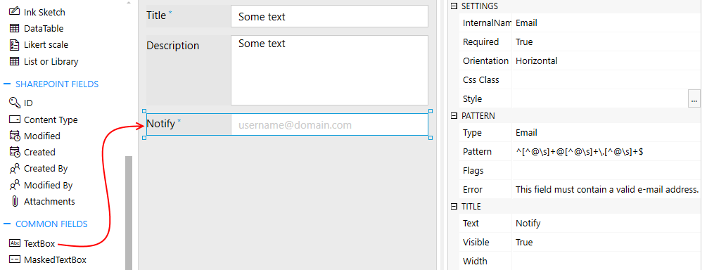

Title and Description are SharePoint fields, but Notify is a Common field with an Email pattern.

In order for us to capture this extra field in Power Automate with the use of Plumsail Forms connector, we need to make sure our form will be submitted to Power Automate.
Open Flow settings and mark this checkbox:

|pic2|

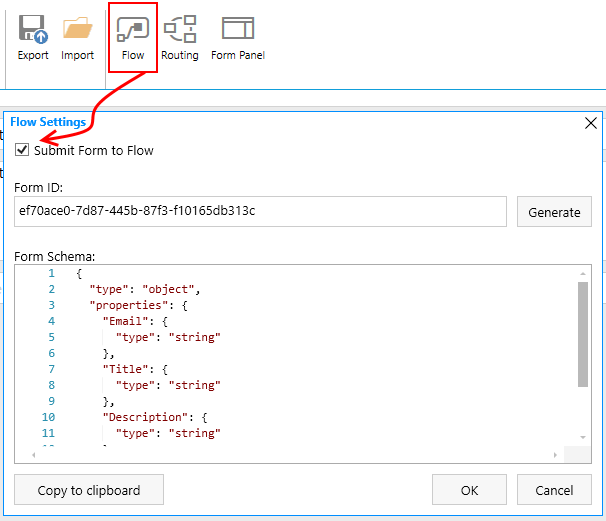

Now, we can configure the flow.

Power Automate configuration
--------------------------------------------------

First thing first, open MS Power Automate and go to My Flows and click *Create from blank*:

|pic4|

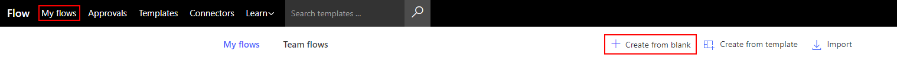

On the next page, click *Search hundreds of connectors and triggers*:

|pic5|

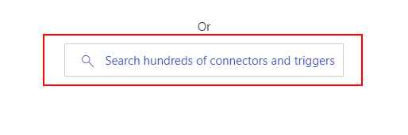

Search for *Plumsail Forms* and add *Plumsail Forms - Form is submitted* trigger:

|pic6|

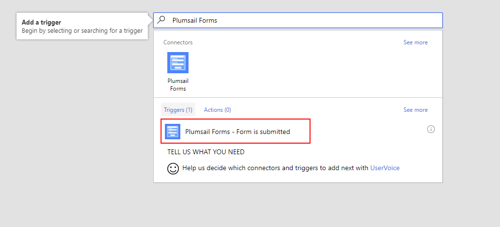

If this is your first flow, at this point you'll need to **Sign in to** |Plumsail Account| from Power Automate, so you can start using your forms inside the flow.

.. |Plumsail Account| raw:: html

   <a href="https://auth.plumsail.com/account/login" target="_blank"><b>Plumsail Account</b></a>

.. important:: You can only bind flows to SharePoint forms, if SharePoint license is bound to this Plumsail Account

|pic7|

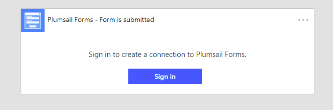

|

Select *Enter custom value*:

|pic-custom-value|

.. |pic-custom-value| image:: /images/how-to/flow/how-to-flow-select-form-custom.png
   :alt: Enter custom value

|

Enter Form ID, which can be found and copied in **Flow Settings** in the Designer:

|pic8|

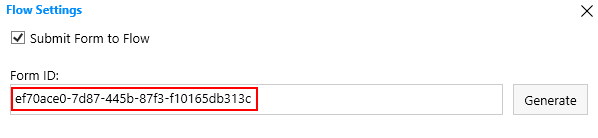

|

Next step for SharePoint form is to parse all the data, so you need to search for **Parse JSON** and select this action:

|pic9|

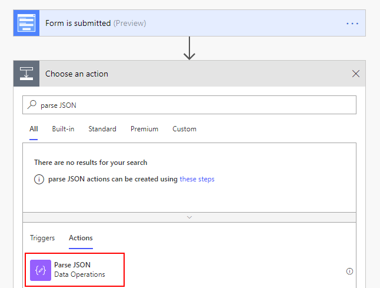

|

Here, you will need to include Form's **Body** as Content and copy Form Schema from **Flow Settings**:

|pic10|

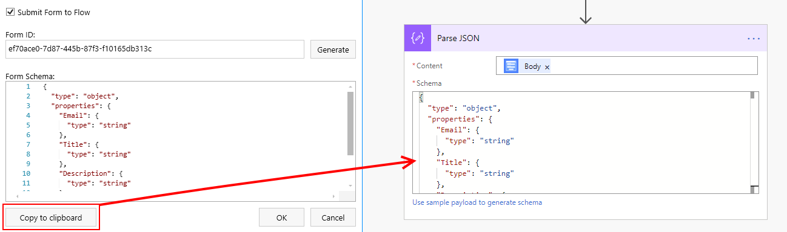

|

Finally, search for **Send an Email** action and fill it with information we've just parsed:

|pic11|

.. |pic11| image:: /images/how-to/flow/email.png
   :alt: Send an Email action

Save flow, make sure the form is also saved with all the configuration, and let's begin testing!

Results
--------------------------------------------------
Here's the form in SharePoint, after being filled in:

|pic12|

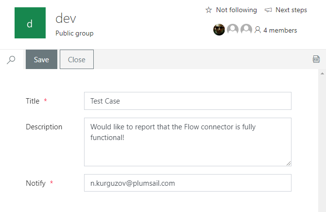

I save the Item and in just a few seconds receive the following email:

|pic13|

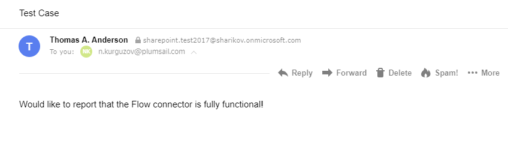

This is just a basic example of how you can use Plumsail Forms connector with SharePoint forms, 
you can actually create much more complex forms with lots of Common fields and controls, and then submit them all to Power Automate, 
using our connector to retrieve the data and use it in any scenario imaginable.