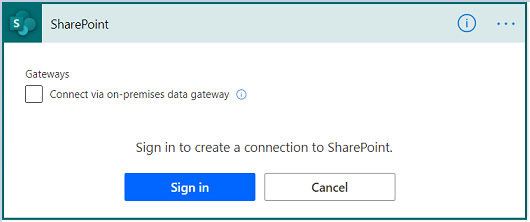
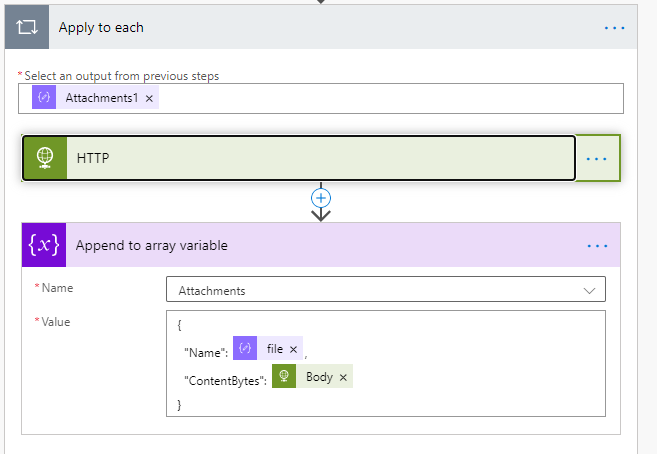

.. title:: Send an email after submitting SharePoint form

.. meta::
   :description: Learn how to send an email with attachments and add a signature to the email body when submitting SharePoint form using Power Automate.

How to send email notification after submitting SharePoint form with Power Automate
======================================================================================

Using Power Automate (MS Flow), you can send a customized email with form data. You can create a flow using a default SharePoint connector or Plumsail Forms connector. 

The default SharePoint connector can be used if your form has SharePoint fields only. 

But in case you want to utilize Plumsail common fields or controls in your flow - you need to use Plumsail Forms connector.

.. contents::
 :local:
 :depth: 3

SharePoint connector
----------------------------------

Here you find instructions on how to create an automated flow using SharePoint connector from scratch. 
You can also create the same flow from the |template| and jump to :ref:`configure_email_SP` step.

Configure the Flow 
^^^^^^^^^^^^^^^^^^^^^^^^^^^^^^^^^

Open |Microsoft Power Automate| page and go to *My Flows* → *New* → *Automated - from blank*. 

|pic2|

|

Select the trigger that starts the flow. Search for *SharePoint*, and you will see all triggers related to SharePoint events. Select 'When an item is created' trigger and click *Create*. 

|pic3|

.. |pic3| image:: ../images/flow/flow_03.png
   :alt: Selecting a trigger

|

If this is the first time you are using the SharePoint connector, you will be asked to sign in to create a connection. Click *Sign in* and enter your SharePoint credentials. 

|pic4|

|

Next, select the site address and the list name from a drop down. 

|pic5|

.. _configure_email_SP:

Configure 'Send an email' action 
^^^^^^^^^^^^^^^^^^^^^^^^^^^^^^^^^^^^^^^^^^^^

Click *New step* and search for *Send email* action. Select 'Send an email (V2)'. 

|pic6|

|

You can add any dynamic content from the SharePoint item to the subject and body of the email. For instance, invoice ID and the name of the user who created the item. 

|pic7|

Adding Ink Sketch to email body
"""""""""""""""""""""""""""""""""

The |Ink Sketch control| picture stores as a base64 string. 
To insert a base64 string to the email body, first, you need to switch the body input to the code view. 

|pic8|

Then, paste this HTML code line to the email body and add field that stores Ink Sketch data from the dynamic content. 

.. code-block:: html

   
 

|pic9|

Adding attachments to email
"""""""""""""""""""""""""""""""""

To send an email with multiple attachments, add these steps.

|pic10|

|  

**1. Get attachments**

Returns the list of attachments for the specified list item. 
Specify site address and list name, and add current item ID from the dynamic content. 

|pic12|

|

**2. Initialize variable**

Name the variable and set its type to 'Array'.

|pic11|

.. |pic11| image:: ../images/flow/flow_11.png
   :alt: Initialize variable

|

**3. Get attachment content**

Add 'Apply to each' action for iterating through the attachments. 'body' is the output from 'Get Attachments' step

Insert the 'Get attachment content' action inside

Specify site address and list name. For the *ID* field select ID output from the 'When an item is created' trigger.
For the *File identifier* field select the Id output from 'Get Attachments' action.

|pic13|

|

**4. Append to array variable**

Add 'Append to array variable' action inside 'Apply to each' step. 
Select the variable name from the drop-down. In the value section, map file name and its content. 

.. code-block:: html

   {
   "Name": ,
   "ContentBytes": 
   }

|pic14|

|

**5. Send an email (V2)**
	
Now you can add the attachments array to the email template.

Go to 'Send and email' action.
Сlick *Show advanced options*, switch attachments field to input entire array. 
Add the variable output to the attachments input field.

|pic15|

Plumsail Forms connector
----------------------------

If you want to send an e-mail with common fields and do not want to save them to a SharePoint item, use Plumsail Forms connector.

.. important:: Plumsail Forms connector submissions are licensed under |Public Web Forms license|, not SharePoint Forms license.

Here you find instructions on how to create an automated flow using Plumsail Forms connector from scratch. 
You can also create the same flow from the |template0| and jump to :ref:`configure_email_PF` step.

Configure the Flow
^^^^^^^^^^^^^^^^^^^^^^

Open |Microsoft Power Automate| page and go to *My Flows* → *New* → *Automated - from blank*. 

|pic2|

|

Select the trigger that starts the flow. Search for *Plumsail* and select 'Form is submitted' trigger, click *Create*.

|pic16|

|

If this is a first time you are using Plumsail Forms connector, you will be asked to sign in to Plumsail account to create a connection. 
Click *Sign in* and enter your account credentials.

|pic17|

.. |pic17| image:: ../images/flow/flow_17.png
   :alt: connection

|

Select 'Enter custom value' from a drop down and paste From ID that can be found in Flow Settings of the form.

|pic18|

|

To copy Form ID, open the form in the desktop designer, go to Flow settings and do the following:

1. Make sure that 'Trigger MS Flow when the form is submitted' option is turned on.
2. Click Generate button and copy Form ID.
3. Click OK and save the form. 

|pic19|

|

Using Plumsail Forms connector the form data is submitted as JSON. 
To parse all the data, add 'Parse JSON' action.
For the *Content* field select body of the form, and for the *Form Schema* -  paste Form Schema from Flow Settings:

|pic20|

.. _configure_email_PF:

Configure 'Send an email' action
^^^^^^^^^^^^^^^^^^^^^^^^^^^^^^^^^

Click *New step* and search for *Send email* action. Select 'Send an email (V2)'.

|pic22|

|

You can add any dynamic content from the form to the subject and body of the email. For instance, names of requester and approver. 

|pic21|

Adding Ink Sketch to email body
"""""""""""""""""""""""""""""""""

The |Ink Sketch control| picture stores as a base64 string. 
To insert a base64 string to the email body, first, you need to switch the body input to the code view. 

|pic8|

Then, paste this HTML code line to the email body and add field that stores Ink Sketch data from the dynamic content. 

.. code-block:: html

   
 

|pic9|

Adding attachments to email
"""""""""""""""""""""""""""""""""

To send an email with multiple attachments, add these steps.

|pic23|

**1. Initialize variable**

Name the variable and set its type to 'Array'.

|pic11|

.. |pic11| image:: ../images/flow/flow_11.png
   :alt: Initialize variable

|

**2. HTTP**

Add the 'Apply to each' action for iterating through the attachments. 'Attachments1' is the common field output.
	
To get the content of the attached files add 'HTTP' action. Select GET in *Method* dropdown field and add url to the *Uri* field.

|pic24|

|
	
**3. Append to array variable**

Add 'Append to array variable' action inside 'Apply to each' step. 
Select the variable name from the drop-down. In the value section, map file name and its content. 

.. code-block:: html

   {
      "Name": ,
      "ContentBytes": 
   }

|pic25|

|

**4. Send an email**

Go to 'Send and email' action.
Сlick *Show advanced options*, switch attachments field to input entire array. 
Add the variable output to the attachments input field.

|pic15|

.. |template| raw:: html

   <a href="https://flow.microsoft.com/en-us/galleries/public/templates/1f8edba0b70e11e68af78d1a54677f1f/send-an-email-when-a-new-item-is-created-in-sharepoint/" target="_blank">Microsoft Power Automate template</a>

.. |template0| raw:: html

   <a href="https://flow.microsoft.com/en-us/galleries/public/templates/834771e8c74d428791ea78ff5ea81396/send-an-office-365-outlook-email-when-a-plumsail-form-is-submitted/" target="_blank">Microsoft Power Automate template</a>

.. |Microsoft Power Automate| raw:: html

   <a href="https://flow.microsoft.com/" target="_blank">Microsoft Power Automate</a>

.. |Ink Sketch control| raw:: html

   <a href="https://plumsail.com/docs/forms-sp/designer/controls.html#ink-sketch" target="_blank">Ink Sketch control</a>

.. |Public Web Forms license| raw:: html

    <a href="https://plumsail.com/docs/forms-web/licensing.html" target="_blank">Public Web Forms license</a>

