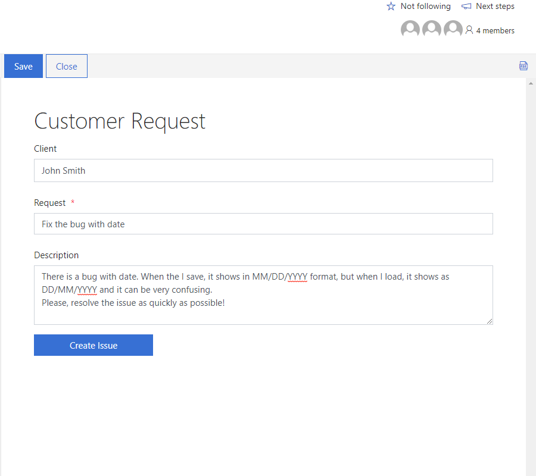
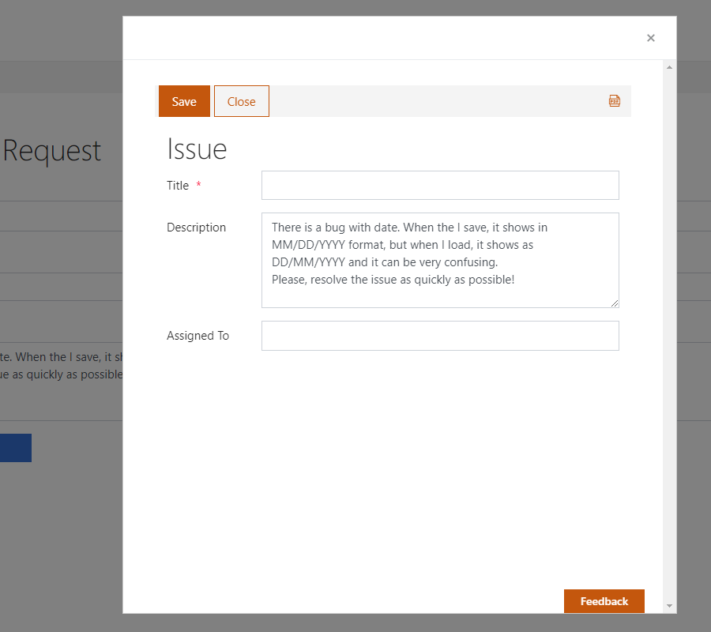
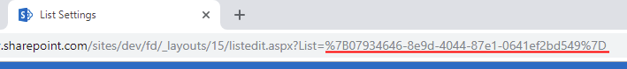
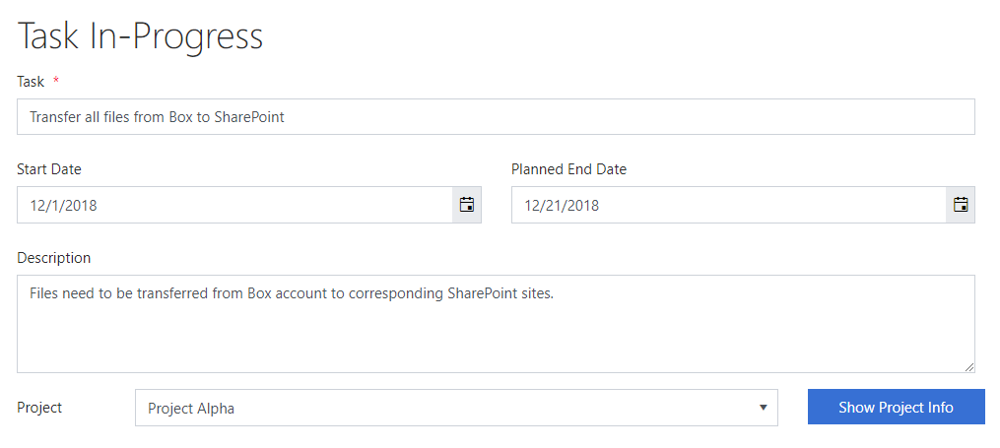
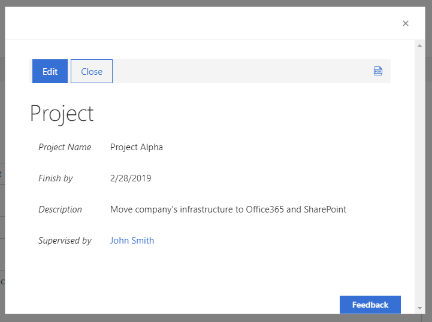

.. title:: Open SharePoint form in dialog from another form

.. meta::
   :description: Open another SP form in dialog and pass parameters to it with JavaScript

How to open SharePoint form in dialog from another form and pass parameters with JavaScript
===============================================================================================

.. contents:: Contents:
 :local:
 :depth: 1
 
Introduction
--------------------------------------------------
It is now possible to open any custom Plumsail SharePoint Form in dialog, from another Plumsail SharePoint Form, and this can be used in variety of cases.

For example, you can open a form in dialog and copy some data from parent form into it, even if the actual form is located in another Site Collection, 
without a need to redirect users to the form. Alternatively, you can open Display or Edit form of a lookup field in a dialog, right from the current form.

JS API also allows you to pass parameters to the form that's opened in dialog, and to retrieve these parameters when the form actually opens. 
Also, it's possible to detect if Dialog form was saved or not, and to even pass some parameters back to main form.

In this article we'll show practical examples of how you can use Dialog, but you can also find general information about it on our JS documentation :doc:`Dialog </javascript/dialog>` page.

Open in dialog form in another Site Collection
---------------------------------------------------
Opening form in a dialog is very easy, you just need to have URL of the site and ID of the List, which can be found in List Settings URL:

|pic0|

I can simply add a button to open this list's form in dialog, and get Description field to pass as a parameter:

.. code-block:: javascript

    //?PageType=8 - will open a New Form
    Dialog.open("https://domain.sharepoint.com/sites/AnotherGroupSite/_layouts/15/listform.aspx?PageType=8&ListId=%7B3b3c9b7b-41ec-43aa-9607-6d5c993bcfd2%7D",
    { Description: fd.field("Description").value });

*Note: read more about generation of form URLs* :doc:`here</how-to/link-to-form>`.

Then, I add the following code to the form that opens, to get the argument and set its own Description field:

.. code-block:: javascript

    fd.spRendered(function() {
        //if opened in dialog
        if (window.frameElement && Dialog.getArgs()){
            //set Description to the passed Description
            fd.field("Description").value = Dialog.getArgs().Description;
        }
    });

As a result, I can open form with Customer's request in one site collection:

|pic1|

And if necessary, copy its Description to another site collection and create an item there:

|pic2|

It's also possible to copy multiple fields if necessary, there are no limits on amount of passable parameters.

Open in dialog Display form for the lookup field
---------------------------------------------------
Another potential use of dialog is to open a specific form in dialog, for example, Display Form for a Lookup field.

First, we still need the ID of the List which we want to open:

|pic0|

Next, just add a button near Lookup field, which will execute the following code:

.. code-block:: javascript

    //ID for the form to be opened
    var lookupID = fd.field('Project').value.LookupId;
    if(lookupID){
        //?PageType=4 - will open a Display Form
        Dialog.open("https://domain.sharepoint.com/sites/SiteName/_layouts/15/listform.aspx?PageType=4&ListId=%7Bcf08de1a-d6f1-4aae-b329-cf029e014f6d%7D&ID=" + lookupID,{});
    }
    else{
        alert("No project selected");
    }

*Note: read more about generation of form URLs* :doc:`here</how-to/link-to-form>`.

And here's the button on the form:

|pic3|

Once pressed, the dialog opens with the currently selected Item:

|pic4|

