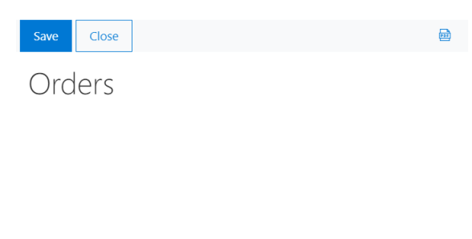
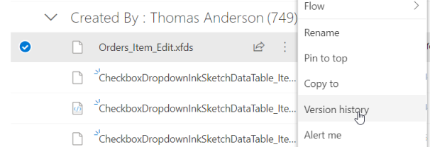
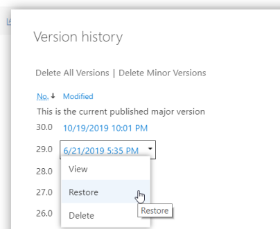
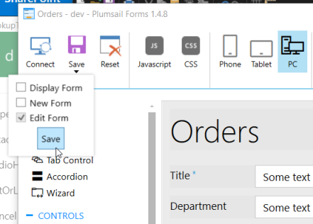
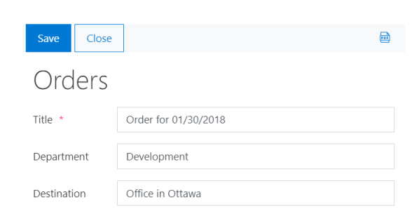
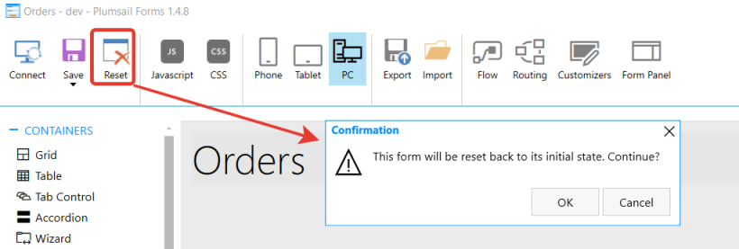
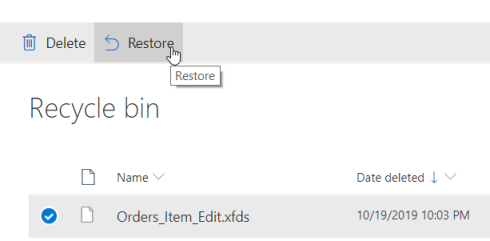

.. title:: Restore previous version of SharePoint form

.. meta::
   :description: Find out how to restore older versions of SharePoint forms designed with Plumsail Forms using SharePoint version history

How to restore previous version of SharePoint form designed with Plumsail Forms
======================================================================================

Designing the right form can take a while. It's also possible that some forms might require additional customization and tuning in the process of use. One wrong move in the editor, and you can potentially lose the changes that you've worked on for a while. 

To prevent this from happening and to always have a back up, we will show you how to enable versioning for any form and how to go back to a previous version, if that ever becomes necessary.

.. Note:: While this method is secure, to be extra sure that the most important and/or complex forms are backed up, we recommend to **Export** them in the editor and store the form schema somewhere safe.

.. contents::
 :local:
 :depth: 1

Restoring older version
--------------------------------------------------
All form schemas, that the editor opens and interprets as a form are stored on the SharePoint site for in **Site Pages** library.

.. important:: Make sure that versioning is enabled for **Site Pages** library!

For example, we've accidentally deleted all fields from Orders Edit Form:

|pic0|

Go to **Site Pages** -> **PlumsailForms** and find the specific form that you want to return to a previous version. 

The file names have the following structure: **{ListName}_{ContentTypeName}_{FormType}.xfds**

|pic3|

You just need to restore the previous version of the file:

|pic4|

Then, open the form again the editor and re-save it:

|pic5|

That's it! This version should now be back:

|pic6|

Restoring form after Reset
--------------------------------------------------

Let's imagine, you Reset a form by accident:

|pic1|

This will send the form to the Recycle Bin on the site. Find and restore it:

|pic2|

Then re-open the form in the editor, and save it again:

|pic5|

This will bring the form back after Reset.