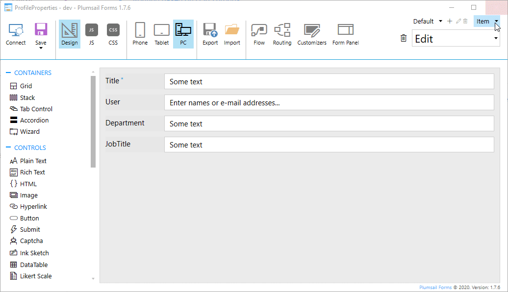
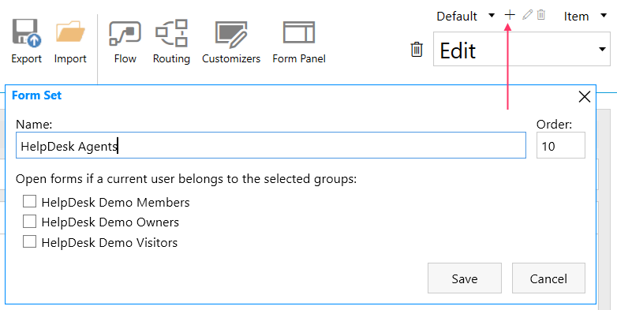
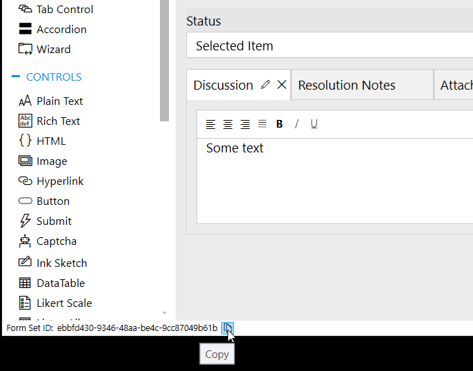
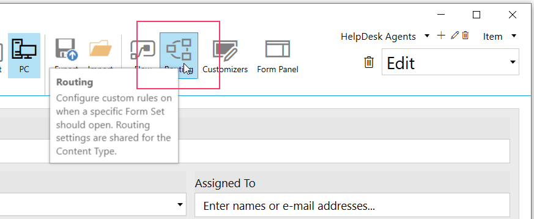

.. title:: Personalize SharePoint forms for user groups

.. meta::
   :description: Provide unique forms for users based on their membership in Azure AD, Office365 or SharePoint groups

Personalize form based on user group in Azure Ad or Office365
======================================================================================

This article will show you how to create custom forms for users of different groups. Some ways are easier than others, but we want you to see all available options.

.. contents::
 :local:
 :depth: 1

Routing based on SharePoint groups
--------------------------------------------------
This is the easiest option to customize forms for a user group. All you need to do is to create a new :doc:`Form Set <../designer/form-sets>`, and select which groups will be redirected to it:

|pic0|

Then the users of this group will automatically redirect to it, all the others will still see only the default form.

For a practical example of how to customize forms for a specific SharePoint group, check out :doc:`add personal form for creating and tracking tickets to any SP page <../examples/ticket-management>`.

Routing based on O365 groups
--------------------------------------------------
You can use custom routing and |Microsoft Graph API| to retrieve Office365 groups and check current user's membership.

.. |Microsoft Graph API| raw:: html

    <a href="https://pnp.github.io/pnpjs/graph/" target="_blank">Microsoft Graph API</a>

.. Important::  In order to retrieve user profile properties with Graph API, you first need to make sure that the Microsoft Graph app has the permissions to access data on your tenant.

                For this, make sure to install |Microsoft 365 CLI| (you'll need to install Node.js first in order to do that).

                Connect it to your Office 365 tenant from the command line:

                .. code-block:: javascript

                    m365 login

                And then use the following line to give Microsoft Graph the required permissions:

                .. code-block:: javascript

                    m365 spo serviceprincipal grant add --resource "Microsoft Graph" --scope "Directory.Read.All"

First of all, create a new Form set:

|pic1|

Copy its Form Set ID:

|pic2|

Finally, add custom routing and specify rules for redirection to this new form set:

|pic3|

We check the user's groups and only redirect user to the Form if they belong to the **HelpDesk Agents** group, using the following code, just replacing Form Set ID with the one that we've copied on the form:

.. code-block:: javascript

   return graph.me.memberOf().then(function(groups) {
      if (groups && groups.length) {
         for (var i = 0; i < groups.length; i++) {
               if (groups[i].displayName === 'HelpDesk Agents')
                  return '--- Form Set ID ---'
         }
      }    
   });

.. |Microsoft 365 CLI| raw:: html

    <a href="https://pnp.github.io/cli-microsoft365/" target="_blank">Microsoft 365 CLI</a>

Show/hide sections based on O365 groups
--------------------------------------------------
Another option that you have is not to design a separate Form Set, but instead hide and show elements based on user's group membership. You still need to configure |Microsoft Graph API| as described in the previous section.

Then, you can use the following code to first hide some fields, and then show them if user belongs to a specific group:

.. code-block:: javascript

   function showHideFields() {
      var userGroups = [];
      graph.me.memberOf().then(function(groups) {
         for (var i = 0; i < groups.length; i++) {
               userGroups.push(groups[i].displayName);
         }

         //check if the user is a member of Administrators user group
         if (userGroups.indexOf('Administrators') >= 0) {
               //Enable fields
               fd.field('AdministratorFeedback').disabled = false;
               fd.field('AdministratorComment').disabled = false;
         }

         //check if the user is a member of Managers user group
         if (userGroups.indexOf('Managers') >= 0) {
               //Show grid container
               $('.manager-section').show();
         }
      });
   }

   fd.spRendered(function() {

      //Turning fields available to administrators only into read-only state
      fd.field('AdministratorFeedback').disabled = true;
      fd.field('AdministratorComment').disabled = true;

      //Hiding the grid containig fields available to managers only
      $('.manager-section').hide();

      //call function on form load
      showHideFields();
   });

For an example of how to use **PnPjs library** and SharePoint groups to achieve the same result, please, check out - :doc:`display specific sections of SharePoint form conditionally based on user’s membership <../examples/dynamic-form-based-on-membership>`.