.. title:: Grids in Plumsail Forms for SharePoint

.. meta::
   :description: Flexible container, allows you to place fields and controls side by side, control how many columns a row has, and adjust it dynamically based on screen size

How to design complex and responsive forms with grids in Plumsail Forms for SharePoint
==========================================================================================

.. contents:: Contents:
 :local:
 :depth: 1
 
Introduction
--------------------------------------------------
Grid is a flexible container.  

It allows you to place fields and controls side by side, control how many columns each row has. It's used as a basis on every form, and inside of other containers – Tab Control, Accordion, Wizard.  

In this article, we describe the advantages of using Grids instead of Tables in Forms. 

|pic0|

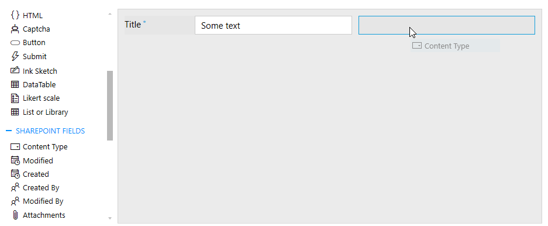

Our Grid is based on |Bootstrap v4 Grid|.

.. |Bootstrap v4 Grid| raw:: html

   <a href="https://getbootstrap.com/docs/4.0/layout/grid/" target="_blank">Bootstrap v4 Grid</a>

Key advantages
--------------------------------------------------

* Responsiveness – an ability to design a single layout that is adjusted to any screen size automatically. It makes Grid even more useful when designing mobile-friendly forms. 

* Flexibility – no need to define the number columns for the whole Grid unlike we do for Tables. Each row can contain an arbitrary and unique number of columns. Thus, you can create a pretty complex form by using just a single Grid. The generated code is more compact with Grids and thus is rendered much faster by browsers. 

* Powerfulness – since the Grid is based on very popular Bootstrap grid, it contains a lot of built-in features e.g. predefined classes for adjusting forms to different screen sizes, aligning content inside a Grid, configuring spacing between cells, etc. 

|pic1|

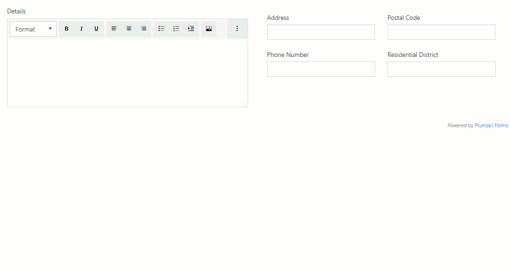

Basics of Grid
--------------------------------------------------
Plumsail Forms leverages the Bootstrap grid providing a series of containers, rows, and columns to layout and align content in forms. It is built on flexbox and is fully responsive.  

Each row can be split into up to 12 columns. In most cases, you will not use all 12 individual columns. But 12 evenly divides into 6 (*halves*), 4 (*quarters*) and 3 (*thirds*) that gives you a wide range of possibilities to organize content in a form. 

|pic2|

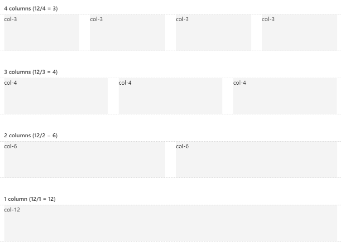

Limit of 12
********************************

By default, each field or control placed into a form takes 6 columns of the root Grid and 12 columns of a nested Grid. 

|pic4|

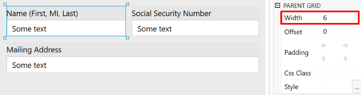

The Width can be changed as demonstrated for the Mailing Address field which size is 12 columns. 

|pic5|

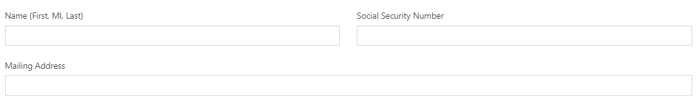

Designer restricts adding new elements into a row if the total width of all items in the row equals to 12. 

|pic6|

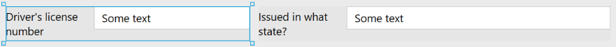

Once you reduce the width of the item(s) in a row, you'll get a free space for adding new items. 

|pic7|

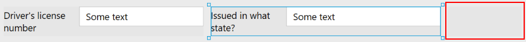

Title width
********************************

Standard Field title's width is 120px but you can change it. 

|pic8|

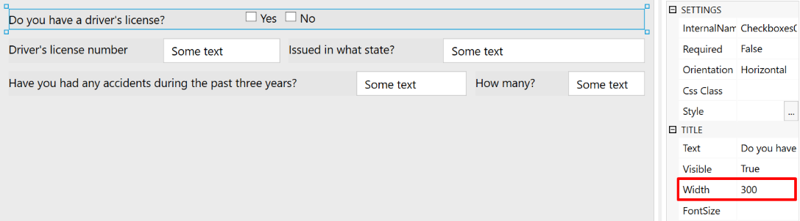

Here, title widths were adjusted to better fit form's layout. 

|pic9|

Nested Grid
********************************
You don't need to limit yourself with 12 columns – nested Grids will allow you to adjust the placement of the fields exactly like you want to. Nested Grids also provide you an opportunity to place some vertically organized fields in a single row. 

|pic3|

There are a lot of scenarios that require organizing fields in multiple rows in a single row of a parent Grid. Here, the nested Grids come in handy.   

|pic10|

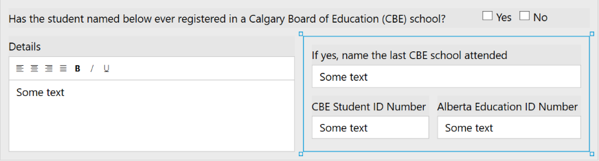

In this sample, we've added the Grid container to the form and placed fields inside in two rows. The result is:

|pic11|

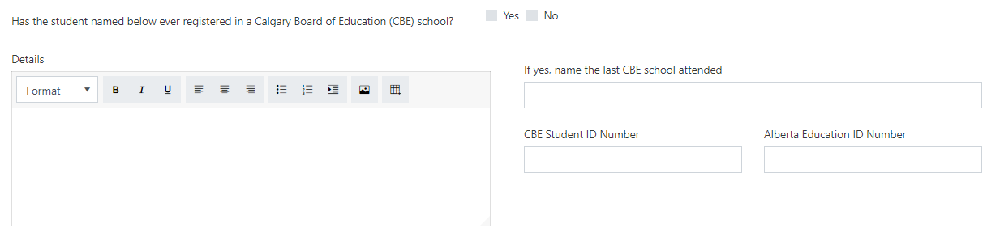

Offset
********************************

You can easily add spacing between fields or a field and Grid border with the Parent Grid's Offset property. 

|pic12|

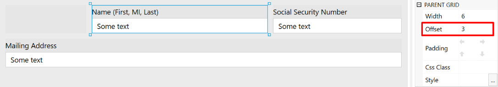

That's how it looks like: 

|pic13|

Stacked property and advanced responsiveness 
--------------------------------------------------

In addition to the concept of column width, Bootstrap has different breakpoints or grid sizes. Each grid size encompasses a range that is designed to best-fit typical device screen widths such as that of desktops, laptops, tablets, and smartphones. These grid sizes enable you to change the layout of columns to best match different screen widths and device. 

Designer implements the breakpoints functionality with Stacked property. 

To make the Grid more responsive, Stacked property has four screen sizes on which the columns are stacked: *Never* (<576 px), *Small* (>=576px), *Medium* (>=768px), *Large* (>=992px).  For example, if the Stacked property is set to Small, the columns will be stacked at the size of the screen < 576 px. If the Stacked property is set to Never the columns will not be stacked at all. 

By default, the Stacked property of the Parent Grid is set to Small. That means that fields are not stacked on larger screens:

|pic14|

But they will be stacked for the screens with size less than 576 px: 

|pic15|

The Stacked property or the root Grid cannot be changed but you can override it in a nested Grid:

|pic16|

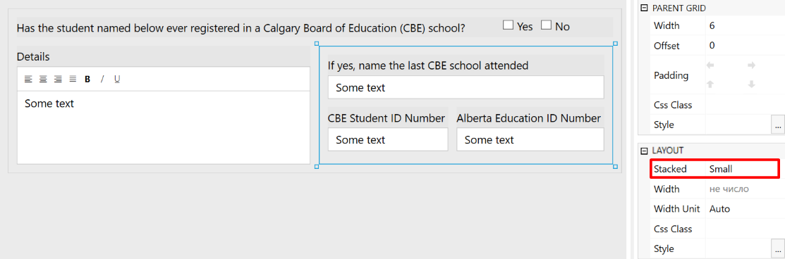

By combining different values of the Stacked property for nested grids, you can define how your form will be adjusted to different screen sizes.  

Example form
********************************

In the form below, I want to leave the Details field alone in a row even for a medium screen size while the remaining fields should be moved to a separate row as a table and collapse into a single column for a small screen.  

For this purpose, I've added a Grid and set its Stacked property to Large: 

|pic17|

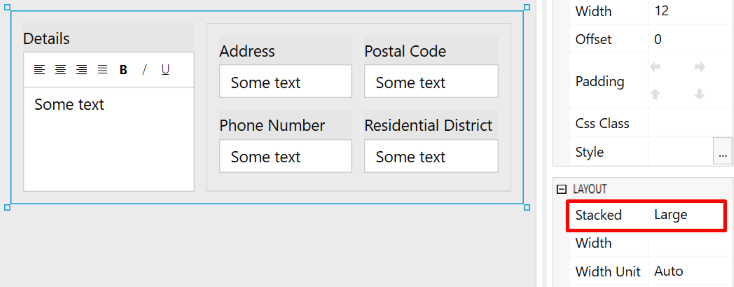

Then, I've added a nested Grid for Address, Postal Code, Phone Number and Residential District and set its Stacked property to Small which is default.

|pic18|

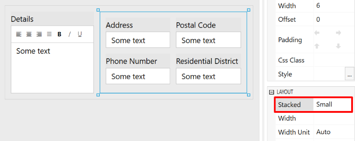

**PC Screen**

|pic19|

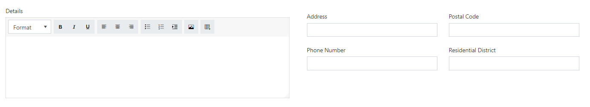

**Tablet Screen**

|pic20|

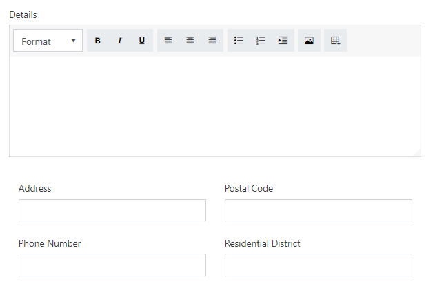

**Mobile Screen**

|pic21|

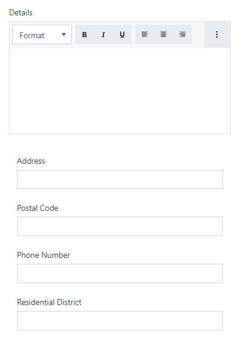

Combining Stacked property with extra CSS-classes provided by Bootstrap e.g. **col-sm-**, **col-md-**, or **col-auto**, allows you to define a layout of any complexity which perfectly suits any screen size.
 
Vertical alignment
--------------------------------------------------

Vertical alignment can be changed with the CSS-classes: **align-items-start**, **align-items-center**, **align-items-end**.  

Grid wide alignment
***********************
 
Assign a CSS class to a nested Grid such as **custom-grid**. Use the following code to align items at the center vertically:  

.. code-block:: javascript

    fd.rendered(function() { 
        $(".custom-grid").find(".row:not(.form-group)").eq(0).addClass("align-items-center");
    });     

Where *eq(0)* uses a row index (zero-based).

You'll get the following result: 

|pic22|

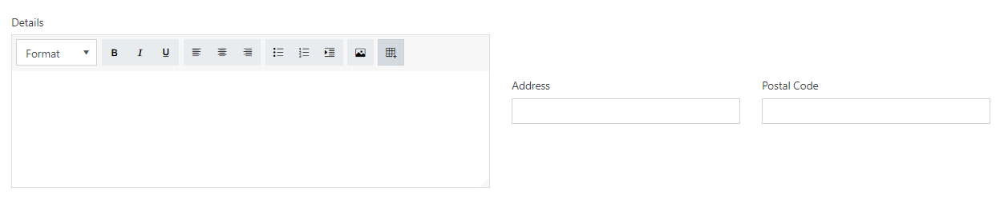

Individual alignment
***********************

If you need to align fields in each column separately, use **align-self-start**, **align-self-center**, **align-self-end** CSS classes: 

|pic23|

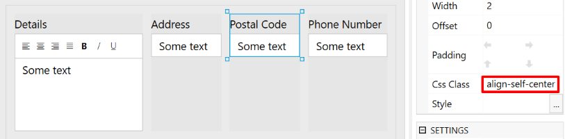

That's how it looks like for each class: 

|pic24|

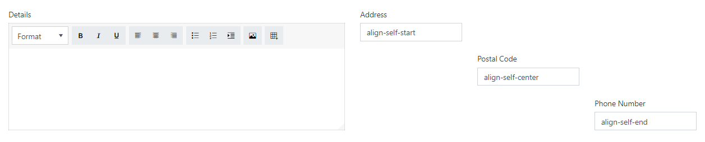

Horizontal alignment
--------------------------------------------------

Horizontal alignment can be changed with **justify-content-start**, **justify-content-center**, **justify-content-end**, **justify-content-around**, and **justify-content-between**.   

We can assign a custom CSS class to our Grid and use the following JavaScript to give each row a different CSS class:

.. code-block:: javascript

    fd.rendered(function() { 
        var rows = $(".custom-grid").find(".row:not(.form-group)"); 
        rows.eq(0).addClass("justify-content-start"); 
        rows.eq(1).addClass("justify-content-center"); 
        rows.eq(2).addClass("justify-content-end"); 
        rows.eq(3).addClass("justify-content-around"); 
        rows.eq(4).addClass("justify-content-between"); 
    }); 

Here's the result, each row uses different option for horizontal alignment:

|pic25|

You can mix and match these classes, or only use one, depending on your needs.

No spacing
--------------------------------------------------

The spacing between columns can be removed with **no-gutters** CSS class. 

Code sample: 

.. code-block:: javascript

    fd.rendered(function() { 
        $(".custom-grid").find(".row:not(.form-group)").eq(0).addClass("no-gutters");
    }); 

|pic26|

