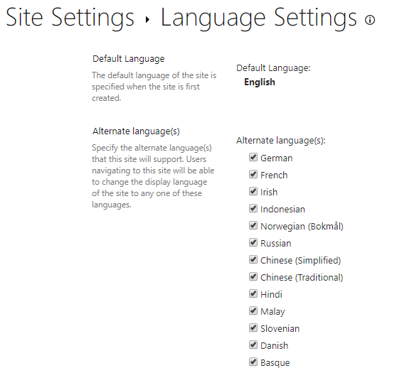
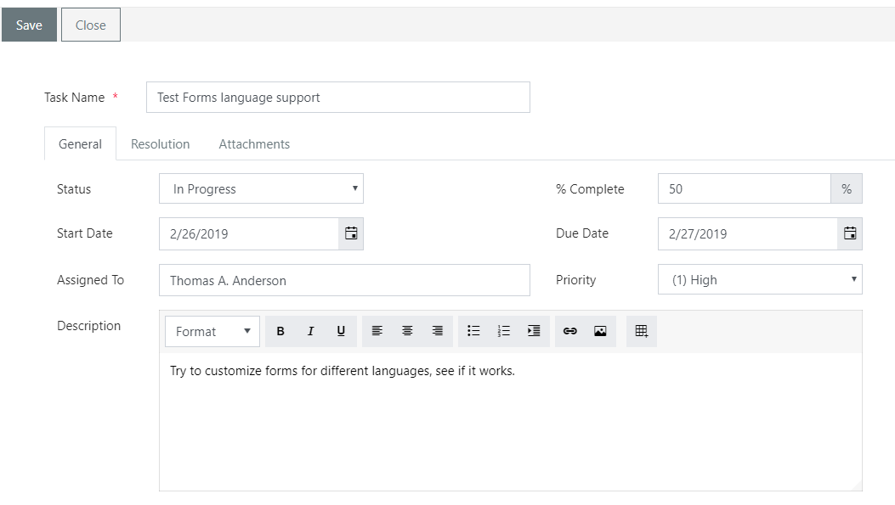
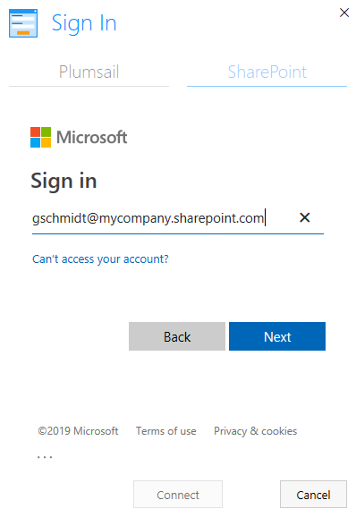
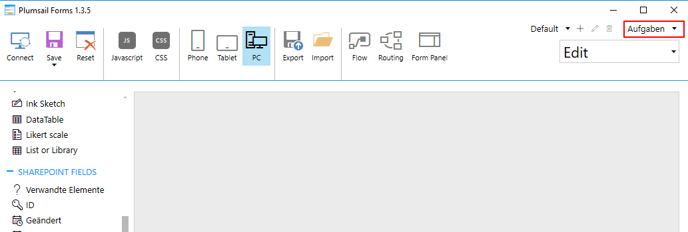
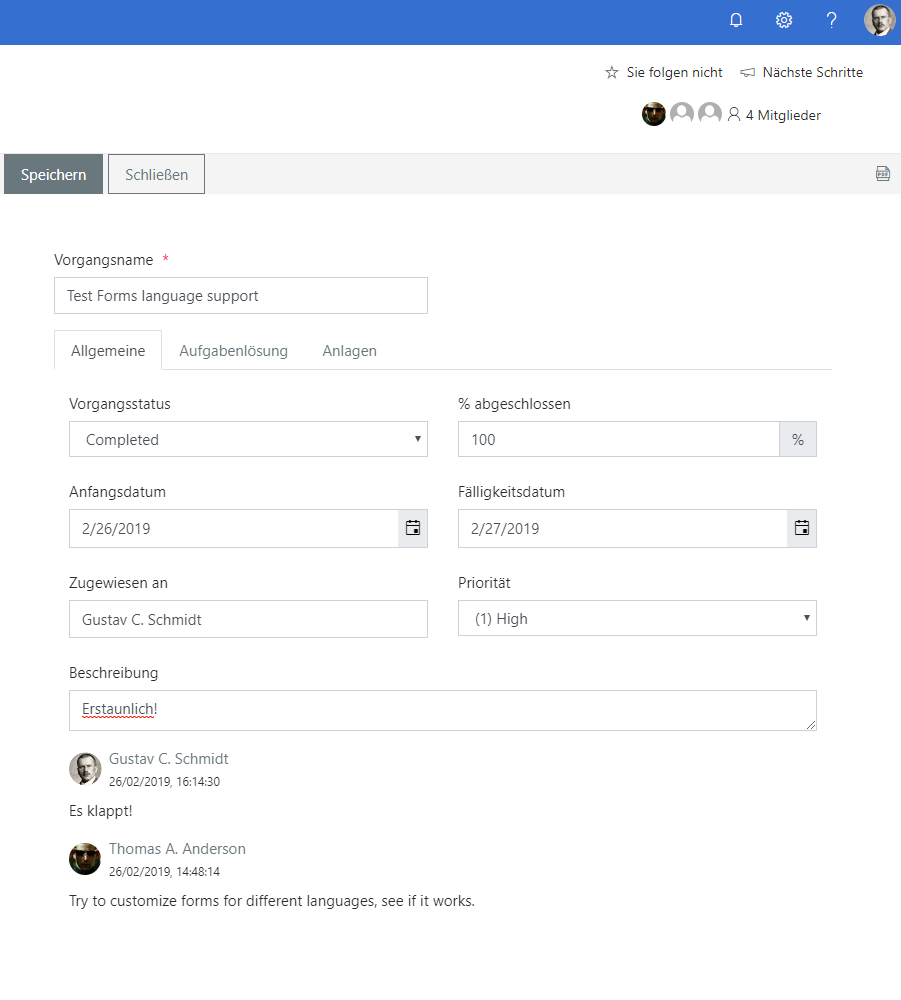
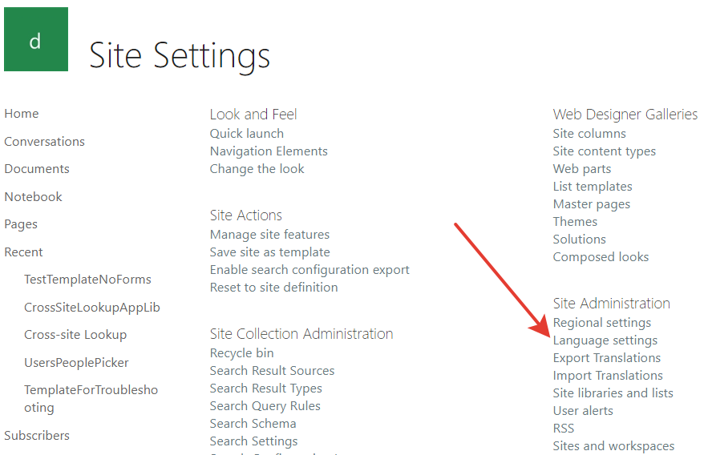

Forms for different languages within one site
===============================================

.. contents:: Contents:
 :local:
 :depth: 1
 
Introduction
--------------------------------------------------
Modern SharePoint sites support large amount of languages. In your company, you might have users with different language preferences, all working on the same site.

|pic1|

Plumsail Forms supports custom forms for different languages out of the box.

Implementation
--------------------------------------------------
Let's say, we have a Task List. Here's the default English form:

|pic2|

To add another form in another language, we only to have SharePoint Admin with different language in his profile:

|pic3|

When they open the form in the editor, they will see an empty form and a Content Type in their own language:

|pic4|

They can customize the form, make sure that it works for their language. 
Next time, when a user with the same language preferences opens the form, they will see the custom form for their language instead:

|pic5|

The forms are generated for each unique Content Type name, in this case: **Task** and **Aufgaben**. These are also used in form URLs:

``/SitePages/PlumsailForms/{ListName}/{ContentType}/NewForm.aspx``

Make sure that the Content Type has a different name in other languages to have different forms. If you don't want this - use the same name for Content Type across languages.

How to fix missing forms
------------------------------------------------------
Sometimes, you can design a form, but when a user tries to open it, they'll be redirected to a non-existing page and will get a 404 error:

|pic6|

.. |pic6| image:: ../images/how-to/language/404.png
   :alt: 404 Error

This can happen if you didn't design a default language form for this Content Type. 

If default language is English and you design an English form first, then users with all kinds of language preferences will be redirected to default language form.

You can check default language in Site Settings -> Language settings:

|pic7|

