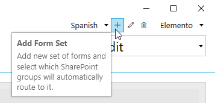

.. title:: SharePoint forms for alternative languages

.. meta::
   :description: How to create new forms for alternative languages and configure routing to them in Plumsail Forms

How to create different SharePoint forms for alternative languages
===================================================================

Modern SharePoint sites support large amount of languages. In your company, you might have users with different language preferences working on the same site.

.. note:: Make sure the desired language is available on your site, before designing a form for it.

|pic1|

Plumsail Forms can support multiple languages for each form with a little bit of work.

.. important:: Previously, the implementation of different language forms worked differently. To get the latest functionality, please, :doc:`update the app package <../general/update-package>` to v1.0.8 or higher, and re-save forms in the editor v1.6.4 or higher.

Implementation
--------------------------------------------------
First, you'll need to create a :doc:`Form Set <../designer/form-sets>` for the language that you want to support:

|pic2|

Then, you need to configure Custom Routing to redirect to this Form Set when the UI of the site is rendered with this language:

|pic4|

Use code like this:

.. code-block:: javascript

   if(_spPageContextInfo.currentUICultureName == 'es-ES'){
      return 'b442f350-2949-4d95-b13c-ac4063ab34e4';
   }

You only need to replace **'es-ES'** with the code of the |language| that you want to be supported and the ID of the Form Set can be copied at the bottom of the editor:

|pic5|

.. |language| raw:: html

   <a href="https://docs.microsoft.com/en-us/deployoffice/overview-deploying-languages-microsoft-365-apps#languages-culture-codes-and-companion-proofing-languages" target="_blank">language</a>

If you need to design a form in a language that use a right-to-left format, please see :doc:`'Align fields to the right for Arabic, Hebrew and other languages' </how-to/right-left>` article.