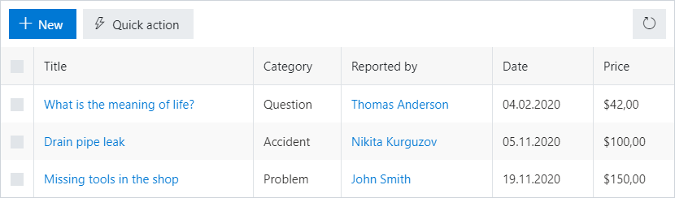
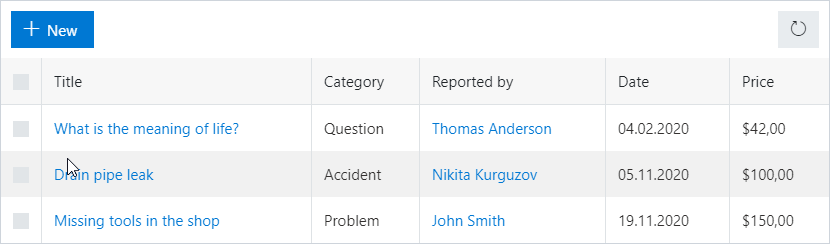
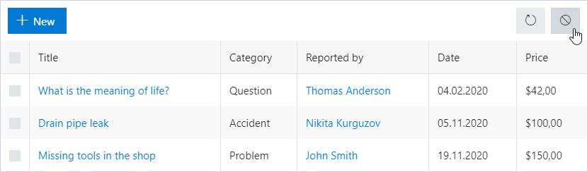
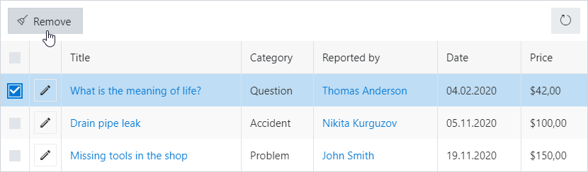

.. title::  Work with buttons on the toolbar of a List or Library

.. meta::
   :description: Simple samples on how to customize existing buttons or add new ones

How to work with buttons on the toolbar of a List or Library control
=========================================================================

In this article, we'll show you how to work with buttons for List or Library control, adding new buttons, removing or modifying existing ones.

.. contents::
 :local:
 :depth: 1

.. note::   For a practical example of how you can customize List or Library buttons, check out :doc:`Duplicate item button for List or Library <../how-to/list-or-library-buttons>` article.
 
Add a new button to the left
--------------------------------------------------

|pic1|

The following code allows you to add a button to the left side of the toolbar, select an icon and run custom code on click:

.. code-block:: javascript

    fd.spRendered(function() {
        //new button
        var button = {
            text: 'Quick action',
            class: 'btn-secondary',
            visible: true,
            icon: 'LightningBolt',
            iconType: 0,
            click: function() {
                alert('Button clicked!');
            }
        }

        fd.control('SPDataTable1').ready().then(function(dt) {
            //dt parameter is the same as fd.control('SPDataTable1')
            dt.buttons.push(button);
        });

    });

Add a new button to the left, which is hidden, if no item is selected
-----------------------------------------------------------------------
|pic2|

The following code allows you to add a button to the left side of the toolbar, which will be hidden until an item is selected and the code sample to access values of selected items:

.. code-block:: javascript

    fd.spRendered(function() {
        //new button
        var button = {
            text: 'Get info',
            class: 'btn-primary',
            visible: false,
            icon: 'Info',
            iconType: 0,
            click: function() {
                var items = fd.control('SPDataTable1').selectedItems;
                var ids = 'Selected item IDs: ';
                items.forEach(function(item){
                  ids += item.ID + '; ';
                });
                alert(ids);
            }
        }

        fd.control('SPDataTable1').ready().then(function(dt) {
            //dt parameter is the same as fd.control('SPDataTable1')
            dt.buttons.push(button);

            dt.$watch('selectedItems', function(items) {
                if(items.length > 0){
                    button.visible = true;
                }
                else{
                    button.visible = false;
                }
            });
        });

    });

Add a new button to the right
--------------------------------------------------

|pic3|

The following code allows you to add a button to the right side of the toolbar:

.. code-block:: javascript

    fd.spRendered(function() {
        //new button
        var button = {
            text: '',
            class: 'btn-secondary',
            visible: true,
            icon: 'Blocked',
            iconType: 0,
            location: 1,
            click: function() {
                alert('Button clicked!');
            }
        }

        fd.control('SPDataTable1').ready().then(function(dt) {
            //dt parameter is the same as fd.control('SPDataTable1')
            dt.buttons.push(button);
        });

    });

Modify existing buttons
--------------------------------------------------

|pic4|

The following samples will allow you to hide, change text or icon for the existing buttons.

You can hide any button, for example, New button, with the following code:

.. code-block:: javascript

    fd.spRendered(function() {
        fd.control('SPDataTable1').ready().then(function(dt) {
            //dt parameter is the same as fd.control('SPDataTable1')
            dt.buttons[0].visible = false;
        });
    });

Change the text on the Delete button:

.. code-block:: javascript

    fd.spRendered(function() {
        fd.control('SPDataTable1').ready().then(function(dt) {
            //dt parameter is the same as fd.control('SPDataTable1')
            dt.buttons[1].text = 'Remove';
        });
    });

Swap the icon for the Delete button (the icons are taken from |Office UI Fabric Icons|):

.. code-block:: javascript

    fd.spRendered(function() {
        fd.control('SPDataTable1').ready().then(function(dt) {
            //dt parameter is the same as fd.control('SPDataTable1')
            dt.buttons[1].icon = 'Broom';
        });
    });

.. |Office UI Fabric Icons| raw:: html

    <a href="https://uifabricicons.azurewebsites.net/" target="_blank">Office UI Fabric Icons</a>