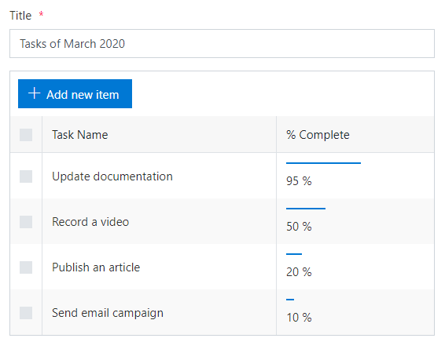
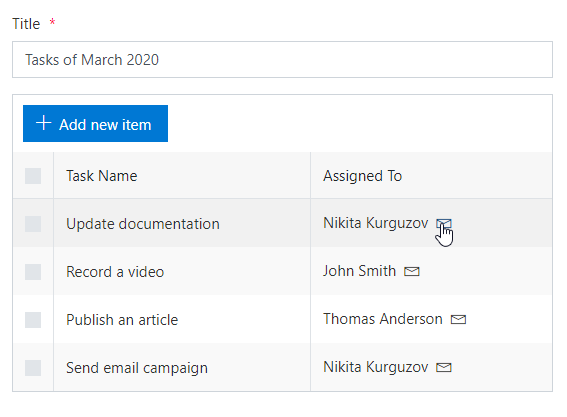
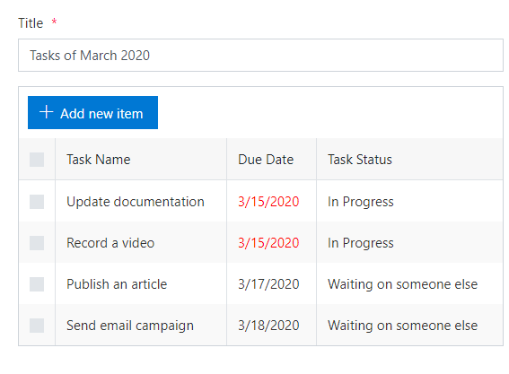
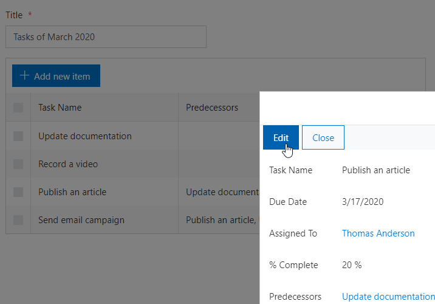
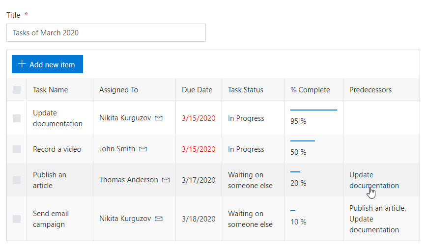

Customize view of specific columns
===========================================

.. contents:: Contents:
 :local:
 :depth: 1
 
Description
--------------------------------------------------
Starting with version 1.5.7, Plumsail Forms support customization of specific columns in List or Library control. 
The possibilities are almost endless, in this article we're going to show some of the possible customizations.

In order to customize a column, you just need to know its Internal Name, what type of field it is, and what you want to achieve with customization.
In this case, I'm using SharePoint's standard Task Content Type and its columns with default Internal Names.

Display numeric fields as progress bars
--------------------------------------------------
One customization option is to turn numeric field into a progress bar, which can be useful for Task List as an example:

|pic0|

Use the following code, just replace **PercentComplete** with the Internal name of the number column:

.. code-block:: javascript

    fd.spRendered(function() {
        fd.control('SPDataTable1').templates = {
            // Display numeric field as a progress bar
            PercentComplete: function(ctx) {
                var value = ctx.row.PercentComplete;
                if (!value) {
                    return '';
                }
                value = value.replace('%','');
                var per = value.split(' ').join('');
                return '' +
                    '' + value + '%';
            }
        }
    })

Send e-mail to a user specified in User field
--------------------------------------------------
You might want to be able to email users in List or Library. Customize column to add an email button to the user names in the column:

|pic1|

Use the following code, just replace **AssignedTo** with the Internal name of the User column:

.. code-block:: javascript

        fd.spRendered(function() {
            var site = 'https://mycompany.sharepoint.com/sites/sitename/subsite';
            var listname = 'Tasks';
            var contenttype = 'Task';
            var displayURL = site + '/SitePages/PlumsailForms/' + listname + '/' + contenttype + '/DisplayForm.aspx';
            fd.control('SPDataTable1').templates = {
                // Send an e-mail to a user specified in the Assigned To field
                AssignedTo: function(ctx) {
                    var value = ctx.row.AssignedTo;
                    if (!value) {
                        return '';
                    }

                    return value.map(function(v) {
                            return '
' +
                                '<a target="_blank" style="padding-right:8px;"data-interception="off" href="/_layouts/15/userdisp.aspx?ID=' + v.id + '">' + v.title + '</a>' +
                                '<a href="mailto:' + v.email + '?subject=Task status&amp;body=Hey, how is your task coming along?.%0D%0A---%0D%0AClick this link for more info. ' +
                                displayURL + '?item=' + ctx.row.ID + '" rel="noopener noreferrer " tabindex="0">' +
                                '<i data-icon-name="Mail" class="ms-Icon ms-Icon--Mail" style="vertical-align: middle;"></i>' +
                                '</a>
'
                        })
                        .join(', ');
                }
            }
        })

Highlight overdue dates
--------------------------------------------------
Want to make sure that the tasks are completed on time? Highlight overdue dates like this:

|pic2|

Use the following code, just replace **TaskDueDate** and **Status** with the Internal names of your columns:

.. code-block:: javascript

    fd.spRendered(function() {
        fd.control('SPDataTable1').templates = {
            // Highlight overdue dates in red
            TaskDueDate: function(ctx) {
                var value = ctx.row.TaskDueDate;
                if (!value) {
                    return '';
                }

                return new Date(value) < new Date() && ctx.row.Status !== 'Completed'
                    ? '' + value + ''
                    : '' + value + '';
            }
        }
    })

Open lookup fields in a dialog
--------------------------------------------------
You can also specify how to open the items linked in lookup fields, for example, open them in dialog:

|pic3|

Use the following code, just replace **Predecessors** with the Internal name of the Lookup column:

.. code-block:: javascript

    fd.spRendered(function() {
        fd.control('SPDataTable1').templates = {
            // Open Office lookup in a dialog
            Predecessors: function(ctx) {
                var value = ctx.row.Predecessors;
                if (!value) {
                    return '';
                }
                return value.map(function(v) {
                        return '<a target="_blank" data-interception="off" ' +
                            'onclick="window[\'' + ctx.openDialogFuncName + '\'](\'' + ctx.field.DispFormUrl + '&ID=' + v.lookupId + '\'); return false;" ' + 
                            'href="' + ctx.field.DispFormUrl + '&ID=' + v.lookupId + '">' + v.lookupValue + '</a>';
                    })
                    .join(', ');
            }
        }
    })

Combine multiple customizations
--------------------------------------------------
You don't have to customize one column at a time. Mix and match, and customize multiple columns at the same time:

|pic4|

Use the following code to achieve the results of all described cases at once:

.. code-block:: javascript

    fd.spRendered(function() {
        var site = 'https://mycompany.sharepoint.com/sites/sitename/subsite';
        var listname = 'Tasks';
        var contenttype = 'Task';
        var displayURL = site + '/SitePages/PlumsailForms/' + listname + '/' + contenttype + '/DisplayForm.aspx';
        
        fd.control('SPDataTable1').templates = {
            // Display numeric field as a progress bar
            PercentComplete: function(ctx) {
                var value = ctx.row.PercentComplete;
                if (!value) {
                    return '';
                }
                value = value.replace('%','');
                var per = value.split(' ').join('');
                return '' +
                    '' + value + '%';
            },
            // Send an e-mail to a user specified in the Assigned To field
            AssignedTo: function(ctx) {
                var value = ctx.row.AssignedTo;
                if (!value) {
                    return '';
                }

                return value.map(function(v) {
                        return '
' +
                            '<a target="_blank" style="padding-right:8px;"data-interception="off" href="/_layouts/15/userdisp.aspx?ID=' + v.id + '">' + v.title + '</a>' +
                            '<a href="mailto:' + v.email + '?subject=Task status&amp;body=Hey, how is your task coming along?.%0D%0A---%0D%0AClick this link for more info. ' +
                            displayURL + '?item=' + ctx.row.ID + '" rel="noopener noreferrer " tabindex="0">' +
                            '<i data-icon-name="Mail" class="ms-Icon ms-Icon--Mail" style="vertical-align: middle;"></i>' +
                            '</a>
'
                    })
                    .join(', ');
            },
            // Highlight overdue dates in red
            TaskDueDate: function(ctx) {
                var value = ctx.row.TaskDueDate;
                if (!value) {
                    return '';
                }

                return new Date(value) < new Date() && ctx.row.Status !== 'Completed'
                    ? '' + value + ''
                    : '' + value + '';
            },
            // Open Office lookup in a dialog
            Predecessors: function(ctx) {
                var value = ctx.row.Predecessors;
                if (!value) {
                    return '';
                }
                return value.map(function(v) {
                        return '<a target="_blank" data-interception="off" ' +
                            'onclick="window[\'' + ctx.openDialogFuncName + '\'](\'' + ctx.field.DispFormUrl + '&ID=' + v.lookupId + '\'); return false;" ' + 
                            'href="' + ctx.field.DispFormUrl + '&ID=' + v.lookupId + '">' + v.lookupValue + '</a>';
                    })
                    .join(', ');
            }
        }
    })