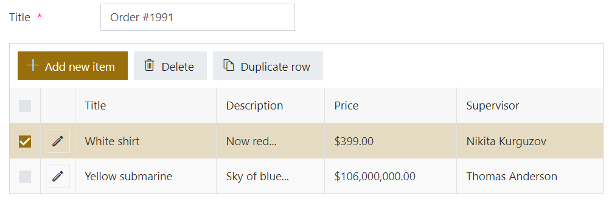
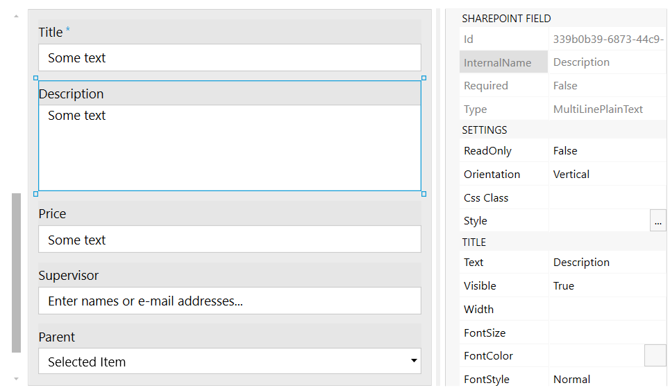
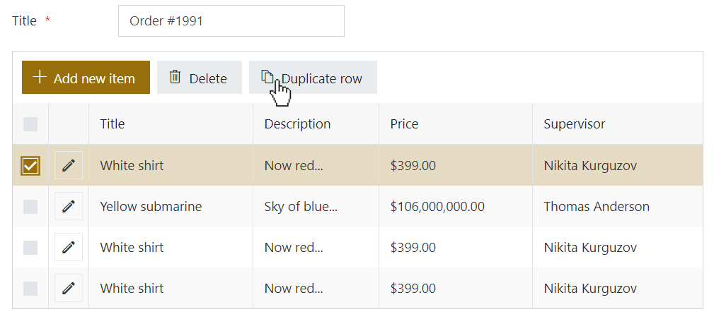

How to add custom button to toolbar of List or Library control and duplicate selected item
==================================================================================================

.. contents:: Contents:
 :local:
 :depth: 1
 
Introduction
--------------------------------------------------
In this scenario, we'll show you how to add button to List or Library control, which would duplicate currently selected item.

|pic1|

Form configuration
--------------------------------------------------
Create a form with a List or Library control. Then, check Internal Names of the fields in List or Library source list - you need to know these, so you can copy them. 

You can open Child List form in the editor and check Internal Names there. For example, my Child item has the following fields to copy: "Title" (Single line), "Description" (Plain text), "Price" (Currency), "Supervisor" (Person), and "Parent" (Lookup).

|pic2|

I can check Internal Name for each field, and make sure that I have correct one.

Then, on the Parent Form, I will add the following code:

.. code-block:: javascript

    //Use Internal Names of your fields
    fieldsToCopy = ['Title', 'Description', 'Price', 'Supervisor', 'Parent'];

    fd.spRendered(function() {
        //new button
        var duplicateButton = {
            text: 'Duplicate row',
            class: 'btn-secondary',
            visible: false,
            icon: 'Copy',
            iconType: 0,
            click: function() {
                //get list from List or Library
                var listURL = fd.control('SPDataTable1').listRootFolder;
                //get item IDs of selected item
                var itemID = fd.control('SPDataTable1').selectedItems[0].ID;
                var items = pnp.sp.web.getList(listURL).items;
                //retrieve all information about selected item
                items.getById(itemID)
                    .get().then(function(item){
                        //create a copy
                        var copy = {};
                        //go through fields and copy each one
                        fieldsToCopy.forEach(function(field) {
                            //copy regular fields
                            if(item[field]){
                                copy[field] = item[field];
                            }
                            //copy more complex fields - Person/Lookup
                            else if(item[field + 'Id']){
                                copy[field + 'Id'] = item[field + 'Id'];
                            }
                        });
                        //add new item based on copy
                        items.add(copy).then(function(result){
                            fd.control('SPDataTable1').refresh();
                            duplicateButton.visible = false;
                        });
                    });
            }
        }

        fd.control('SPDataTable1').ready().then(function(dt) {
            //dt parameter is the same as fd.control('SPDataTable0')
            dt.buttons.push(duplicateButton);

            dt.$watch('selectedItems', function(items) {
                duplicateButton.visible = items && items.length == 1 ;
            });
        });

    });

Now, this would allow me to select and copy any single item in List or Library, and it will work in both Dialog and Inline editing mode.

|pic3|

The code only supports duplicating one item at a time, but it can be further expanded to copy several items at the same time.