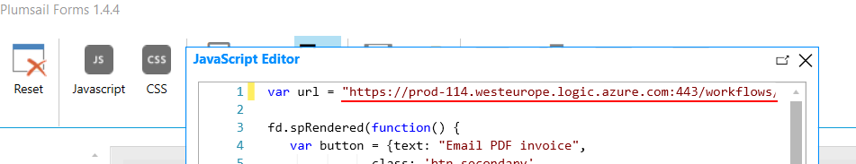

Send selected items to Flow on button click
=================================================

.. contents:: Contents:
 :local:
 :depth: 1
 
Description
--------------------------------------------------
List or Library control allows selection of multiple items, which can then be manipulated in a variety of ways.

In this article we'll show you how you can add a new button to List or Library control which will start a new Flow, and use selected items to create a PDF invoice.

Form configuration
--------------------------------------------------
First, create form a with List or Library control. We'll use Order form with Order items in List or Library:

|pic1|

We'll use JavaScript to add a new button:

.. code-block:: javascript

    //this URL needs to be updated
    var url = "FLOW_URL";

    fd.spRendered(function() {
        //new button
        var button = {
            text: "Email PDF invoice",
            class: 'btn-secondary',
            visible: true,
            icon: 'PDF',
            iconType: 0,
            click: function() { 
                //get item IDs of selected items
                var items = {};
                items.ids = [];
                fd.control("SPDataTable0").selectedItems.forEach(function(item){
                  items.ids.push(parseInt(item.ID));
                });

                //send a request to start flow
                fetch(url, {
                    method: 'POST',
                    body: JSON.stringify(items), // data can be `string` or {object}!
                    headers:{
                      'Content-Type': 'application/json'
                    }
                }).then(  
                  function(response) {  
                    if (response.status >= 300) {  
                      alert('Looks like there was a problem. Status Code: ' +  
                        response.status);  
                      return;  
                    }
                    else{
                      alert("Sent succesfully");
                    }
                  }  
                )  
                .catch(function(err) {  
                  alert('Fetch Error :-S', err);  
                });
            }
        }
        
        

        fd.control('SPDataTable0').ready().then(function(dt) {
            //dt parameter is the same as fd.control('SPDataTable0')
            dt.buttons.push(button);
            dt.buttons[2].visible = false;
            dt.$watch('selectedItems',
            function(items) {
                dt.buttons[2].visible = items.length > 0 ;
            });
        });
        
    });

This JavaScript code will allow button to show up only when some items are selected. This button would send a POST request to MS Flow with the IDs of currently selected items.

Flow
--------------------------------------------------
Create a new Flow from blank, and search for Request connector - **When a HTTP request is received**:

|pic2|

Give it the following Request Body JSON schema:

.. code-block:: javascript

    {
        "type": "object",
        "properties": {
            "ids": {
                "type": "array",
                "items": {
                    "type": "integer"
                }
            }
        }
    }

Next search for Variables connector - **Initialize variable**:

|pic3|

We'll need to Initialize an Array variable to hold SharePoint Items.

To populate the array, we search for SharePoint connector - **Get Item** action (not *Get Items*!):

|pic4|

You then need to fill out the information about List or Library Source List, and select Item as Item ID:

|pic5|

This will automatically transform SharePoint Get Item action into a part of Apply to Each actions, which will be applied to all Item IDs sent in a request. 

This can be used with Compose action to define certain variables. Search for Compose action and add it inside Apply to Each loop, you can define current SharePoint item variables, such as Amount, Price, Total, etc.

|pic6|

After getting all the items to the Array, it's now possible to use them in our own actions. In this example, we're using two actions from Plumsail Documents.

We'll use Create HTML from Template:

|pic7|

And then Convert HTML to PDF:

|pic8|

The result of which we'll send as an attachment in an email with **Send an email** action:

|pic9|

All we need to do now is save the Flow, and copy the URL from **When a HTTP request is received** action: 

|pic10|

Back to our JavaScript editor:

|pic11|

Result
--------------------------------------------------
So, this is how the button looks like on the form, when items are selected:

|pic12|

And here's a preview of the PDF received in an email:

|pic13|

