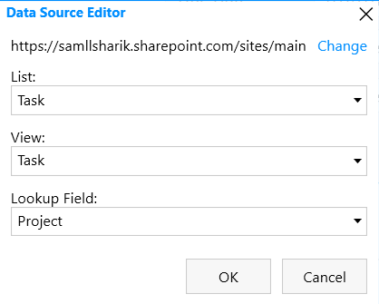
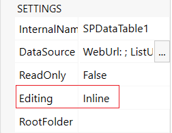
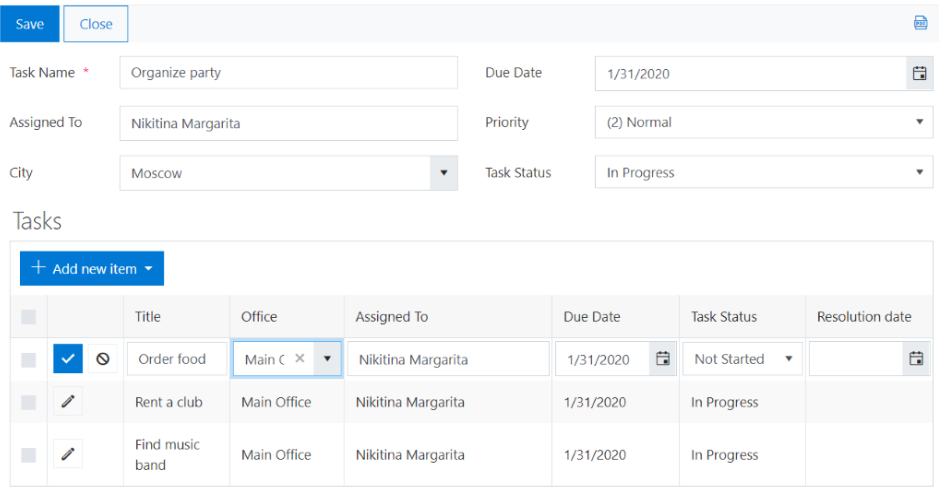

.. title:: Manipulate fields in inline editing mode of List or Library

.. meta::
   :description: How to work with fields when editing List or Library in Inline mode - e.g. prepopulate fields, set fields based on changes in other fields, filter lookup fields

How to manipulate fields in inline editing mode of List or Library control
===========================================================================

In this article, I will show you how to work with List or Library control in the Inline editing mode.  

You will know how to prepopulate fields, set fields based on changes in other fields, filter lookup fields within a List or Library control. 

.. contents:: Contents:
 :local:
 :depth: 1

Form and Source Lists
-----------------------------------

Assume that you have a Project list. Each project is tied to the city and can have several associated tasks. Each task is tied to the Project and Office within the selected city. 

For this, we will create the following lists:  

- City;  

- Office;  

- Project (a regular Tasks list);  

- Task (a regular Tasks list).  

City list will store the city names.   

And Office list will store the information about the offices:  

- Title (text field);  

- City (lookup field).  

Project and Task list are the SharePoint Tasks list with extra columns.   

Project list will have these additional fields:  

- City (lookup field);  

- Resolution Date (date field).  

And Task list will have these: 

- Project (lookup field); 

- Office (lookup field); 

- Resolution Date (date field).  

Next, we will design a form for the Project list. To display Tasks related to the Project, we will add a List or Library control to the form. In Settings >> DataSource, select List: Task and Lookup Field: Project.

|pic0|

In the settings of the List or Library control, we will choose inline editing:  

|pic1|

This is how Project form will look like: 

|pic2|

Populating fields of a new row in List or Library control 
----------------------------------------------------------------------

First, we want to prepopulate the Due Date and Assigned To fields in a new task with the Project field values. 

To handle switching a row into Inline editing mode, we will use the edit event of the List or Library control. Since we're prepopulating fields of a new record only, we will check the form type. 

Find more information about the |edit event|.  

.. |edit event| raw:: html

    <a href="https://plumsail.com/docs/forms-sp/javascript/controls.html#list-or-library" target="_blank">edit event</a>

.. code-block:: javascript

    //prepopulating fields of a new record  
    //with the values from the parent form
    //when a new item created

    fd.spRendered(function() {
        //prepopulating fields of a new record
        //with the values from the parent form 
        fd.control('SPDataTable1').$on('edit', function(editData) {
            //check that this is a new record
            if (editData.formType === 'New') {
                //prepopulating due date
                editData.field('TaskDueDate').value = fd.field('TaskDueDate').value;
                //prepopulating AssignedTo field
                editData.field('AssignedTo').ready().then(function() {
                    editData.field('AssignedTo').value = fd.field('AssignedTo').value;
                });
            } 
        });
    });

Populating fields based on other fields in List or Library control 
----------------------------------------------------------------------

Next, we want to set the Resolution Date to the current date when a user changes the Status field to 'Completed'.  

As in the previous example, we will use the 'edit' event of the List or Library control and 'change' event of the Status field. 

.. code-block:: javascript

    fd.spRendered(function() { 
        fd.control('SPDataTable1').$on('edit', function(editData) {
            //Set Resolutiondate field value when TaskStatus field changes
            editData.field('TaskStatus').$on('change', function(value) {
                if (value === 'Completed') {
                    editData.field('Resolutiondate').value = new Date();
                } else {
                    editData.field('Resolutiondate').value = null;
                }
            });
        });
    });

Filtering lookup fields in List or Library control  
----------------------------------------------------------------------

Finally, in the 'edit' event, we can dynamically filter lookup values in the List or Library control. In this example, we will filter the Office lookup field by the selected City field. Here is the code:

.. code-block:: javascript

    fd.spRendered(function() {
        fd.control('SPDataTable1').$on('edit', function(editData) {
            //filter Office field by City
            editData.field('Office').filter = "City/Title eq '" + fd.field("City").value.LookupValue + "'";
            editData.field('Office').useCustomFilterOnly = true;
        });
    }); 