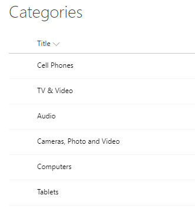
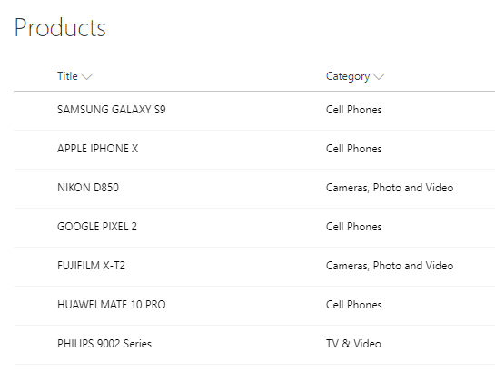
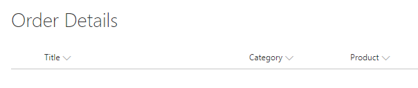
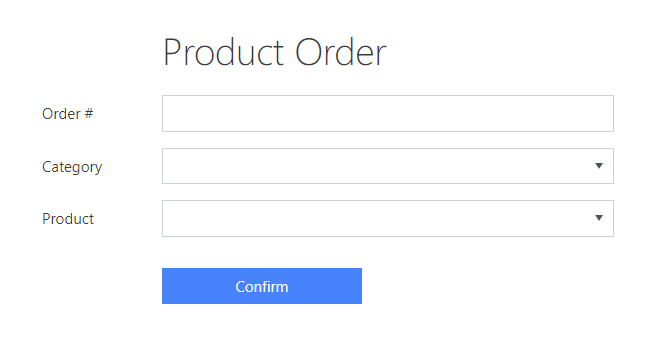
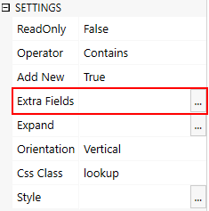
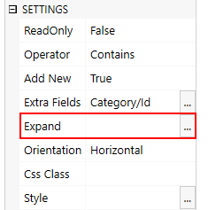
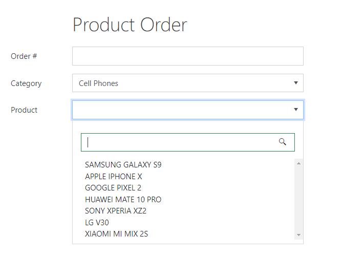
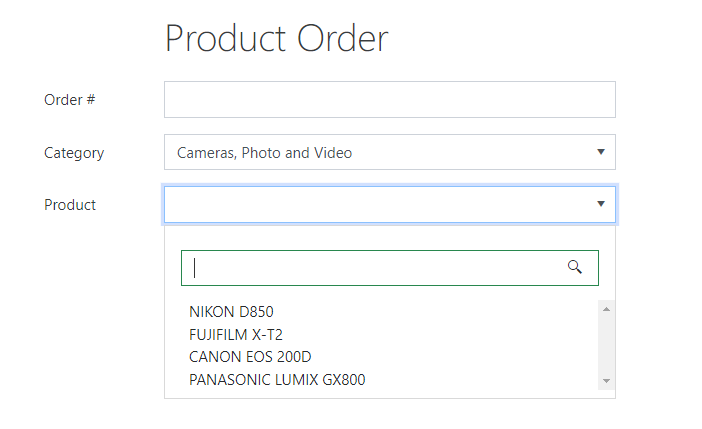

.. title:: Configure cascading lookup fields on a SharePoint form

.. meta::
   :description: Find out how to configure filering for cascading lookup fields on Plumsail Forms - e.g. first select country, then office branch in this specific country
   
How to configure cascading lookup fields in SharePoint form
============================================================================

With a little bit of JavaScript code, you can now easily configure Cascading Lookup fields. 

What does that mean? Just to be clear, I am talking about Lookup fields where choosing value in one field, limits available choice in the other field. 
Lookup filtering can be applied with any data, including values of other fields on the form, not limited to other lookups.

In this example, however, I will show you two Lookup fields on one form - Category and Product, so that the user can only see and choose Products belonging to the selected Category.

.. contents::
 :local:
 :depth: 1
 

Setting up Lists
--------------------------------------------------
There is nothing difficult in setting up the Lists. Our first List - Categories, only contains Title column:

|pic1|

Second list needs to be connected to the first List, in order for filtering to work correctly. Easiest way is via Lookup. 
In our case, Products List has a Lookup to Categories List:

|pic2|

Finally, you need a third List to create form for. It should include 2 Lookup fields: 1 to Categories List and 1 to Products List.

|pic2.5|

Form Configuration
--------------------------------------------------
I've created a simple Product Order form:

|pic3|

In order for Lookups to be connected, I only need to change two things. First, I need to select Products Lookup and alter its Extra Fields property:

|pic4|

It should retrieve ID of the Category Lookup in the Products List, so we can compare it to this form's selected Category:

.. code-block:: javascript

    Category/Id

I will also need to use Expand property to get access to the Category field in the code:

|pic5|

Here, I just need to add Internal Name of the Lookup field, simple enough:

.. code-block:: javascript

    Category

JavaScript
--------------------------------------------------

Last but not least, we use JavaScript in order to apply filtering:

.. code-block:: javascript

    function filterProducts(category) {
        var categoryId = category && category.LookupId || category || null;
        fd.field('Product').filter = 'Category/Id eq ' + categoryId;
        fd.field('Product').refresh();
    }

    fd.spRendered(function() {
        fd.field('Product').ready().then(function() {
            //filter Products when Category changes
            fd.field('Category').$on('change', function(value){
                filterProducts(value);
                fd.field('Product').value = null;
            });
            
            //filter Products when form opens
            fd.field('Category').ready().then(function(field) {
                filterProducts(field.value);
            });
        });
    });

fd.field('FieldName').filter property is an OData $filter query. You can include all kinds of conditions in this query and combine them with **and/or** operators.

Read more about OData query |here|.

.. |here| raw:: html

   <a href="https://docs.microsoft.com/en-us/sharepoint/dev/sp-add-ins/use-odata-query-operations-in-sharepoint-rest-requests" target="_blank">here</a>

Result
--------------------------------------------------
By default, all Products are available in the Products field, but if I choose Category - only products of this particular Category are available.

For example, here is Cell Phone Category:

|pic6|

And here I've selected Camera Category:

|pic7|

Examples
-----------------------------------------------------

Learn how to filter lookup results by selected date and time from :doc:`Conference room reservation system </examples/reservation-system>` article. 