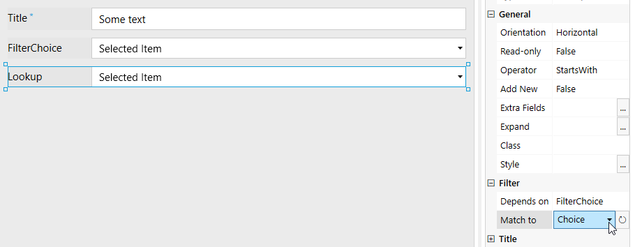
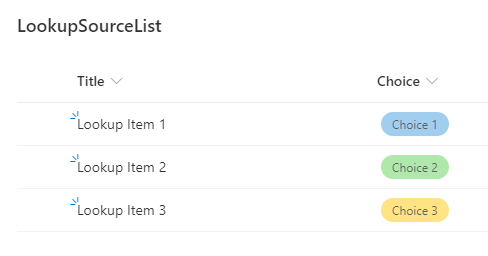
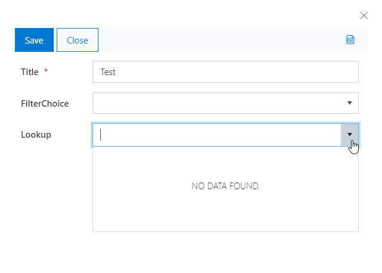
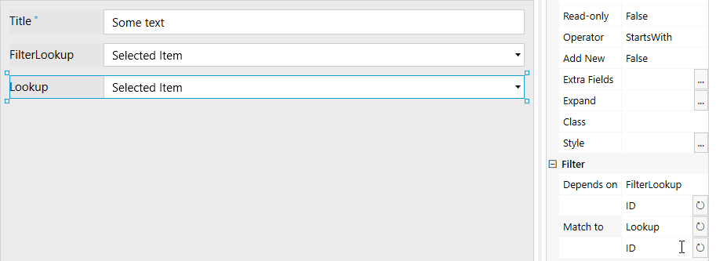
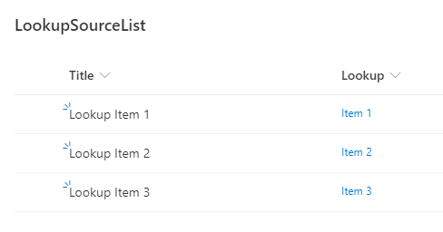
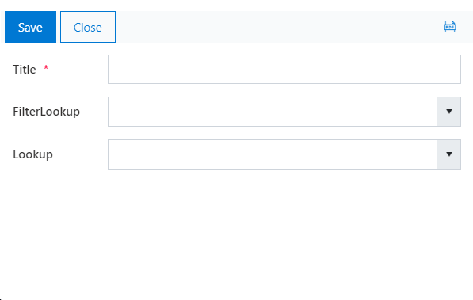
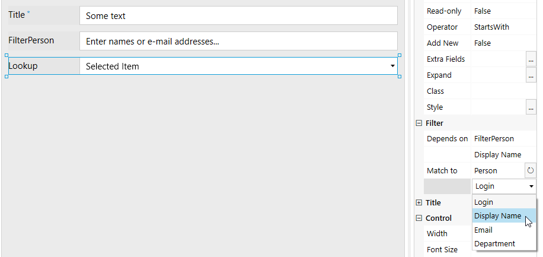
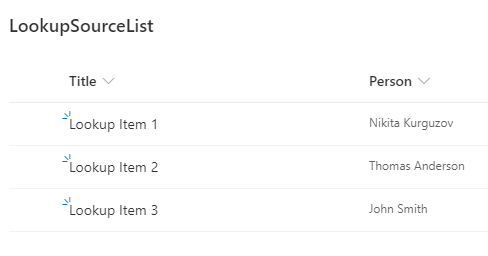
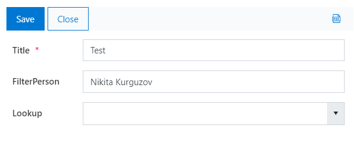

.. title:: Filter lookup fields by Choice, Lookup or Person fields

.. meta::
   :description: Find out how to configure filering for lookup fields on Plumsail Forms
   
How to filter a lookup by choice, lookup or person fields (single value)
=============================================================================

Property of the lookup field **Depends on** allows you to set up a filter condition on a lookup field without any JavaScript. This way you can filter a lookup by variety of fields, starting with simple ones such as Single Line text and Choice, but also by single value Lookup or Person fields.

.. Note:: More advanced filter conditions are possible programmatically, you can find an example in our :doc:`Configure cascading lookups with JS article <./lookup-cascading>` (this is just an example, the same filter can currently be applied with **Depends on** property without JavaScript)

.. contents::
 :local:
 :depth: 1
 
Filter by choice field (or another text field)
--------------------------------------------------
If you have a choice field (or maybe a text field) that you want to match on the current form (or in the current List, it doesn't have to be placed on the form itself) to the one in the lookup source list, all you have to do is select the field that the lookup will have to check in **Depends on** property and the field that you want it to match to in the **Match to** property:

|pic1|

In my lookup source list, I have the following Choice values available:

|pic2|

And on the form, I will only be able to select lookup field when FilterChoice field matches the Choice field in the lookup source list:

|pic3|

Filter by lookup field
--------------------------------------------------
If you have a lookup field that you want to match on the current form (or in the current List, it doesn't have to be placed on the form itself) to the one in the lookup source list, all you have to do is select the field that the lookup will have to check in **Depends on** property and the field that you want it to match to in the **Match to** property. It's best to match lookup fields by ID:

|pic4|

In my lookup source list, I have the following Lookup values available:

|pic5|

And on the form, I will only be able to select lookup field when FilterLookup field matches the Lookup field in the lookup source list:

|pic6|

Filter by person field
--------------------------------------------------
If you have a person field that you want to match on the current form (or in the current List, it doesn't have to be placed on the form itself) to the one in the lookup source list, all you have to do is select the field that the lookup will have to check in **Depends on** property and the field that you want it to match to in the **Match to** property. You can filter by Login, Display Name, Email or Department - just make sure that both selections match for **Depends on** and **Match to** properties:

|pic7|

In my lookup source list, I have the following Person values available:

|pic8|

And on the form, I will only be able to select lookup field when FilterPerson field matches the Person field in the lookup source list:

|pic9|

